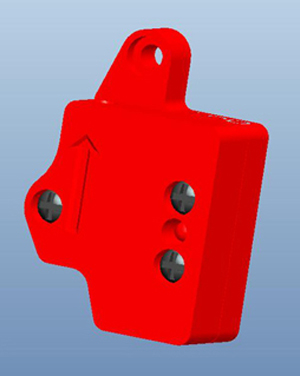
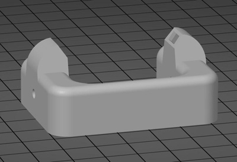
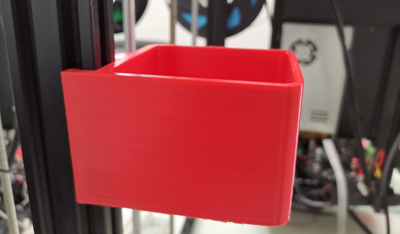

## Print parts stl file of Z9V5
### Filament run out sensor
- :arrow_down:[**Case of filament run out sensor V6**](./FRODV6.zip)    
       
:pushpin: If your machine is upgraded to Dual Gear Extruders, you need to update the FROD base prints, please download the stl from above link, print it out and replace them. stl file name: "FRODV6L-B.stl" and "FRODV6R-B.stl".      
      

### hotend fan duct 
The hotend fan duck stl file to improve the effeciency of cooling.    
<!-- - [:arrow_down:**E4 hotend fan duct**](./fanduct_e4.zip)    
- [:arrow_down:**M4V4 hotend fan duct**](./fanduct_M4V4.zip)   
- [:arrow_down:**M4V6 hotend fan duct**](./fanduct_m4v6.zip)    -->
- [:arrow_down:**Fan duct for E4&M4 hotend**](./fanduct_4c_v7.zip)   
<!--        -->

### Hotend Cable Bracket
- [:arrow_down:**Hotend Cable Bracket**](./z9v5_hecable_holder.zip)   

### Bracket of ZL-Sensor(Only used on Z9V5Pro-MK3)
- [:arrow_down:**Bracket to mount ZL-Sensor**](./br_zlsensor.zip)    
  

### Recyclebin
A box (Installed  on the z-axis aluminum profile at the front left) to collect filament flowed out from the nozzle.     
- [:arrow_down:**Filament recyclebin box**](Recyclebin.zip)    

### tool supports  
- [:arrow_down:**Support for the tools**](./Z9_tool_supports.zip)    

### Filament Spool Bracket
- [:arrow_down:**FilamentSpoolBracket**](./FilamentSpoolBracket.zip)   

### Anti-entanglement Filament
- [:arrow_down:**Anti-entanglement Filament**](./antientanglementfilament.st)   

-----
### Made by customers
- [**Z9V5 Spool Holder by MichaW**](https://www.thingiverse.com/thing:4977619)
- [**Z9V5 Purge chute and nozzle clean by AFelix**](https://www.thingiverse.com/thing:4940319)
- [**Z9V5 Fan duct by Memphisrain**](https://www.thingiverse.com/thing:5754401)
