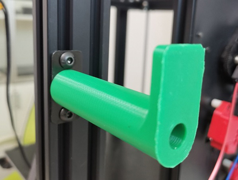

### :globe_with_meridians: Choose Language (Translated by google)

-----
## Print parts stl file of Z9V5
### Filament run out sensor
- :arrow_down:[**Case of filament run out sensor V6**](./FRODV6.zip)    
  

### hotend fan duct 
The hotend fan duck stl file to improve the effeciency of cooling.    
- [:arrow_down:**E4 hotend fan duct**](./fanduct_e4.zip)    
- [:arrow_down:**M4V4 hotend fan duct**](./fanduct_M4V4.zip)   
- [:arrow_down:**M4V6 hotend fan duct**](./fanduct_m4v6.zip)   
      

### Hotend Cable Bracket
- [:arrow_down:**Hotend Cable Bracket**](./z9v5_hecable_holder.zip)   

### Bracket of ZL-Sensor(Only used on Z9V5Pro-MK3)
- [:arrow_down:**Bracket to mount ZL-Sensor**](./br_zlsensor.zip)    
  

### Recyclebin
A box (Installed  on the z-axis aluminum profile at the front left) to collect filament flowed out from the nozzle.     
- [:arrow_down:**Filament recyclebin box**](Recyclebin.zip)    

### tool supports  
- [:arrow_down:**Support for the tools**](./Z9_tool_supports.zip)    

### Filament Spool Bracket
- [:arrow_down:**FilamentSpoolBracket**](./FilamentSpoolBracket.zip)   

### Anti-entanglement Filament
- [:arrow_down:**Anti-entanglement Filament**](./antientanglementfilament.st)   

-----
### Made by customers
- [**Z9V5 Spool Holder by MichaW**](https://www.thingiverse.com/thing:4977619)
- [**Z9V5 Purge chute and nozzle clean by AFelix**](https://www.thingiverse.com/thing:4940319)
- [**Z9V5 Fan duct by Memphisrain**](https://www.thingiverse.com/thing:5754401)
