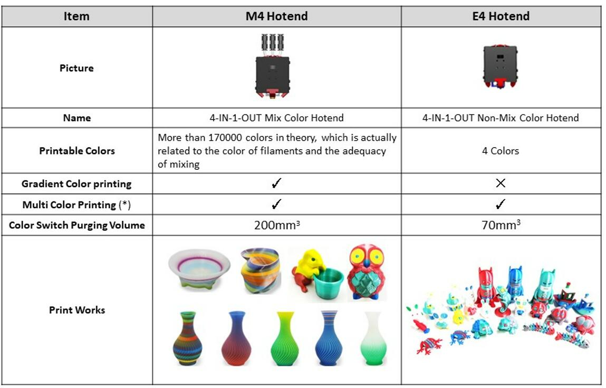

### :globe_with_meridians: Choose Language (Translated by google)

-----
## [:point_right: New Arrival Upgrade Features](#upgrade-parts-and-features) :+1:

-----
## Summary of Updates for ZONESTAR Z9V5
### Updates in 2022-12-14
- **Z9V5Pro-MK4** Release firmware V1.2.4 :point_right:[View](https://github.com/ZONESTAR3D/Firmware/tree/master/Z9/Z9V5/bin/Z9V5Pro-MK4/released)
- **Z9V5Pro-MK3** Release firmware V3.2.4 :point_right:[View](https://github.com/ZONESTAR3D/Firmware/tree/master/Z9/Z9V5/bin/Z9V5Pro-MK3/released)
- **Z9V5Pro-MK1(2)** Release firmware V3.2.4 :point_right:[View](https://github.com/ZONESTAR3D/Firmware/tree/master/Z9/Z9V5/bin/Z9V5Pro/released)

### Updates in 2022-11-29
- **Z9V5Pro-MK4** Release firmware V1.2.3_beta :point_right:[View](https://github.com/ZONESTAR3D/Firmware/tree/master/Z9/Z9V5/bin/Z9V5Pro-MK4/beta)
- **Z9V5Pro-MK3** Release firmware V3.2.3_beta :point_right:[View](https://github.com/ZONESTAR3D/Firmware/tree/master/Z9/Z9V5/bin/Z9V5Pro-MK3/beta)
- **Z9V5Pro-MK1(2)** Release firmware V3.2.3_beta :point_right:[View](https://github.com/ZONESTAR3D/Firmware/tree/master/Z9/Z9V5/bin/Z9V5Pro/beta)

### Updates in 2022-11-19
- **Z9V5Pro-MK4** Release firmware V1.2.2_beta :point_right:[View](https://github.com/ZONESTAR3D/Firmware/tree/master/Z9/Z9V5/bin/Z9V5Pro-MK4/beta)
- **Z9V5Pro-MK3** Release firmware V3.2.2_beta :point_right:[View](https://github.com/ZONESTAR3D/Firmware/tree/master/Z9/Z9V5/bin/Z9V5Pro-MK3/beta)
- **Z9V5Pro-MK1(2)** Release firmware V3.2.2_beta :point_right:[View](https://github.com/ZONESTAR3D/Firmware/tree/master/Z9/Z9V5/bin/Z9V5Pro/beta)

### Updates in 2022-11-11
- **Z9V5Pro-MK4** Release firmware V1.2.0_beta :point_right:[View](https://github.com/ZONESTAR3D/Firmware/tree/master/Z9/Z9V5/bin/Z9V5Pro-MK4/beta)
- **Z9V5Pro-MK3** Release firmware V3.2.0_beta :point_right:[View](https://github.com/ZONESTAR3D/Firmware/tree/master/Z9/Z9V5/bin/Z9V5Pro-MK3/beta)

### Updates in 2022-09-27
- **Z9V5Pro-MK3** Release firmware V3.1.0_beta :point_right:[View](https://github.com/ZONESTAR3D/Firmware/tree/master/Z9/Z9V5/bin/Z9V5Pro-MK3/beta)

### Updates in 2022-08-27
- **Add test gcode files for E4 hotend** [:arrow_down:View](https://github.com/ZONESTAR3D/Slicing-Guide/tree/master/PrusaSlicer/test_gcode/E4)
- **Launched a new Mixing Color hotend** [:gift:OfficalStore](https://bit.ly/3QhWJtf)/[:gift:Aliexpress](https://www.aliexpress.com/item/1005004547646195.html)/[:book:User Guide](https://bit.ly/3QBEWhu)

### Updates in 2022-08-15
- **Slicer** Update ZONESTAR 3D Printer Profiles for Cura :point_right:[View](https://github.com/ZONESTAR3D/Slicing-Guide/tree/master/cura)

### Updates in 2022-07-06
- **Z9V5Pro-MK3** Release firmware V3.0.0_beta :point_right:[View](https://github.com/ZONESTAR3D/Firmware/tree/master/Z9/Z9V5/bin/Z9V5Pro-MK3/beta)
- **DWIN LCD MENU** Release firmware V3 :point_right:[View](https://github.com/ZONESTAR3D/Upgrade-kit-guide/tree/main/TFT-LCD/LCD-DWIN)
- **Z9V5Pro Video Tutorial** Upload video tutorial for Z9V5Pro :point_right:[View](https://youtube.com/playlist?list=PLbvlwbqXvSC_Ue49X_mEBViiTigqgsl08)

### Updates in 2022-06-18
- **Slicer** Update Slicing Profiles and guide for PrusaSlicer :point_right:[View](https://github.com/ZONESTAR3D/Slicing-Guide/tree/master/PrusaSlicer)
- **Z9V5Pro-MK3** Release firmware V2.4.9_beta :point_right:[View](https://github.com/ZONESTAR3D/Firmware/tree/master/Z9/Z9V5/bin/Z9V5Pro-MK3/beta)

### Updates in 2022-05-12
- **Slicer** Update Slicing Guide for PrusaSlicer :point_right:[View](https://github.com/ZONESTAR3D/Slicing-Guide/tree/master/PrusaSlicer)

### Updates in 2022-04-26
- **Z9V5Pro-MK1(2)** Release firmware V1.4.2_bate :point_right:[View](https://github.com/ZONESTAR3D/Firmware/tree/master/Z9/Z9V5/bin/Z9V5Pro/beta)
- **Z9V5Pro-MK1(2)** Release firmware V2.0.2_bate :point_right:[View](https://github.com/ZONESTAR3D/Firmware/tree/master/Z9/Z9V5/bin/Z9V5Pro/beta)
- **Z9V5Pro-MK3** Release firmware V2.4.7_beta :point_right:[View](https://github.com/ZONESTAR3D/Firmware/tree/master/Z9/Z9V5/bin/Z9V5Pro-MK3/beta)
- **E4 HOTEND** Update E4 hotend printing example :point_right:[View](https://github.com/ZONESTAR3D/Upgrade-kit-guide/tree/main/HOTEND/E4%204-IN-1-OUT%20Non-Mixing%20Color%20Hotend/example)

### Updates in 2022-04-22
- **Z9V5Pro-MK1(2)** Release firmware V1.4.1_bate :point_right:[View](https://github.com/ZONESTAR3D/Firmware/tree/master/Z9/Z9V5/bin/Z9V5Pro/beta)
- **Z9V5Pro-MK1(2)** Release firmware V2.0.1_bate :point_right:[View](https://github.com/ZONESTAR3D/Firmware/tree/master/Z9/Z9V5/bin/Z9V5Pro/beta)
- **Z9V5Pro-MK3** Release firmware V2.3.4_beta :point_right:[View](https://github.com/ZONESTAR3D/Firmware/tree/master/Z9/Z9V5/bin/Z9V5Pro-MK3/beta)
- **Z9V5Pro-MK3** Release firmware V2.4.6_beta :point_right:[View](https://github.com/ZONESTAR3D/Firmware/tree/master/Z9/Z9V5/bin/Z9V5Pro-MK3/beta)
- **E4 HOTEND** Update E4 hotend slicing settings :point_right:[View](https://github.com/ZONESTAR3D/Upgrade-kit-guide/tree/main/HOTEND/E4%204-IN-1-OUT%20Non-Mixing%20Color%20Hotend/example)
- **Slicer** Update PrusaSlcier prifiles for Z8(Z9)+E4 hotend and :point_right:[View](https://github.com/ZONESTAR3D/Slicing-Guide/tree/master/PrusaSlicer)

### Updates in 2022-04-20
- **Z9V5Pro-MK1(2)** Release firmware V1.4.0 :point_right:[View](https://github.com/ZONESTAR3D/Firmware/tree/master/Z9/Z9V5/bin/Z9V5Pro/release)
- **Z9V5Pro-MK1(2)** Release firmware V2.0.0 :point_right:[View](https://github.com/ZONESTAR3D/Firmware/tree/master/Z9/Z9V5/bin/Z9V5Pro/release)

### Updates in 2022-04-19
- :star2:**Slicer** Update PrusaSlcier prifiles :point_right:[View](https://github.com/ZONESTAR3D/Slicing-Guide/tree/master/PrusaSlicer)
- **Mechanics** Update fan duck and recyclebin box stl :point_right:[View](https://github.com/ZONESTAR3D/Z9/tree/main/Z9V5/Parts_Stl)

-----
## Upgrade Parts and Features
### :new: M4V6 hotend :+1: 
New arrival the 6th version 4-IN-1-OUT mix color hotend. M4V6 hot end performs better than the original M4 (4-IN-1-OUT mixing color) hot end when printing multi colors prints:
1. No clogged issue when printing muti color prints.
2. Support high temperature consumables (ABS/PETG), etc.
3. Not strings.
4. Better mixing effect, support to mix different types of filament.
- **[:gift:ZONESTAR Offical Shop](https://bit.ly/3QhWJtf)** 
- **[:gift:Aliexpress](http://bit.ly/3GD0at8)** 
### :new: E4 Hotend :+1: 
:warning: **If you have a Z9V5-MK4, don't need to upgrade it.**  
New arrival 4-IN-1-OUT Non-mix color hotend. E4 hot end performs better than the original M4 (4-IN-1-OUT mixing color) hot end when printing multi color prints:
1. Smaller filament purge tower size when color switching.
2. Support faster printing speed.
3. Not strings.
- **[:gift:ZONESTAR Offical Shop](https://bit.ly/3V7IeuT)** 
- **[:gift:Aliexpress](https://bit.ly/3KXQeJ5)** 

### :new: WiFi module :+1: 
Add a WiFi model, you can control your 3d printer by Mobile phone, PC, laptop.
:warning: **For Z8P, please choose for ZM3E4V2. For Z8P-MK2, please choose for ZM3E4V21.**    
- **[:gift:ZONESTAR Offical Shop](https://bit.ly/3rB7mx1)**
- **[:gift:Aliexpress](http://bit.ly/3i7aX4o)**
### :new: PEI Spring Steel Sheet Flexible Hotbed Sticker
The PEI hot bed is more durable than the original PC film hot bed sticker, and the surface of the hot bed is smoother.
- **[:gift:ZONESTAR Offical Shop](http://bit.ly/3VkmXOi)** 
- **[:gift:Aliexpress](https://bit.ly/3GbI9Sr)**
### :new: Direct Drive Extruder (one color)
By upgrading Direct Drive Extruder, you can print flexible filaments (TPU).    
- **[:gift:ZONESTAR Offical Shop](https://bit.ly/3CA0QvV)** 
- **[:gift:Aliexpress](http://bit.ly/3TZxkGp)**
### :new: Filament run out sensor
By upgrading filament run out sensor, the printer can pause to print while filament spool is run out. It is useful when printing big size 3d prints.
- **[:gift:Aliexpress](https://www.aliexpress.com/item/4001309957376.html)**