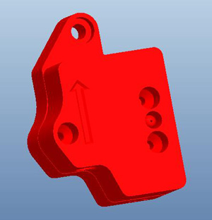

## Parts_Stl
Download [here](

### M4 hotend fan duck
Upgrade the hotend fan duck to improve the effeciency of cooling

### Filament Spool Bracket
Support more types of filament spool

### Filament run out sensor
Case of filament run out sensor

### Recyclebin
Install a recycling bin (on the z-axis profile at the front left) to collect filament flowed out from the nozzle

### tool supports 
Support for common tools

