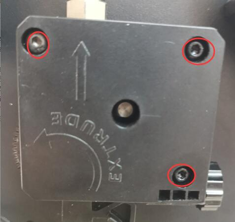
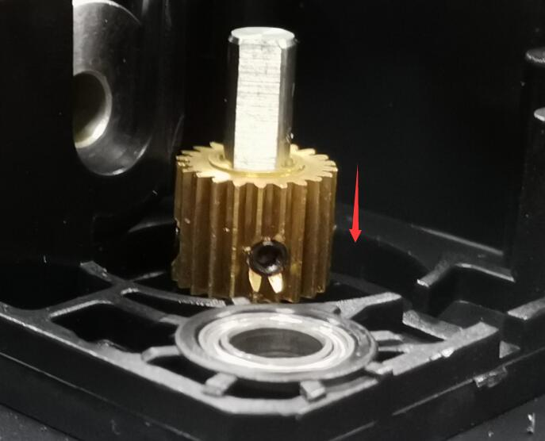
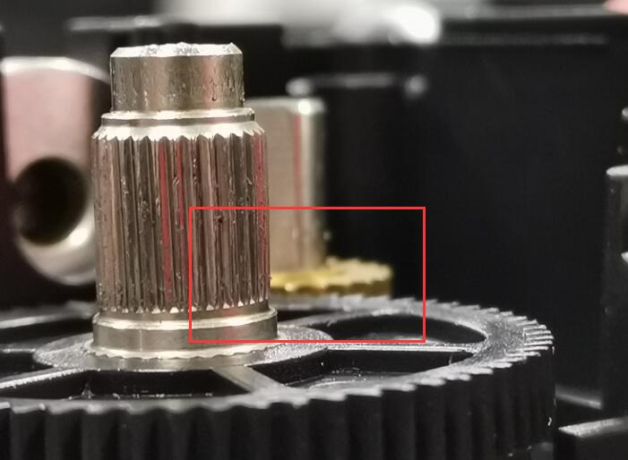
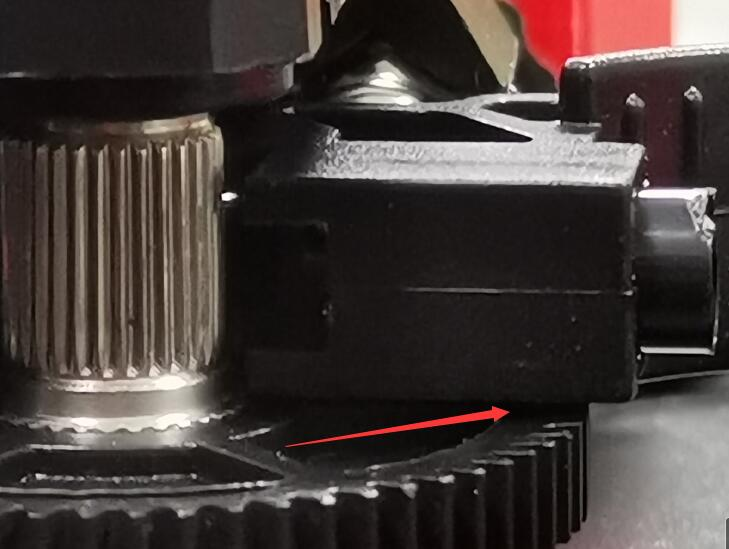
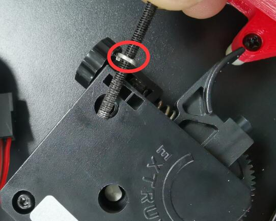
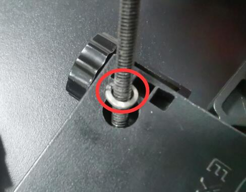
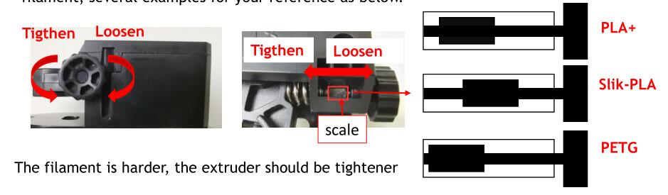

## Substance
We found that some extruders may not be well installed, which will lead to insufficient conveying force of the extruder and more likely to scratch the filament. This article describes how to check and solve this problem.  

## Check
#### Please check whether there is obvious gap here,refer to the below picture:

## Fixing Steps :
#### Step 1: Remove these three screws to disassemble the extruder.

#### Step 2: Check if the gear install too high, move it down if need. 

##### 1. The top of the copper gear is at the same height as the big gear.

##### 2. After installation, the clearance between the indenter and the big gear is less than 1mm

#### Step 3: Install the screws back, add a shim under the 3nd screws

#### Step 4: Properly adjust the extruder pressure according to the hardness of filament.

## Reference
For the details of Titan extruder installation, please refer to this [video toturial](https://youtu.be/VUR70xm5ZmA)

 
  