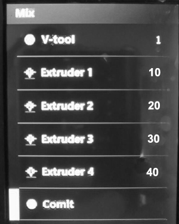
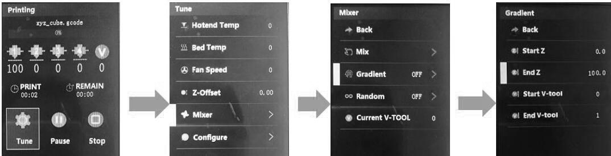

## How to start gradient color mix printing from LCD Screen
For example, we need to set a gradient color mix from height 0mm to 100mm, and mix rate is from "10:20:30:40" to "40:30:20:10"
### Step 1: print the gcode file from SD card, which is sliced to one color.
### Step 2: set mix rate of the used V-tool
- :dart: To set the gradient color is from **V-tool 0** to **V-tool 1**, and the mix rate of **V-tool 0** is E1:E2:E3:E4 = 10:20:30:40, the mix rate of **V-tool 1** is E1:E2:E3:E4 = 40:30:20:10   
- :feet:Open the MENU "Control>>Mixer>>Mix" and set: 
  - **V-tool: 0, Extruder 1: 10, Extruder 2: 20, Extruder 3: 30, Extruder 4: 40**, and then move to **commit** to confirm. 
  - **V-tool: 1, Extruder 1: 40, Extruder 2: 30, Extruder 3: 20, Extruder 4: 10**, and then move to **commit** to confirm.    

### :warning: wait for starting to print (until the nozzle moved to the bed) and then do the below steps.
:memo: Tips: When slicing, the slicing software may add a Tx (switch extruder) command to the gcode file following the "start gcode". However, the Tx command will stop the "auto gradient color", so we must wait for the Tx command to complete execution before starting the gradient color function from the LCD Screen.
### Step 3: set and start gradient color mix
Set it on LCD Screen: **Tune>>Mixer>>Gradient: Start Z: 0, End Z: 100, Start V-tool: 0, End V-tool: 1**

#### About the parameter of gradient color mix
- **Start Z**: Start position of z-axis for gradient.It can be set to the start position of 0, or it can be set to a start position of Z axis.Note: this value cannot be greater than the end positi.
- **End Z**: End position of Z-axis for gradient. It can be set to the highest value of the 3d model, or it can be set to an end position of the Z axis. Note: this value cannot be less than the "start Z".
- **Start V-tool**: The percentage of colors defined in this Start V-tool value is used as the starting percentage of the color gradient. 
- **End V-tool**: The percentage of colors defined in this End V-tool value is used as the ending percentage of the color gradient. 
    Note: the Start V-tool cannot be the same as the End V-tool.
---
### You can use the Plugin of slicing software to achieve richer gradient effects. For details, please refer to [ZONESTAR Gradient Color Plugin](https://github.com/ZONESTAR3D/Slicing-Guide/blob/master/cura/plugins/readme.md)
