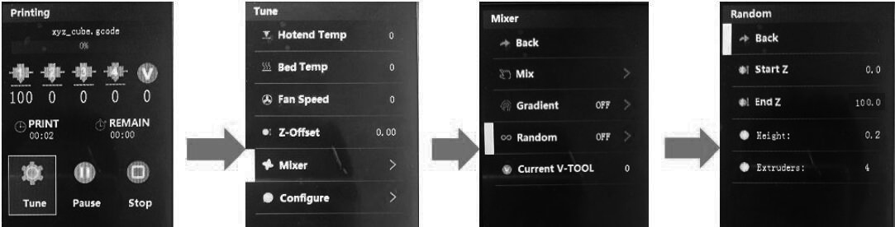

## How to start random color mix printing from LCD Screen
For example, we need to set a random color mix from height 0mm to 100mm
### Step 1: print the gcode file from SD card, which is sliced to one color.
### :warning: wait for starting to print (until the nozzle moved to the bed) and then do the below steps.
:memo: Tips: When slicing, the slicing software may add a Tx (switch extruder) command to the gcode file following the "start gcode". However, the Tx command will stop the "auto random color", so we must wait for the Tx command to complete execution before starting the random color function from the LCD Screen.
### Step 2: set and start random color mix
Set it on LCD Screen: **Tune>>Mixer>>Random: Start Z: 0, End Z: 100, Start V-tool: 0, End V-tool: 1**

#### About the parameter of random color mix
- **Start Z**: Start position of z-axis for gradient.It can be set to the start position of 0, or it can be set to a start position of Z axis.Note: this value cannot be greater than the end positi.
- **End Z**: End position of Z-axis for gradient. It can be set to the highest value of the 3d model, or it can be set to an end position of the Z axis. Note: this value cannot be less than the "start Z".
- **Height**: Random height setting. That is, every time the z-axis increases to this set value, the system will generate a mixed color percentage ratio randomly.
- **Extruders**: Number of extruders participating in random color mixing.
