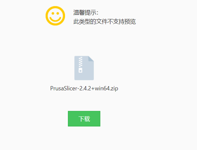
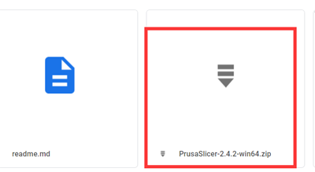
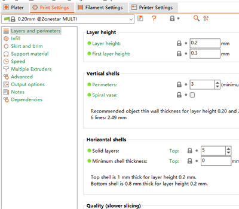

# PrusaSlicer slicing guide for ZONESTAR 3D Printer 
## :book: Contents
1. [Download PrusaSlicer software](#1-download-prusaslicer)
2. [Run PrusaSlicer and choose the printer ](#2-run-prusaslicer-and-choose-the-printer)
3. [Choose system presets](#3-choose-system-presets)
4. [Slicing one color](#4-slicing-one-color)
5. [Gradient and random mixed color printing](#5-gradient-and-random-mixed-color-printing)
6. [Slicing muti-color for Z9V5 + M4 hotend](#6-slicing-muti-color-for-m4-hotend)
7. [Slicing muti-color for Z9V5 + E4 hotend](#7-slicing-muti-color-for-e4-hotend)

## 1. Download PrusaSlicer
#### For windows system (win 7/8/10/11) 
- Click the below links to download:
  - [**Download from Github Page**](https://github.com/ZONESTAR3D/Slicing-Guide/blob/master/PrusaSlicer/PrusaSlicer-2.4.2-win64.zip)   
    
  - [**Download from Jianguoyun**](https://www.jianguoyun.com/p/DQtYE2IQyoP1Bxjy374EIAA)    
    
  - [**Download from Google Driver**](https://drive.google.com/drive/folders/18WoIydKMPNVGcCbk_6rOo17a5pWe2N0l)    
    
- And then unzip downloaded file to your PC or laptop  
   

#### For Macos or linux
- [Download PrusaSlicer software](https://github.com/prusa3d/PrusaSlicer/releases)
- [Download profiles](https://downgit.github.io/#/home?url=https:%2F%2Fgithub.com%2FZONESTAR3D%2FSlicing-Guide%2Ftree%2Fmaster%2FPrusaSlicer%2FProfiles)
- Copy Profiles to "resource/profiles" directory of the installation directory of the PrusaSlicer software.

## 2. Run PrusaSlicer and choose the printer 
#### 2.1 Find the PrsuaSlicer.exe and click it to run

#### 2.2 Choose your printer, "Other Vendors>>Zonestar FFF>>your printer model>>finish"

## 3. Choose system presets
Choose system presets according to your printer, hotend and the colors you want to print:   

- If you need to print one color 3d model, choose **"Z9 + One Color"**.  
  :warning:If you upgraded **Direct Drive Extruder**, choose **“Z9 + DDE”**.  
- If your printer has a **M4 (4-IN-1-OUT Mix Color) hotend** and print multi colors 3d model, choose **"Z9 + M4 HOTEND"**.    
- If you upgraded **E4 (4-IN-1-OUT Non-Mix Color) hotend** and print multi colors 3d model, choose **"Z9 + E4 HOTEND"**.   
  :warning:By default, Z9V5Pro-MK3 equiped with a M4 hotend, click [:gift:here](https://www.aliexpress.com/item/1005002951777699.html) or [:gift:here](https://www.zonestar3dshop.com/discount/E8KA2H3PPXRN?redirect=%2Fproducts%2Fzonestar-multi-colors-4-in-1-out-non-mixing-color-hotend-extruder-part-e4-print-head-3d-printer-diy-kit-parts-hot-end-24v%3Fvariant%3D42310155174073) to buy an E4 hotend. For more about E4 hotend, please refer to [:book:here](https://github.com/ZONESTAR3D/Upgrade-kit-guide/tree/main/HOTEND#faq-for-e4-and-m4-hotend)     

## 4. Slicing one color
#### :movie_camera:[Video Tutorial](./PrusaSlicer_Z9_OneColor.gif)
#### 4.1 choose printer presets "Z9 + One Color"

#### 4.2 load 3d model file (stl/obj/AMF file etc.)

#### 4.3 Choose print filament type

#### 4.4 If need, you can resize, cut, rotate the 3d model 
  
#### 4.5 Set the print settings: layer height, print speed, support, infill, etc.
  
You may need to set these parameters according to the shape of the model and your requirements for print quality. For some models, the object even cannot be printed successfully if the settings is incorrect. For details please refer to:
- [**PrusaSlicer introduction**](https://www.prusa3d.com/page/prusaslicer_424/)
- [**Slic3r User Manuual**](https://manual.slic3r.org/)
#### 4.6 Slicing
  
#### 4.7 Preview the sliced result (gcode file) and then save to gcode file to your PC and then copy to SD card
  

#### :warning: NOTE: While you print one color by M4 (4-IN-1-OUT Mix Color) Hotend, you can: 
- (**RECOMMENDED**) Load filament to that extrusion feeders used, feed it into the center channel of the hotend. And close unused channels of the hotend by "hotend clean tools".
- Or load all filaments to extrusion feeders and feed all filaments into all channels of the hotend. 
#### :warning: NOTE: While you print one color by E4 (4-IN-1-OUT Non-Mix Color) Hotend, only load one filament to which used extrusion feeder and feed it into any one channel of hotend.

## 5. Gradient and random mixed color printing
The slicing process of realizing gradient mixed color printing is exactly the same as that of monochrome, but you need to enable the gradient printing function in the LCD menu. Please refer to the introduce of gradient mixed color printing.   
- [:blue_book: How to set gradient color printing](../../1.%20Installation%20and%20User%20Guide/Advance%20Features/How%20to%20set%20gradient%20color%20printing.pdf)
- [:blue_book: How to set random color printing](../../1.%20Installation%20and%20User%20Guide/Advance%20Features/How%20to%20set%20random%20color%20printing.pdf)

## 6. Slicing muti-color for M4 hotend 
#### :movie_camera:[Video Tutorial](./PrusaSlicer_Z9M4_MultiColor.gif)
#### 6.1 choose printer presets "Z9 + M4 hotend"

#### 6.2 load 3d model files (stl/obj/AMF file etc.)
 
##### :memo: Usually, "split model" is inneed to print multi-color, that is, a 3d model has been split into multiple STL files according to colors, and these files use the same origin coordinate position so that they can be merged correctly.
##### :star2: PrusaSlicer has a very powerful new feature. It can [painting 3d model into multi-color](https://www.youtube.com/watch?v=6LLK9soDW88).
#### 6.3 Choose print filament type - PLA and set filament color

#### 6.4 Assign extruders to different parts

#### 6.5 If need, you can resize, cut, rotate the 3d model 
  
#### 6.6 Set the print settings: layer height, print speed, support, infill, etc.
  
You need to set these parameters according to the shape of the model and your requirements for print quality. Even for some models, printing cannot be completed normally without support. For details please refer to:
- [**PrusaSlicer introduction**](https://www.prusa3d.com/page/prusaslicer_424/)
- [**Slic3r User Manuual**](https://manual.slic3r.org/)
#### 6.7 Set parameters for "wipe tower"
##### You may notice that a square square will appear in the sliced figure, which is called "Wipe tower" in PrusaSlicer. Because for the multi-color printer, while switching extruders, there are still the previous color filaments inside the hotend, it need to be clean before printing another color.   
    
##### In order to obtain better cleaning effect and minimize to waste filament, we can set the amount of color purge according to different colors. Please pay attention to the following table, the columns shows the filament color of the last extruder printed, and the rows shows the filament color of the next extruder to be printed.
##### When we change from the extruder with lighter color filament to the extruder with darker color consumables, we can set a smaller extrusion erasure. On the contrary, when we change from the extruder with darker color consumables to the extruder with darker color filament, we need to set a smaller extrusion erasure
  
#### 6.8 Slicing
  
#### 6.9 Preview the sliced result (gcode file) and then save to gcode file to your PC and then copy to SD card
  

-------------
If you upgraded a E4 (4-IN-1-OUT non-mix color) hotend, please refer to the below guide to slicing.
## 7. Slicing muti-color for E4 hotend
#### :movie_camera:[Video Tutorial](./PrusaSlicer_Z9E4_MultiColor.gif)
#### 7.1 choose printer presets "Z9 + E4 hotend"

#### 7.2 the other steps for E4 hotend and M4 hotend is the same, please refer to 
:star:For E4 hotend, there are few filaments left in the hot end, so we can use smaller purging volume on wipe tower.  
  
:star:When previewing the gcode file, you can see that some additional print lines will appear on the side of bed, which are for preloading filament. For detail how to pre-load filament, please refer to "E4 Hotend user guide".   
  