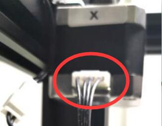

## Stepping motor don't work
:warning: Power off the printer first before connecting or disconnecting the motor cables.

### X&Y motors 
- Check the motor wire on motor side.  
- Check the motor wire on control board side.  
- Check the motor wires.   
:star2: Tips: First loosen the belt on the top, then try to exchange the wiring of X and Y motors, and then move X on the LCD menu to check whether the problem is from the motor side or the control board side.
:warning: Please note that because the Z9 is a Corexy structure, the X and Y motors will rotate at the same time when the print head moves along the X axis or Y axis.
      

### ZL or ZR motors
- Check the motor wiring well on motor side.  
- Check the motor wiring well on control board side.  
- Check the motor wires.   
:star2: Tips: Try to exchange the wiring of Z-L and Z-R motors, and then move Z on the LCD menu to check whether the problem is from the motor side or the control board side.

### Extruder motors