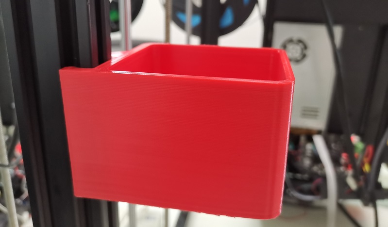
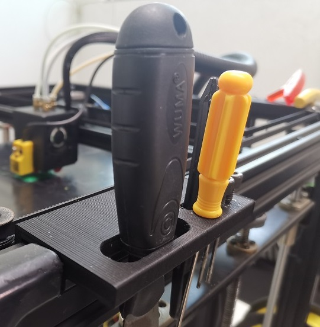

## Parts_Stl

### M4 hotend fan duck
Upgrading the hotend fan duck to improve the effeciency of cooling.     
[:arrow_down: **Download Stl file**](./fan_duct_m4_v3.zip)     

### Filament Spool Bracket
Support more types of filament spool.     
[:arrow_down: **Download Stl file**](./FilamentSpoolBracket.zip)    

### Filament run out sensor
Case of filament run out sensor.     
[:arrow_down: **Download Stl file**](./FRODV6.zip)  

### Recyclebin
A box to collect filament flowed out from the nozzle.     
[:arrow_down: **Download Stl file**](./Recyclebin.zip)   

### tool supports 
Support for the tools.     
[:arrow_down: **Download Stl file**](./Z9_tool_supports.zip)   

### Made by customers
- [**Z9V5 Spool Holder by MichaW**](https://www.thingiverse.com/thing:4977619)
- [**Z9V5 Purge chute and nozzle clean by AFelix**](https://www.thingiverse.com/thing:4940319)
- [**Z9V5 Fan duct by Memphisrain**](https://www.thingiverse.com/thing:5754401)

