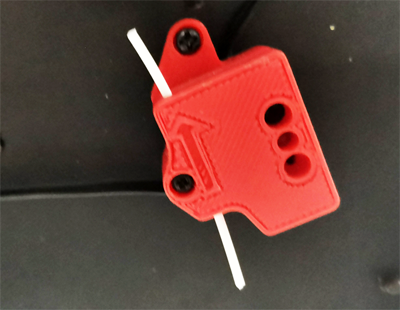
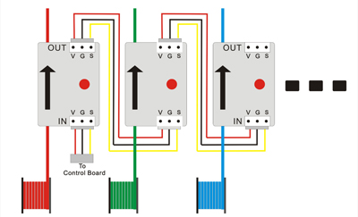

### :globe_with_meridians: Choose Language (Translated by google)

-----
## Advance features
### Contents
- [**Bed auto leveling Feature**](#bed-auto-leveling)
- [**Power Auto Shutdown Feature**](#power-auto-shutdownwn)
- [**Filament Run Out Detect Feature**](#filament-run-out-detect)
- [**Power Loss Recovery Feature**](#power-loss-recovery)
- [**Auto retract**](#auto-retract)

-----
### Bed Auto Leveling
#### [:clapper: Video tutorial](https://youtu.be/Zoyl6PybsUk)  
:book: Most beds appear quite flat and even, but even when the bed is flat, there may be irregularities due to tape or other matter on the surface. Bed Automatic Leveling helps improve the quality of printing and bed adhesion by taking several measurements of the bed surface and then adjusting all movement to follow the tilt or contours of the bed.   
#### Steps of turn on bed auto leveling feature:
##### :loudspeaker: If you have not done the auto leveling test before, or you have executed restore defaults, or you have upgraded the firmware, or the auto leveling data is incorrect. You need to redo these steps.   
1. Turn on Automatic Bed Leveling on LCD MENU ***Control>>Configre>>Auto Leveling***  
2. Do ***Prepare>>Bed Leveling>>Point 1 ~ Point 4*** and adjust the bed mounted screws to level the bed first.   
:loudspeaker: Wait for the hotbed and hotend to cool down if they were not cold before doing this step.  
:loudspeaker: Clean the nozzle, ensure there isn't any filament left on the nozzle.
3. Do ***Prepare>>Bed Leveling>>Catch Z offset***.
4. Do ***Prepare>>Bed Leveling>>Auto Lebeling***. After finished, you will get a "height error table" as below picture.
    - If the measured values are evenly distributed around 0, and the difference between the maximum value and the minimum value is less than 0.4 (***as shown in Figure 1***), we suggest that you do not need to enable the automatic leveling function.   
    - If most of the measured values are bigger than zero and the average value > 0.2 (***as shown in Figure 2***), please add the ***Preobe Z offset*** (new value = previous value + average value of measured (>0)  ) and do this steps again.
    - If most of the measured values are bigger than zero and the average value < -0.2 (***as shown in Figure 3***), please reduce the ***Preobe Z offset*** (new value = previous value + average value of measured (<0>)) and do this steps again.      
  

-----
### Power auto shutdown
#### [:clapper:Video tutorial](https://youtu.be/SJLpmJL-tG4).
#### Turn on the auto shutdown feature on LCD screen 
You can turn on the auto shut down feature on LCD sceen, after turned on it, the machine will shut down automatically:
1. In a non printing state, you did not perform any operations through the display knob within 15 minutes.
2. After the SD card printing is completed, the hot bed and hot end issues cool down to below the safe temperature for 15 minutes.      

#### Turn on the printer after print finish by adding command
You can also add a "M81" gcode command in the "End G-code" of the slicing software, it will turn off the printer after finished to print the gcode file.      

-----
### Filament Run Out Detect
#### [:clapper: Video tutorial](https://youtu.be/QCJ-6L6ze1w) 
If there is not enough filaments left in the filament roll to complete the current printing, you can enable the ***"Runout Sensor"*** feature. The machine will pause the printing when detected the filament is run out, then you can load a new filament roll and resume the printing. What you need to do is:    
1. Pass the filament through the **Filament Run Out Sensor**.
2. Turn on the **run out** feature on LCD screen.      

#### :warning: Notice
1. If you're sure that the filament is enough, do not pass the filament through the **Filament Run Out Sensor**.         
     
2. The printing pause may cause some obvious defects on the prints. 
3. If you need to use the Filament run out detect function, you should insert fine wires on all 4 sensors. If you do not actually use 4 filaments when printing, you can cut a small segment of filaments and insert it into the shortage detection sensor. As shown in the following figure:     
     
#### Introduction of Filament Run Out Sensor

- **LED:** Filament detection indicator light, it will light up when the filament is inserted.
- **"IN" Connector:** Connect to  the control board or the previous FROD.
- **"OUT" Connector:** Connect to the next FROD. Let it suspend if there is not the next one.   
:bulb:  The filament must be inserted in the direction indicated by the arrow.
#### Wiring diagram of Filament Run Out Sensors

-----
### Power Loss Recovery
#### [:clapper: **Video tutorial**](https://youtu.be/f-PpasByiiE)   
If your power supply network has frequent power outages, you can enable the automatic power losss recovery function before start printing. When the power goes out and it resumed, you can press the DC switch to turn on the power of the machine, and then the machine will automatically detect the printing breakpoint and provide you with whether you need to continue printing.    
#### :warning: Notice 
1. Breakpoints data and gcode files will be stored on the SD, must keep the SD card in socket before turn on the machine.       
2. The printing pause may cause some obvious defects on the prints.    

-----
### Auto retract
In the process of multi-color printing,if the stringing or oozing is serious, you can try to turn on the automatic retract function to reduce the stringing or oozing phenomenon!
### 1. Enter Auto Retract Menu Open the Configure Menu and click Auto Retract to enable 

### 2. Setting parameters if need

1. Turn ON / OFF auto retraction feature.      
2. Set retract distance (mm) for each extruder. 
3. Set retract speed (mm/s).
4. Set the overload filament length (mm) after each retraction.
5. Set reload speed (mm/s).
