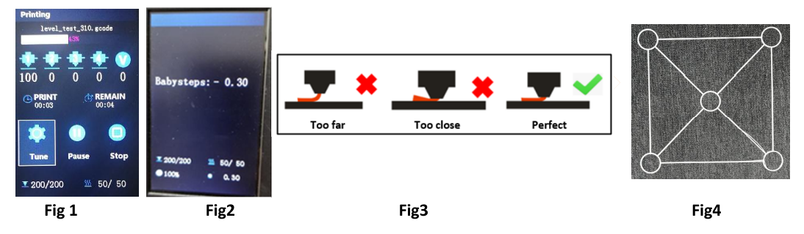

### Choose Language (Translated by google)

----
## Bed Auto leveling User Guide
### Level Corners
:loudspeaker: The automatic bed leveling function is used to correct the relative offset of different positions on the hot bed at the Z-axis height, not the absolute value. Before executing Bed Auto Leveling, you must perform **Level Corners** to make the machine obtain a correct absolute value of the starting point of Z axis (it is so called **Z axis absolute zero point** of the machine). Steps as below:    
##### Step 1: Power on the 3d printer and then do “Prepare>>Auto Home>>Home All” on LCD MENU, wait the hotend go to the HOME position. 
##### Step 2: Tighten the hand nuts under the bed to move down the bed to the lowest position (Fig 1).
##### Step 3: Do “Prepare>> Bed leveling>> Point 1” on control panel(Fig 2), the nozzle will go to the corners of the bed, loosen the hand nuts under the hotbed (Fig 3) and let the nozzle almost touch the hotbed (Fig 4). Continue to do “Point 2/3/4” until all of the 4 corners has been leveled.
##### Step 4: Repeat Step 3 and do 2 ~ 3 rounds, until all of the four corners at the same height.  
    

### Catch Probe Z offset
:warning: Do ***Control>> Configure>> Auto Leveling*** to turn on **bed auto leveling feature** if you didn't see this menu.

**"Probe Z Offset"** indicates that when the sensor sensed the hot bed, the distance between the nozzle and the Z axis absolute zero point.      
If the sensor is installed correctly, the nozzle is always above the hot bed when the sensor sensed the hot bed, so **Probe Z Offset** is always a negative value. Since the sensing distance of each PL-08N sensor is different, and the actual installation height of PL-08N is also different, the **Probe Z Offset** of each machine is different too.     
You need to do ***Catch Z offset*** to get the **Probe Z Offset** before doing bed auto leveling. Do **Prepare>> Bed Leveling>>Catch Z-Offset**.

### Bed Leveling
After completing the above steps, we have a reliable sensor to measure the hotbed surface and already set all its parameters. Now we need the machine to make a comprehensive measurement of the surface of the hot bed, so as to get a data sheet of the hot bed height on the surface.   
Do **Prepare>> Bed Leveling>>Auto Leveling** 
    
After measure done, the state of Auto leveling on Leveling menu will change from **--NA---** to **Actived**. 

### Verification  
Now you can try to print a test file to verfiy the bed auto leveling result. Steps as below:   
1. Copy **[level_test_310.gcode :arrow_down:](./level_test_310.zip)** to SD card and print it from SD card (Fig 1).
2. When printing started, double click (click twice in one second) the knob to open Baby Z offset menu (Fig 2).
3. Rotate the knob to fine tune the nozzle height, let the filament pasted on the hotbed very well (Fig 3).
4. Watch the print result(Fig 4).
  

-----
### Active auto leveling after the printer reset
Auto leveling feature will be disable automatically when the printer reset, you can turn it on manually from LCD screen.
- **Step 1. Menu>>Prepare>> Auto Home**
- **Step 2. Motion>> Control>> Configure>>Active autolevel: ON**
NOTE: After do these 2 steps, the printer will apply stored leveling correction parameters in the last “bed level”.
  

### Auto leveling the bed before each printing
If you want the printer do bed auto leveling for each printing, you need to add a "G29" command in the "Start Gcode" of printer settings of the slicing software.
  

