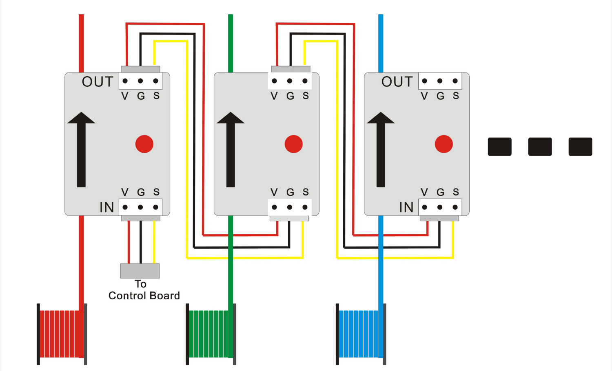

## ZONESTAR Z9V5Pro advance features
### Contents
- [**Bed auto leveling Feature**](#1automatic-bed-leveling)
- [**Power Auto Shutdown Feature**](#2power-auto-shutdown)
- [**Filament Run Out Detect Feature**](#3filament-run-out-detect)
- [**Power Loss Recovery Feature**](#4power-loss-recovery)
- [**WiFi wireless control feature**](#5wifi-wireless-control)
- [**Auto Mixing Color Feature**](#6auto-mixing-color)

### 1.Automatic Bed Leveling
:book: Most beds appear quite flat and even, but even when the bed is flat, there may be irregularities due to tape or other matter on the surface.  
Automatic Bed Leveling helps improve the quality of printing and bed adhesion by taking several measurements of the bed surface and then adjusting all movement to follow the tilt or contours of the bed.   
#### Steps of turn on bed auto leveling feature:
:movie_camera: [**Bed Auto Leveling**](https://youtu.be/Zoyl6PybsUk)  
:arrow_down:[**leveling test gcode file**](./Bed_Auto_Leveling/level_test_310.zip)  
##### :loudspeaker: If you have not done the auto leveling test before, or you have executed restore defaults, or you have upgraded the firmware, or the auto leveling data is incorrect. You need to redo these steps.   
- :one: Turn on Automatic Bed Leveling on LCD MENU ***Control>>Configre>>Auto Leveling***  
- :two: Do ***Prepare>>Bed Leveling>>Point 1 ~ Point 4*** and adjust the bed mounted screws to level the bed first.   
:loudspeaker: Wait for the hotbed and hotend to cool down if they were not cold before doing this step.  
:loudspeaker: Clean the nozzle, ensure there isn't any filament left on the nozzle.
- :three: Do ***Prepare>>Bed Leveling>>Catch Z offset***.
- :four: Do ***Prepare>>Bed Leveling>>Auto Lebeling***. After finished, you will get a "height error table" as below picture.
  - If the measured values are evenly distributed around 0, and the difference between the maximum value and the minimum value is less than 0.4 (***as shown in Figure 1***), we suggest that you do not need to enable the automatic leveling function.   
  - If most of the measured values are bigger than zero and the average value > 0.2 (***as shown in Figure 2***), please add the ***Preobe Z offset*** (new value = previous value + average value of measured (>0)  ) and do this steps again.
  - If most of the measured values are bigger than zero and the average value < -0.2 (***as shown in Figure 3***), please reduce the ***Preobe Z offset*** (new value = previous value + average value of measured (<0>)) and do this steps again.  
  

### 2.Power Auto Shutdown
:movie_camera: [**Power Auto Shutdown**](https://youtu.be/SJLpmJL-tG4)

### 3.Filament Run Out Detect
The machine is equipped with 4 filament run out sensors. With these sensors, the printer can pause the printing while one 
of the filament spools used up, and when you load a new roll filament, you can continue to print.   
- :movie_camera: [**Filament Run Out Detect**](https://youtu.be/QCJ-6L6ze1w) 
#### **:bulb: Please note:**   
- This function only works when printing from SD card.
- If you can confirm that your current printing will not run out of consumables, it is recommended not to enable this function and do not pass the consumables through the shortage detector.
#### Introduction of Filament Run Out Sensor

- **LED:** Filament detection indicator light, it will light up when the filament is inserted.
- **"IN" Connector:** Connect to  the control board or the previous FROD.
- **"OUT" Connector:** Connect to the next FROD. Let it suspend if there is not the next one.   
:bulb:  The filament must be inserted in the direction indicated by the arrow.
#### Wiring diagram of Filament Run Out Sensors

### 4.Power Loss Recovery
:movie_camera: [**Power losss recovery**](https://youtu.be/SK95C-6OpB4)  

