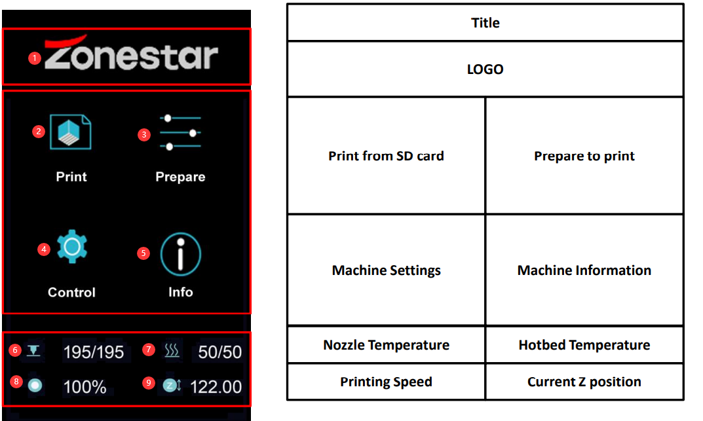
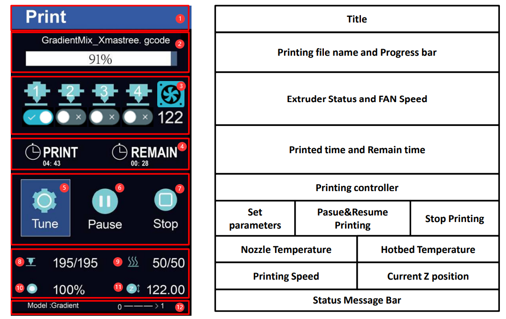
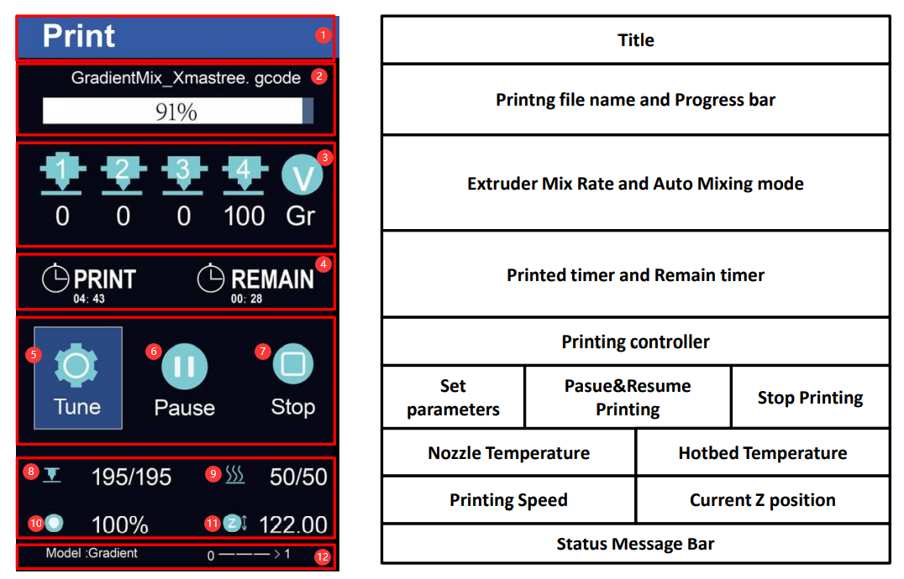
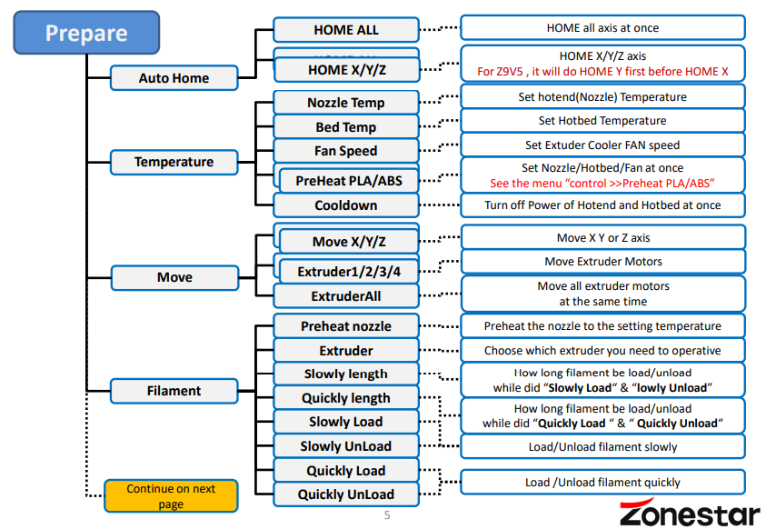
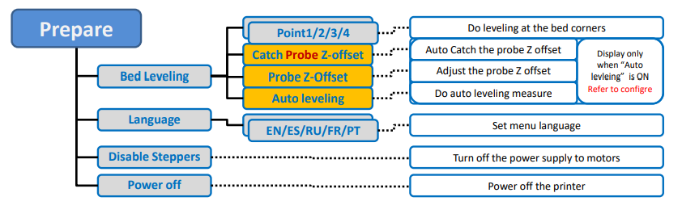
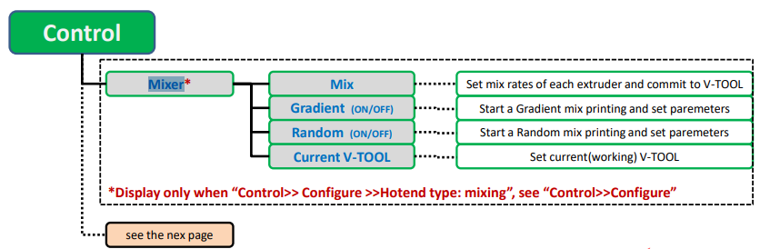
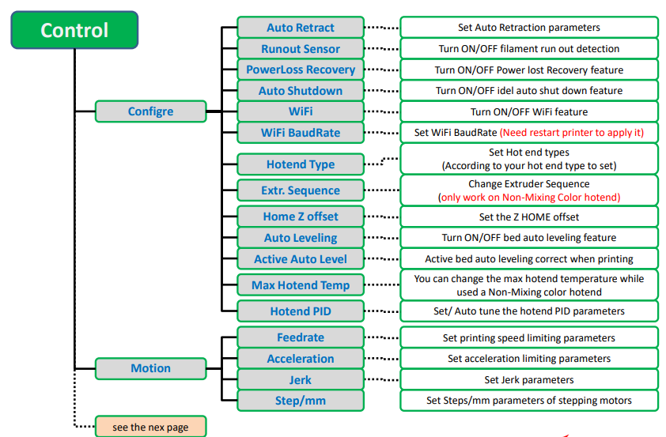
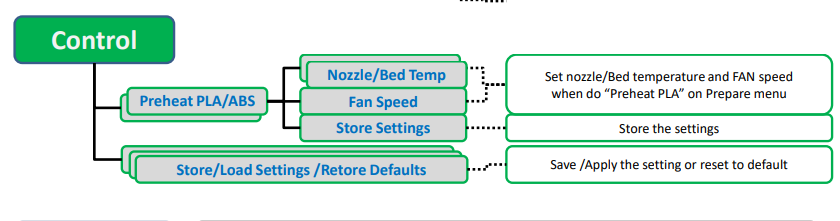
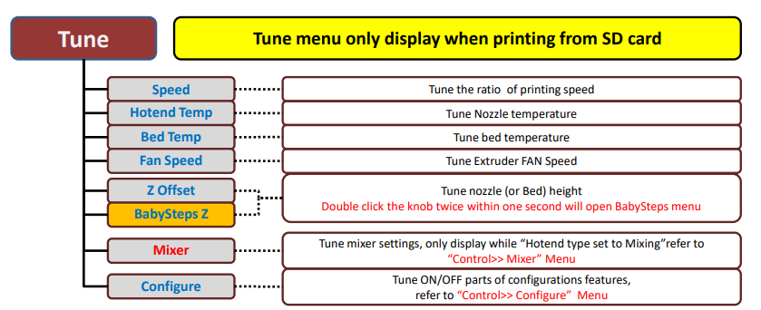

## LCD Menu Description 
:blue_book:[Watch PDF](./LCD_DWIN_MENU_Description.pdf)

### Main Menu

  >
    1. LOGO                   2. Print from SD card            3. Prepare to print
    4. Machine Settings       5. Machine Information           6. Nozzle Temperature
    7. Hotbed Temperature     8. Printing Speed                9. Current Z position

### Printing status Menu (Hotend Type set to “Non-mixing”)

  >
    1. Titel                              2. Printing file name and Progress bar      3. Extruder Status and FAN Speed
    4. Printed time and Remain time       5. Set printing parameters                  6. Pasue&Resume Printing
    6. Stop Printing                      7. Nozzle Temperature                       8. Hotbed Temperature     
    9. Printing Speed                     10. Current Z position                      12.Status Message Bar

### Printing status Menu (Hotend Type set to “Mixing”)

  >
    1. Titel                              2. Printing file name and Progress bar      3. Extruder Mix Rate and Auto Mixing mode
    4. Printed time and Remain time       5. Set printing parameters                  6. Pasue&Resume Printing
    6. Stop Printing                      7. Nozzle Temperature                       8. Hotbed Temperature     
    9. Printing Speed                     10. Current Z position                      12.Status Message Bar

### Menu - Prepare

|     Level 1        |     Level 2    |                         Description                            |
|:------------------:|:--------------:|:---------------------------------------------------------------|
|     Auto Home      |  HOME ALL      |  HOME all axis at once                                         |
|     Auto Home      |  HOME X        |  HOME X axis                                                   |
|     Auto Home      |  HOME Y        |  HOME Y axis                                                   |
|     Auto Home      |  HOME Z        |  HOME Z axis                                                   |
|                    |                |                                                                |
|     Temperature    |  Nozzle Temp   |  Set Nozzle(hotend) Temperature                                |
|     Temperature    |   Bed Temp     |  Set Hotbed Temperature                                        |
|     Temperature    |   Fan Speed    |  Set Extuder Cooler FAN speed                                  |
|     Temperature    |  PreHeat PLA   |  Set Nozzle/Hotbed at once (lower temperature for PLA filament)|
|     Temperature    |  PreHeat ABS   |  Set Nozzle/Hotbed at once (lower temperature for ABS filament)|
|     Temperature    |   Cooldown     |  Stop heating Hotend and Hotbed at once                        |
|                    |                |                                                                |
|       Move         |    X           |  Move X axis                                                   |
|       Move         |    Y           |  Move X axis                                                   |
|       Move         |    Z           |  Move X axis                                                   |
|       Move         |    Extruder(n) |  Move Extruders (to feed/unload filament)                      |
|       Move         |    Extruder All|  Move All Extruders (to feed/unload filament)                  |
|                    |                |                                                                |
|     Filament       |Preheat nozzle  |  Preheat the nozzle to the setting temperature                 |
|     Filament       |Extruder        |  Choose which extruder to operate                              |
|     Filament       |Slowly length   |How long filament be load/unload while did “Slowly Load“ & “lowly Unload”|
|     Filament       |Quickly length  |How long filament be load/unload while did “Quickly Load “ & “ Quickly Unload“|
|     Filament       |Slowly Load     |Load filament slowly                                            |
|     Filament       |Slowly UnLoad   |Unload filament slowly                                          |
|     Filament       |Quickly Load    |Load filament quickly                                           |
|     Filament       |Quickly UnLoad  |Unload filament quickly                                         |
|                    |                |                                                                |
|   Bed Leveling     |Point 1         |Do leveling at the bed corner 1                                 |
|   Bed Leveling     |Point 2         |Do leveling at the bed corner 2                                 |
|   Bed Leveling     |Point 3         |Do leveling at the bed corner 3                                 |
|   Bed Leveling     |Point 4         |Do leveling at the bed corner 4                                 |
|   Bed Leveling     |Catch Probe Z-offset|Auto Catch the probe Z offset (Display only “Auto levleing” is ON)|
|   Bed Leveling     |Adjust the probe Z offset|Auto Catch the probe Z offset (Display only “Auto levleing” is ON)|
|   Bed Leveling     |Auto leveling|Do auto leveling measure (Display only “Auto levleing” is ON)      |
|                    |                |                                                                |
|   Language         | EN/ES/RU/FR/PT | Set menu language                                              |
|   Disable Steppers |                | Turn off the power supply to motors                            |
|   Power off        |                | Power off the printer                                          |

### Menu - Control

### Menu - Tune

