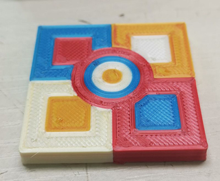

## Test Gcode file
### xyz_cube
 A simple test gcode file for verifing if the machine is working well.  

### TempCal_PLA
A test gcode file to check the best printing temperature of your filament (190~235 degree)

### 1C_3DBenchy
A classic printing quanlity test file, one color

### 1C_dog
A classic printing quanlity test file, one color

### 4C_Test
[:arrow_down: **Download gcode file**](./E4_4C/Z9E4_4CTest.zip)  

 
### 4C_3DBenchy
[:arrow_down: **Download gcode file**](./E4_4C/Z9E4_4C_3DBenchy.zip)  

### 4C_3DBenchy
[:arrow_down: **Download gcode file**](./E4_4C/Z9E4_4C_3DBenchy.zip)  
