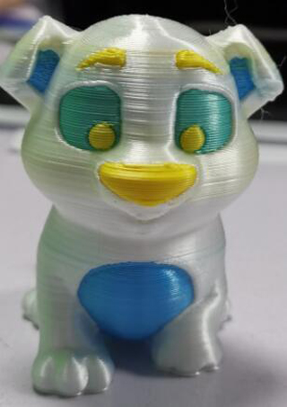

## Test Gcode file
:warning: Note: Download the zip files and then unzip to your PC and then copy to SD card.
### xyz_cube
 A simple test gcode file for verifing if the machine is working well.    
 [:arrow_down: **Download gcode file**](./E4_4C/Z9E4_4CTest.zip)  

### TempCal_PLA
A test gcode file to check the best printing temperature of your filament (190~235 degree)    
[:arrow_down: **Download gcode file**](./E4_4C/Z9E4_4CTest.zip)    

### 1 Color 3DBenchy
A classic printing quanlity test file, one color    
[:arrow_down: **Download gcode file**](./E4_4C/Z9E4_4CTest.zip)    

### 1 Color dog
A classic printing quanlity test file, one color    
[:arrow_down: **Download gcode file**](./E4_4C/Z9E4_4CTest.zip)    

### 4 Colos Test
A test gcode file for 4 colors printing   
[:arrow_down: **Download gcode file**](./E4_4C/Z9E4_4C_Test.zip)     

 
### 4 Colors 3DBenchy
A classic printing quanlity test file, 4 colors    
[:arrow_down: **Download gcode file**](./E4_4C/Z9E4_4C_3DBenchy.zip)     

### 4 Colors Dog
[:arrow_down: **Download gcode file**](./E4_4C/Z9E4_4C_Dog.zip)     

### 4 Colors Owl
[:arrow_down: **Download gcode file**](./E4_4C/Z9E4_4C_OWL.zip)  

### 4 Colors Patrick
[:arrow_down: **Download gcode file**](./E4_4C/Z9E4_4C_Patrick.zip)  

### 4 Colors Rabbit Pot
[:arrow_down: **Download gcode file**](./E4_4C/Z9E4_4C_Rabbit_Pot.zip)  

### 4 Colors Treefrog
[:arrow_down: **Download gcode file**](./E4_4C/Z9E4_4C_treefrog.zip)  

