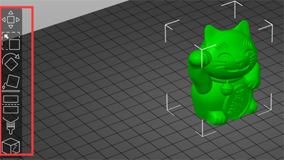
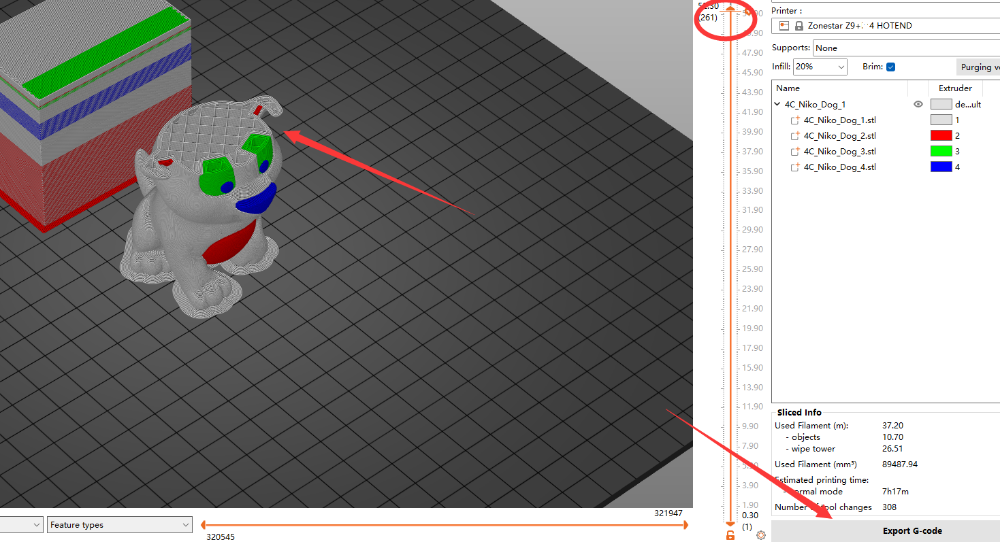

### :globe_with_meridians: Choose Language (Translated by google)

-----
# PrusaSlicer slicing guide for ZONESTAR 3D Printer 
#### :warning:NOTE: About the newest slicing guide of PrusaSlicer, please refer to [**here**](https://github.com/ZONESTAR3D/Slicing-Guide/tree/master/PrusaSlicer).

-----
## :book: Contents
1. [Download PrusaSlicer](#1-download-prusaslicer)
2. [Run PrusaSlicer and choose the printer ](#2-run-prusaslicer-and-choose-the-printer)
3. [Choose system presets](#3-choose-system-presets)
4. [Slicing one color](#4-slicing-one-color)
5. [Slicing muti-color for E4 hotend](#5-slicing-muti-color-for-e4-hotend)

-----
## 1. Download PrusaSlicer
#### For windows system (win 7/8/10/11) 
- :movie_camera: [**Download and install slicing software**](https://youtu.be/SgyXD-kQIeo)
- :arrow_down: [**Download PrusaSlicer 2.4.2 with ZONESTAR 3D Printer Profiles**](https://github.com/ZONESTAR3D/Slicing-Guide/releases)     
Download it and unzip it to your PC or laptop, and then find and run the "PrusaSlicer.exe".  

#### For Macos or linux
- [**Download PrusaSlicer software**](https://github.com/prusa3d/PrusaSlicer/releases)
- [**Download profiles**](https://downgit.github.io/#/home?url=https:%2F%2Fgithub.com%2FZONESTAR3D%2FSlicing-Guide%2Ftree%2Fmaster%2FPrusaSlicer%2FProfiles)
- Copy Profiles to "resource/profiles" directory of the installation directory of the PrusaSlicer software.

## 2. Run PrusaSlicer and choose the printer 
#### 2.1 Find the PrsuaSlicer.exe and click it to run

#### 2.2 Choose your printer, "Other Vendors>>Zonestar FFF>>your printer model>>finish"

## 3. Choose system presets
Choose system presets according to your printer, hotend and the colors you want to print.    
:warning: Note: Default Z9V5Pro-MK4 eqipped with a E4 hotend.
- If you print one color, choose "Z9 + One Color"  
- If your printer has a E4 (4-IN-1-OUT Non-mixing color) hotend and print multi-color, choose "Z9 + E4 HOTEND"  
- If your printer has a M4 (4-IN-1-OUT mixing color) hotend and print multi-color, choose "Z9 + M4 HOTEND" 
- If you printer has a Direct Drive Extruder, choose “Z9 + DDE”  

## 4. Slicing one color
- :movie_camera: [**Slicing guide - for one color printing**](https://youtu.be/SgyXD-kQIeo4) 
#### 4.1 choose printer presets "Z9 + One Color"

#### 4.2 load 3d model file (stl/obj/AMF file etc.)

#### 4.3 Choose print filament type

#### 4.4 If need, you can resize, cut, rotate the 3d model 
  
#### 4.5 Set the print settings: layer height, print speed, support, infill, etc.
  
You may need to set these parameters according to the shape of the model and your requirements for print quality. For some models, the object even cannot be printed successfully if the settings is incorrect. For details please refer to:
- [**PrusaSlicer introduction**](https://www.prusa3d.com/page/prusaslicer_424/)
#### 4.6 Slicing
  
#### 4.7 Preview the sliced result (gcode file) and then save to gcode file to your PC and then copy to SD card
  

#### :warning: NOTE: While you print one color by E4 (4-IN-1-OUT Non-Mixing) Hotend, only load one filament to which used extrusion feeder and feed it into any one channel of hotend.
#### :warning: NOTE: While you print one color by M4 (4-IN-1-OUT Mixing) Hotend, you can: 
- (**RECOMMENDED**) Load filament to that extrusion feeders used, feed it into the center channel of the hotend. And close unused channels of the hotend by "hotend clean tools".
- Or load all filaments to extrusion feeders and feed all filaments into all channels of the hotend.

## 5. Slicing muti-color for E4 hotend
- :movie_camera: [**Slicing guide - for multi colors printing**](https://youtu.be/AIKrszmxvE4)  
#### 5.1 choose printer presets "Z9 + E4 hotend"

#### 5.2 load 3d model files (stl/obj/AMF file etc.)
 
##### :memo: Usually, "split model" is inneed to print multi-color, that is, a 3d model has been split into multiple STL files according to colors, and these files use the same origin coordinate position so that they can be merged correctly.
##### :star2: PrusaSlicer has a very powerful new feature. It can painting any 3d model into multi colors. For details, please refer to
:movie_camera: [**Slicing guide - Convert one color 3d file to multi colors**](https://youtu.be/Yx4fKDRGEJ4) 
#### 5.3 Choose print filament type - PLA and set filament color

#### 5.4 Assign extruders to different parts

#### 5.5 If need, you can resize, cut, rotate the 3d model 
  
#### 5.6 Set the print settings: layer height, print speed, support, infill, etc.
  
You need to set these parameters according to the shape of the model and your requirements for print quality. Even for some models, printing cannot be completed normally without support. For details please refer to:
- [**PrusaSlicer introduction**](https://www.prusa3d.com/page/prusaslicer_424/)
- [**Slic3r User Manuual**](https://manual.slic3r.org/)
#### 5.7 Set parameters for "wipe tower"
##### You may notice that a square square will appear in the sliced figure, which is called "Wipe tower" in PrusaSlicer. Because for the multi-color printer, while switching extruders, there are still the previous color filaments inside the hotend, it need to be clean before printing another color.   
    
In order to obtain better cleaning effect and minimize to waste filament, we can set the amount of  purge volume according to different colors. Please pay attention to the following table, the columns shows the filament color of the last extruder printed, and the rows shows the filament color of the next extruder to be printed. When we change from the extruder with lighter color filament to the extruder with darker color filament, we can set a smaller purge volume. On the contrary, when we change from the darker color filament to the  lighter color filament, we need to set a bigger purge volume.   
  
#### 5.8 Slicing
  
#### 5.9 Preview the sliced result (gcode file) and then save to gcode file to your PC and then copy to SD card
   
:star:When previewing the gcode file, you can see that some additional print lines will appear on the side of bed, which are for preloading filament. For detail how to pre-load filament, please refer to [:book:**E4 Hotend user guide**](https://github.com/ZONESTAR3D/Upgrade-kit-guide/tree/main/HOTEND/E4%204-IN-1-OUT%20Non-Mixing%20Color%20Hotend#4-in-1-out-non-mix-color-hotend-user-guide).
  

-----
## :warning: ATTETION PLEASE :warning:
Default Z9V5-MK4 used a E4 (4-IN-1-OUT **Non-Mix Color** Hotend) hotend, **if you have upgraded a Mixing Color Hot end**, please refer to [**here**](https://github.com/ZONESTAR3D/Slicing-Guide/blob/master/PrusaSlicer/PrusaSlicerGuide_M4.md) to slicing.
