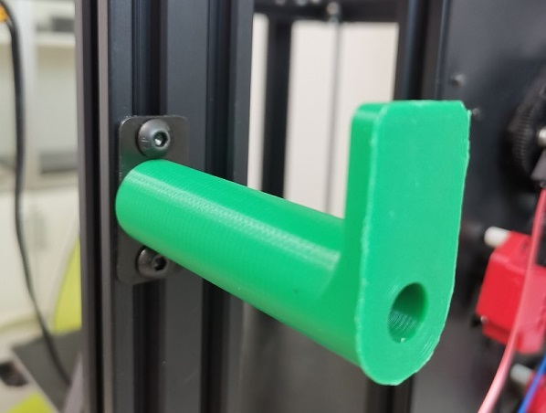

## Parts_Stl
### hotend fan duck 
The hotend fan duck stl file to improve the effeciency of cooling.    
- :arrow_down:[**E4 hotend fan duck**](fan_duck_e4_v2.zip)
- :arrow_down:[**M4 hotend fan duck**](fan_duck_m4_v4.zip)  
  

### Filament Spool Bracket
Support more types of filament spool.    
- :arrow_down:[**FilamentSpoolBracket_70mm**](FilamentSpoolBracket_70mm.zip)  
- :arrow_down:[**FilamentSpoolBracket_90mm**](FilamentSpoolBracket_90mm.zip)  

### Filament run out sensor
- :arrow_down:[**Case of filament run out sensor**](FRODV6.zip)

### Recyclebin
A box (Installed  on the z-axis aluminum profile at the front left) to collect filament flowed out from the nozzle.     
- :arrow_down:[**Filament recyclebin box**](Recyclebin.zip)

### tool supports  
- :arrow_down:[**Support for the tools  **](./Z9_tool_supports.zip)

