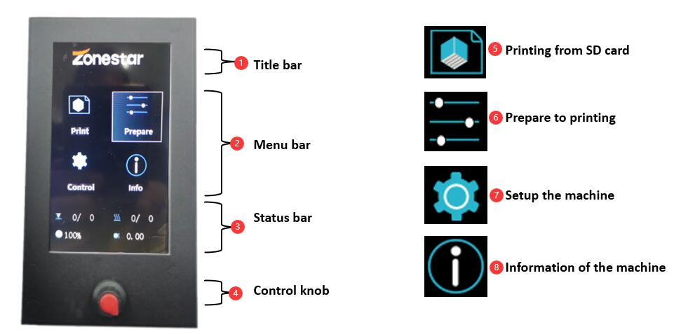
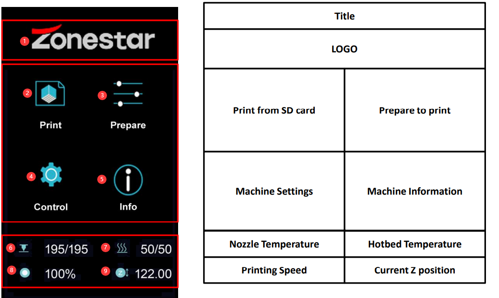
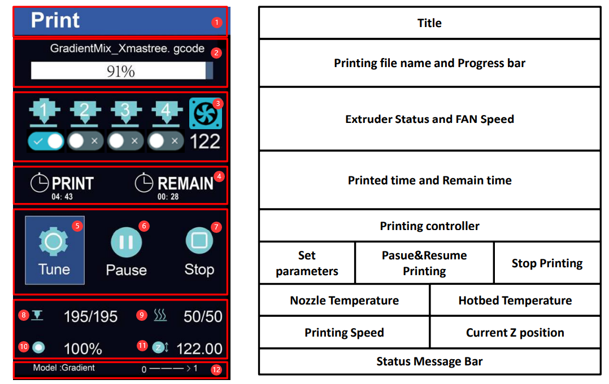
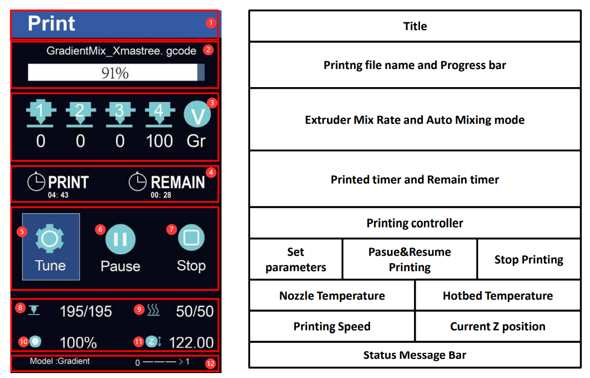
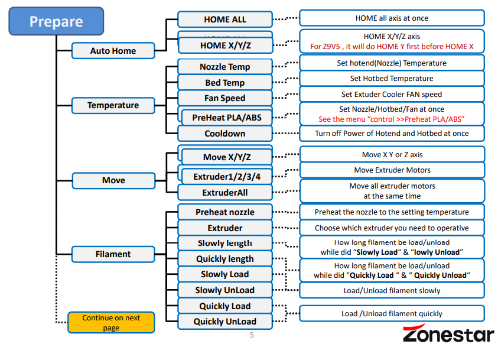
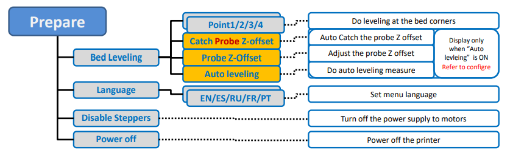
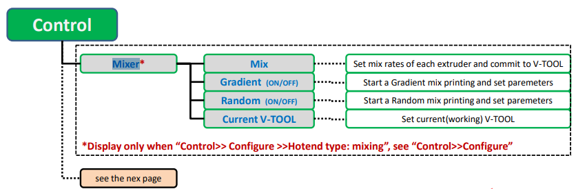
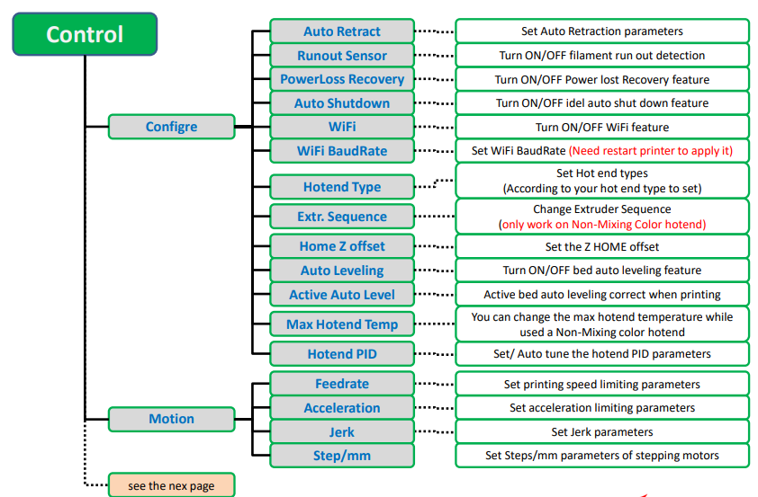
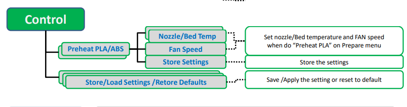
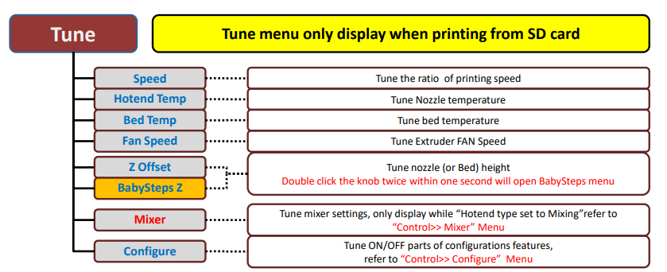

### :globe_with_meridians: Choose Language (Translated by google)

-----
## Brief of the Control Panel 

### Intruduction of menu
  >
    1. Title bar          2. Menu bar       3. Status bar         4. Control knob
    5. Printing Menu      6. Prepare Menu   7. Setup Menu         6. Information Menu
### Operation of the knob
- **Press:**                  Execute command / Enter menu.
- **Rotate clockwise:**       Increase the value / Move to the next menu item.
- **Rotate anti-clockwise:**  Decrease the value / Move to the pervious menu item.

-----
## LCD Menu Description 

### Main Menu

  >
    1. LOGO                   2. Print from SD card            3. Prepare to print
    4. Machine Settings       5. Machine Information           6. Nozzle Temperature
    7. Hotbed Temperature     8. Printing Speed                9. Current Z position

### Printing status Menu (Hotend Type set to “Non-mixing�

  >
    1. Titel                              2. Printing file name and Progress bar      3. Extruder Status and FAN Speed
    4. Printed time and Remain time       5. Set printing parameters                  6. Pasue&Resume Printing
    6. Stop Printing                      7. Nozzle Temperature                       8. Hotbed Temperature     
    9. Printing Speed                     10. Current Z position                      12.Status Message Bar

### Printing status Menu (Hotend Type set to “Mixing�

  >
    1. Titel                              2. Printing file name and Progress bar      3. Extruder Mix Rate and Auto Mixing mode
    4. Printed time and Remain time       5. Set printing parameters                  6. Pasue&Resume Printing
    6. Stop Printing                      7. Nozzle Temperature                       8. Hotbed Temperature     
    9. Printing Speed                     10. Current Z position                      12.Status Message Bar

### Prepare Menu

|     Level 1        |     Level 2    |                         Description                            |
|:------------------:|:--------------:|:---------------------------------------------------------------|
|     Auto Home      |  HOME ALL      |  HOME all axis at once                                         |
|     Auto Home      |  HOME X        |  HOME X axis                                                   |
|     Auto Home      |  HOME Y        |  HOME Y axis                                                   |
|     Auto Home      |  HOME Z        |  HOME Z axis                                                   |
|                    |                |                                                                |
|     Temperature    |  Nozzle Temp   |  Set Nozzle(hotend) Temperature                                |
|     Temperature    |   Bed Temp     |  Set Hotbed Temperature                                        |
|     Temperature    |   Fan Speed    |  Set Extuder Cooler FAN speed                                  |
|     Temperature    |  PreHeat PLA   |  Set Nozzle/Hotbed at once (lower temperature for PLA filament)|
|     Temperature    |  PreHeat ABS   |  Set Nozzle/Hotbed at once (lower temperature for ABS filament)|
|     Temperature    |   Cooldown     |  Stop heating Hotend and Hotbed at once                        |
|                    |                |                                                                |
|       Move         |    X           |  Move X axis                                                   |
|       Move         |    Y           |  Move X axis                                                   |
|       Move         |    Z           |  Move X axis                                                   |
|       Move         |    Extruder(n) |  Move Extruders (to feed/unload filament)                      |
|       Move         |    Extruder All|  Move All Extruders (to feed/unload filament)                  |
|                    |                |                                                                |
|     Filament       |Preheat nozzle  |  Preheat the nozzle to the setting temperature                 |
|     Filament       |Extruder        |  Choose which extruder to operate                              |
|     Filament       |Slowly length   |How long filament be load/unload while did “Slowly Load�& “lowly Unload�|
|     Filament       |Quickly length  |How long filament be load/unload while did “Quickly Load �& �Quickly Unload“|
|     Filament       |Slowly Load     |Load filament slowly                                            |
|     Filament       |Slowly UnLoad   |Unload filament slowly                                          |
|     Filament       |Quickly Load    |Load filament quickly                                           |
|     Filament       |Quickly UnLoad  |Unload filament quickly                                         |
|                    |                |                                                                |
|   Bed Leveling     |Point 1         |Do leveling at the bed corner 1                                 |
|   Bed Leveling     |Point 2         |Do leveling at the bed corner 2                                 |
|   Bed Leveling     |Point 3         |Do leveling at the bed corner 3                                 |
|   Bed Leveling     |Point 4         |Do leveling at the bed corner 4                                 |
|   Bed Leveling     |Catch Probe Z-offset|Auto Catch the probe Z offset (Display only “Auto levleing�is ON)|
|   Bed Leveling     |Adjust the probe Z offset|Auto Catch the probe Z offset (Display only “Auto levleing�is ON)|
|   Bed Leveling     |Auto leveling|Do auto leveling measure (Display only “Auto levleing�is ON)      |
|                    |                |                                                                |
|   Language         | EN/ES/RU/FR/PT | Set menu language                                              |
|   Disable Steppers |                | Turn off the power supply to motors                            |
|   Power off        |                | Power off the printer                                          |

### Control Menu

#### Control Menu Description
| Menu 2           | Menu 3            |                             Description                                           |  
|------------------|-------------------|-----------------------------------------------------------------------------------|  
| Mixer*           |Mix                |Set mix rates of each extruder and commit to V-TOOL                                |  
|                  |Gradient(ON/OFF)   |Start a Gradient mix printing and set paremeters                                   |  
|                  |Random (ON/OFF)    |Start a Random mix printing and set paremeters                                     |  
|                  |Current V-TOOL     |Set current(working) V-TOOL                                                        |  
| Configre         |Auto Retract       |Set Auto Retraction parameters                                                     |  
|                  |Runout Sensor      |Turn ON/OFF filament run out detection feature                                     |  
|                  |Auto Unload        |Auto unload filament when printing is abort (only works on Non-mix color hot end)  |  
|                  |PowerLoss Recovery |Turn ON/OFF Power lost Recovery feature                                            |  
|                  |Auto Shutdown      |Turn ON/OFF idel auto shut down feature                                            |  
|                  |WiFi               |Turn ON/OFF WiFi feature                                                           |  
|                  |WiFi BaudRate      |Set WiFi BaudRate (Need restart printer and change the WiFi module BaudRate)       |  
|                  |Hotend Type        |Set Hot end types (according to your hot end type)                                 |  
|                  |Extr. Sequence     |Change Extruder Sequence (only work on Non-Mixing Color hotend)                    |  
|                  |Home Z offset      |Set the Z HOME offset                                                              |  
|                  |Auto Leveling      |Turn ON/OFF bed auto leveling feature                                              |  
|                  |Active Auto Level  |Active bed auto leveling correct when printing                                     |  
|                  |Hotend PID         |Set the hotend PID parameters                                                      |  
| Motion           |Feedrate           |Set printing speed limiting parameters                                             |  
|                  |Acceleration       |Set acceleration limiting parameters                                               |  
|                  |Jerk               |Set Jerk parameters                                                                |  
|                  |Step/mm            |Set Steps/mm parameters of stepping motors                                         |  
| Preheat PLA      |Nozzle Temp        |Set nozzle temperaturewhen do “Preheat PLA�on Prepare menu                        |
|                  |Bed Temp           |Set Bed temperature when do “Preheat PLA�on Prepare menu                          |
|                  |Fan Speed          |Set FAN speed when do “Preheat PLA�on Prepare menu                                |
|                  |Store Settings     |Store above settings                                                               |  
| Preheat ABS      |Nozzle Temp        |Set nozzle temperaturewhen do “Preheat ABS�on Prepare menu                        |
|                  |Bed Temp           |Set Bed temperature when do “Preheat ABS�on Prepare menu                          |
|                  |Fan Speed          |Set FAN speed when do “Preheat ABS�on Prepare menu                                |
|                  |Store Settings     |Store above settings                                                               |  
| Store Settings   |                   |Save the settings                                                                  |  
| Load Settings    |                   |Load the settings from NVRAM (maybe it has been changed by Gcode command)          |  
| Restore Default  |                   |Reset NVRAM settings to the factory status                                         |  

*Display only when “Control>> Configure >>Hotend type: mixing� see “Control>>Configure"

### Tune Menu
:warning: Tune menu only display when printing from SD card.

##### Tune Menu Description

| Menu item        |                             Description                                                |  
|------------------|----------------------------------------------------------------------------------------|  
| Speed            |Set the ratio of printing speed                                                         |
| Flow Rate        |Set the flow rate of extruder                                                           |
| Nozzle Temp      |Set Nozzle temperature                                                                  |
| Bed Temp         |Set Bed temperature                                                                     |
| Fan Speed        |Set Extruder FAN Speed                                                                  |
| Z Offset         |Tune Z offset                                                                           |
| Mixer            |Set mixer,refer to “Control>> Mixer�Menu (only display while “Hotend type is Mixing�  |
| Configure        |Tune ON/OFF parts of configurations features, refer to “Control>> Configure�Menu       |

---
### :blue_book: [How to upgrade firmware of DWIN LCD Screen](https://github.com/ZONESTAR3D/Upgrade-kit-guide/tree/main/TFT-LCD/LCD-DWIN#update-image-data-of-dwin-lcd)
