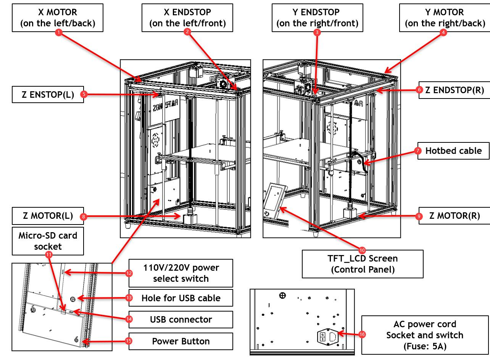
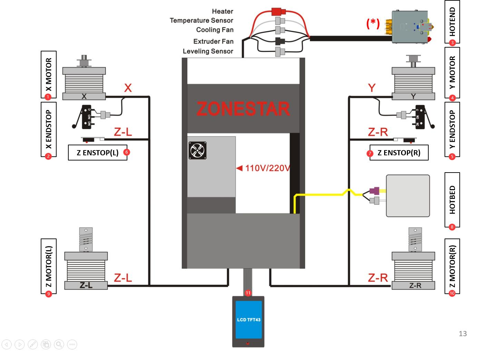
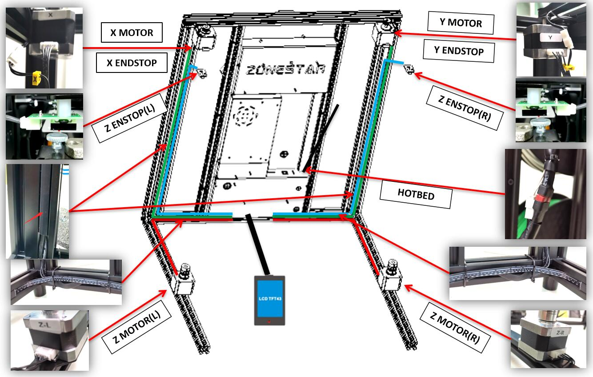
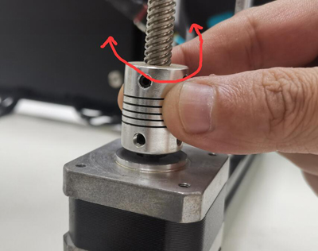
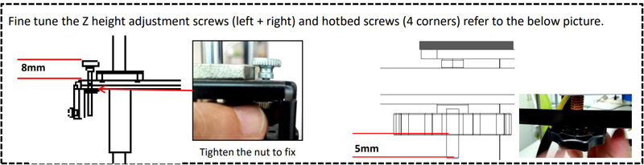
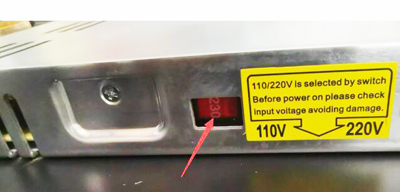
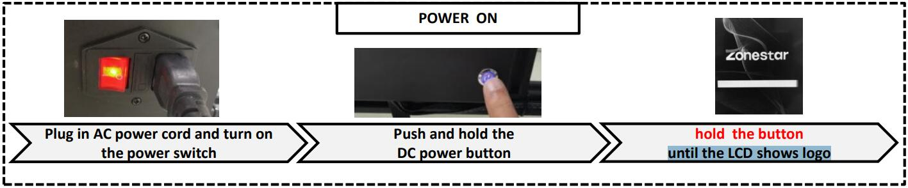
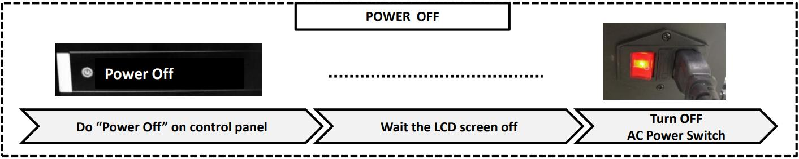

### :globe_with_meridians: Choose Language (Translated by google)

-----
# Z9V5-MK5 wiring guide
## [:clapper: Wiring video tutorial]()
## About the electronics parts
#### Please refer to the following figure to understand the location and name of the electronic components of the machine.

>
     1. X motor (on the left/back) 2. X ENDSTOP (on the left/front) 3. Y ENDSTOP (on the right/front)  4. Y motor (on the right/back)
     5. Left Z ENDSTOP             6. Right Z ENDSTOP               7. Cable for Heat bed              8. Left Z motor                       
     9. Right Z motor             10. LCD Screen (Control Panel)   11. Micro-SD card socket           12. 110V/220V power select switch
    13. Hole for USB cable        14. USB connector                15. DC Power Button                16. AC power socket and switch
## Wiring Diagram
#### Plug the wiring connector to the connectors of the electronic component as shown in the following figure, incude:
- **X motor wire and X ENDSTOP**
- **Y motor wire and Y ENDSTOP**
- **Left and right Z motor wire and Z ENDSTOP**
- **Hot bed cable (power and temperature sensor)**
- **LCD screen**
- **Hot end assembly (*Note: Hot end wires has already connected before the kit leaving factory.*)**

## Layout the wires
#### Put the wires to the profile grooves, cover with profile plastics strips. Tie the wires to the profiles after connected.
#### :warning: Be careful not to damage the insulation of wires when puting the motor cables to the profile grooves.

## Inspection and confirm the wiring
### Confirm all wires are properly connected to the connectors.
#### Confirm the X/Y axis move smoothly by moving the "print head" manually.
#### Confirm the motor shaft has fixed with the lead screws properly by rotating both of the Z couplings manually.

#### Confirm the Z-axis limit switch adjustment knob and the hot bed screw have been adjusted to the specified position.

#### :warning:Confirm the AC voltage select switch of the power supply has been set to the correct position.

## Power on the machine
#### 1. Connect one end of the power cord (female base) to the printer, and then connect the other end of the power cord to your power outlet. Turn on the AC power switch of the 3d printer.
#### 2. Push and hold the DC power button, until you can see the LCD shows "logo screen", release the DC power button.

##### Tips: If you need to power off the printer, please turn off the printer on LCD screen first and then turn off the AC power switch.

## Final inspection 
#### :book: About LCD Menu description, please refer to [this guide](https://github.com/ZONESTAR3D/Z9/tree/main/Z9V5/Z9V5-MK5/1.Installation_and_User_Guide/LCDMENU_Description.md).
Now you have completed the wiring, but please follow the steps below to perform a simple inspection before using the machine.
1. Power on the printer.
2. Rotate and press the knob on the control panel (LCD screen) to check if the control panel is working properly.
3. Use the knob to move the menu "Prepare>>Auto Home>>Home All", and press the knob to do. The machine will follow these steps to operate:
    - The printing platform move down a few millimeters.
    - The Y-axis move forward until it reaches the Y ENDSTOP (a limit switch on the top-right of the machine).
    - The print head move to the left until the housing of the print head touches the X ENDSTOP (a limit switch on the top-left of the machine).
    - The printing platform move upwards until the Z-axis height adjustment screws touches the Z ENDSTOP (limit switch on the top of Z carrier).        
:warning: If the machine doesn't work properly, please refer to the [**troubleshooting**](https://github.com/ZONESTAR3D/Z9/tree/main/Z9V5/Z9V5_FAQ#faq-for-z9v5) to check it first.
4. Use the knob to move the menu "Prepare>>Temperature>>Preheat PLA", and press the knob to do. And then watch the hot bed and hot end temperature shows on LCD screen, they will rise up to the setting temperature.
5. Power off the printer after finish the above steps.

## :fireworks: Congratulate! 
Now, you have completed the wiring. Next, please refer to the [**operating manual**]((https://github.com/ZONESTAR3D/Z9/tree/main/Z9V5/Z9V5-MK5/1.Installation_and_User_Guide/Operation.md) to make necessary adjustments to the machine and complete several printing tests to familiarize yourself with the operation of the machine.

