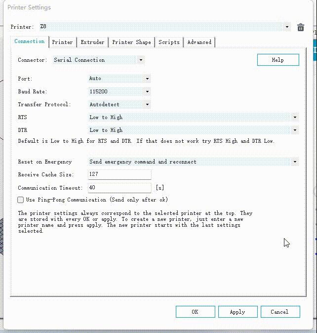

### Choose Language (Translated by google)

-----
## Brief user guide of Repetier-Host
:warning: Repetier-host is a free software for 3d printer control and silcinig, you can download it for free. If you are satisfied with the this software, you can donations to the developers. Please note that ZONESTAR have no interest relationship with developers.   
### Step:one:: Download repetier-host software and then install to your PC.    
- **[:arrow_down:Download repetier-host](https://www.repetier.com/download-now/)**     
:warning:Don't choose the "Repetier-Server" when installing the software.    
     
### Step:two:: Set printer settings
- Set a printer name, choose "connector" to "Serial connection" and set the Baud rate to "115200". You don't need to set the com Port in this step.     

- Set other settings, extruder, shape, etc.     

### Step:three:: Power on the printer first and then connect 3d printer with PC by a USB cable
     
Open the "connection" page of "printer setting", when pluging the USB cable to PC, a new port will be showed out in the "Port" item, this new port is the com port of your 3d printer.   
     
:warning: Note: If the port doesn't show out, you many need to install the USB driver. please download the USB driver (Click [here :arrow_down:](./USBDriver.zip) to download) and then install to your PC.     
PS: Usually you don't need to install the USB driver in Windows10, Windows11, and newer version MacOs, Linux.    
:blue_book:[Manually updating drivers in Windows](https://support.microsoft.com/en-us/windows/update-drivers-manually-in-windows-ec62f46c-ff14-c91d-eead-d7126dc1f7b6)

### Step:four:: Connect the printer with PC and then control it, or load gcode file to start print
     
:blue_book:About more detail user guide, please refer to the [manual of Repetier-host](https://www.repetier.com/documentation/repetier-host/)

