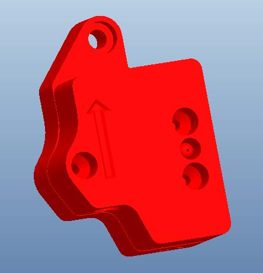
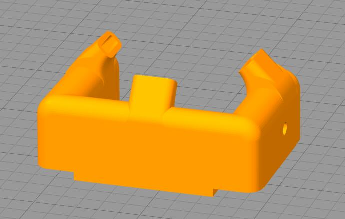

## Parts_Stl
### Recyclebin
A box (Installed  on the z-axis aluminum profile at the front left) to collect filament flowed out from the nozzle.     
- :arrow_down:[**Filament recyclebin box**](https://github.com/ZONESTAR3D/Z9/tree/main/Z9V5/Z9V5-MK5/6.PrintParts/Recyclebin.zip)    

### tool supports  
- :arrow_down:[**Support for the tools**](https://github.com/ZONESTAR3D/Z9/tree/main/Z9V5/Z9V5-MK5/6.PrintParts/Z9_tool_supports.zip)    

### Filament Spool Bracket
Support more types of filament spool.    
- :arrow_down:[**FilamentSpoolBracket_70mm**](https://github.com/ZONESTAR3D/Z9/tree/main/Z9V5/Z9V5-MK5/6.PrintParts/FilamentSpoolBracket_70mm.zip)   
- :arrow_down:[**FilamentSpoolBracket_90mm**](https://github.com/ZONESTAR3D/Z9/tree/main/Z9V5/Z9V5-MK5/6.PrintParts/FilamentSpoolBracket_90mm.zip)   

### Filament run out sensor
- :arrow_down:[**Case of filament run out sensor**](https://github.com/ZONESTAR3D/Z9/tree/main/Z9V5/Z9V5-MK5/6.PrintParts/FRODV6.zip)    

### hotend fan duct  
- :arrow_down:[**M4 hotend fan duct**](https://github.com/ZONESTAR3D/Z9/tree/main/Z9V5/Z9V5-MK5/6.PrintParts/fan_duct_m4_v4.zip)   
  

### Made by customers
- [**Z9V5 Spool Holder by MichaW**](https://www.thingiverse.com/thing:4977619)
- [**Z9V5 Purge chute and nozzle clean by AFelix**](https://www.thingiverse.com/thing:4940319)
- [**Z9V5 Fan duct by Memphisrain**](https://www.thingiverse.com/thing:5754401)
