# Z9V5Pro-MK6 Installation guide

-----
## [:clapper: Installation video tutorial](https://youtu.be/TGHUVzV1Pg4)

-----
## :warning:ATTENTION:warning: 
### :beginner: Please strictly follow the standard operation when installation.
### :children_crossing: Please put the printer away from the reach of kids.
### :underage: Must be guided by adults when children are installed or used.
### :zap: Take care when installation, to avoid electrical shock hazards.
### :hotsprings: Hotend has high temperature even the printer stop working.
### :hotsprings: Hotbed has high temperature even the printer stop working.
### :smoking: Please keep well-ventilated condition! May produce toxic gases when printer working.

-----
## Parts list
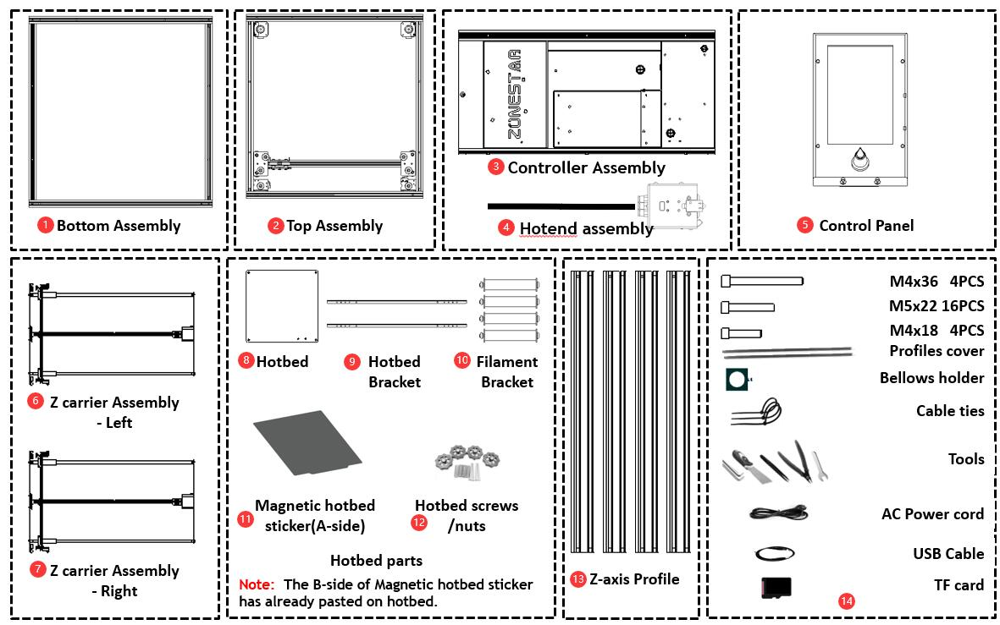    
>
     1. Bottom Assembly            2. Top Assembly               3. Controller Assembly          4. Hot end assembly          
     5. Control Panel              6. Left Z carrier Assembly    7. Right Z carrier Assembly     8. Hotbed                       
     9. Hot bed Bracket           10. Filament Bracket          11. Magnetic hotbed sticker     12. Hotbed screws /nuts       
    13. Z-axis Profile            14. Others (screws, tools, cable tie, SD card, Spare parts, etc.)

-----
## Before installation
### Machine View (after installed)
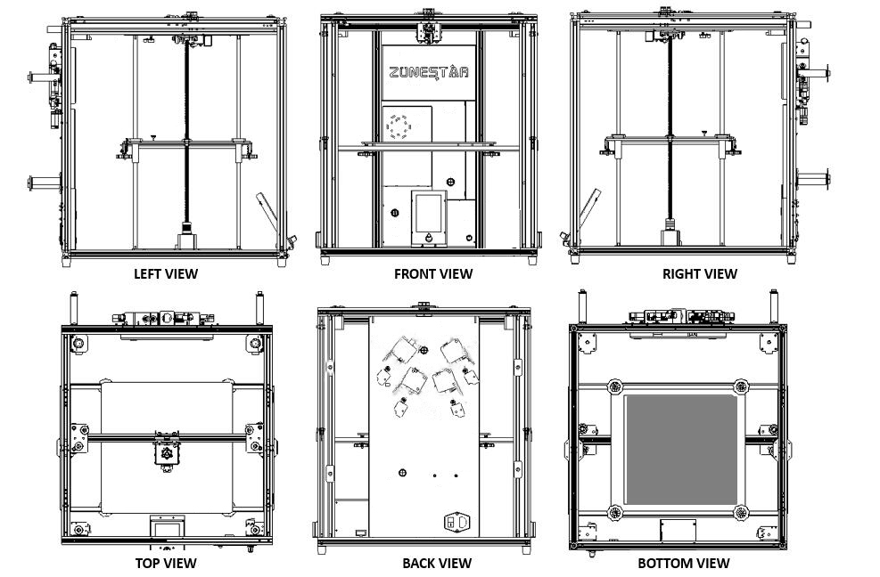
### Installation direction
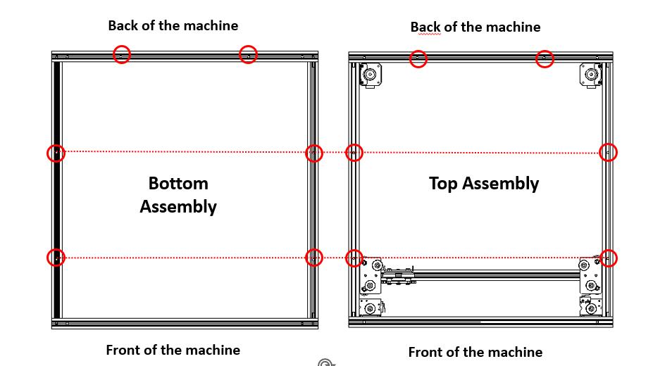     
### :warning: Pay attention to distinguish the front and back of the top and bottom assembly.     
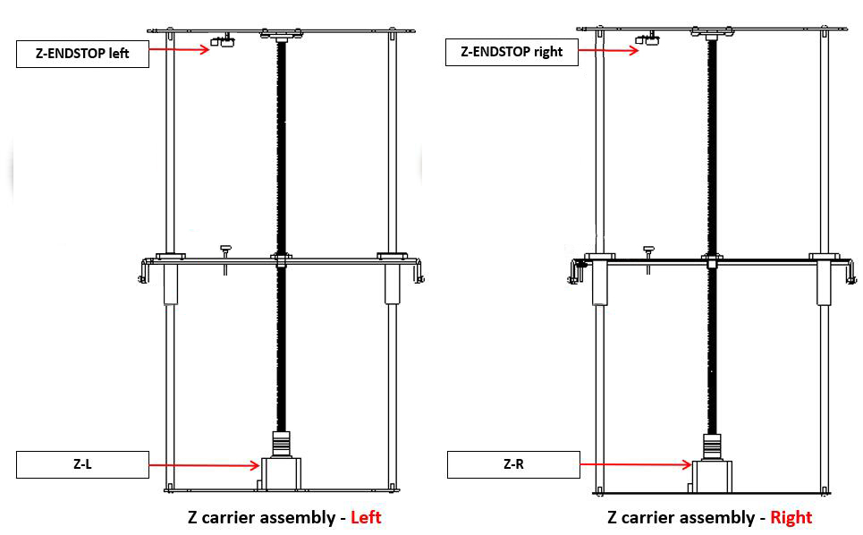    
### :warning: Pay attention to distinguish the left Z carrier assembly and the right Z carrier assembly.   

-----
## Assembly
### 1. Install Z profiles
#### Install 4 Z Profiles to the bottom assembly. Note that there is a hole on one of side of Z profile, this side should be toward to the upper. There is a hole next to the rubber foot pad of the bottom assembly, which is used to fix the Z-axis profile. Mount M5x22 screws from the bottom profiles upwards and secure to Z profile.
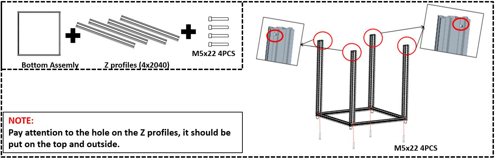          
### :warning: Pay attention to the hole on the Z profiles, it should be put on the top and outside.     
### 2. Install Left & Right Z carriers 
#### Install Left & Right Z carriers to the bottom assembly. Note that the side with a Z limit switch of the Z carrier should towards the back of the machine. Mount M4x18 screws from the bottom profile upwards and secure to the sheet metal of the Z carrier.
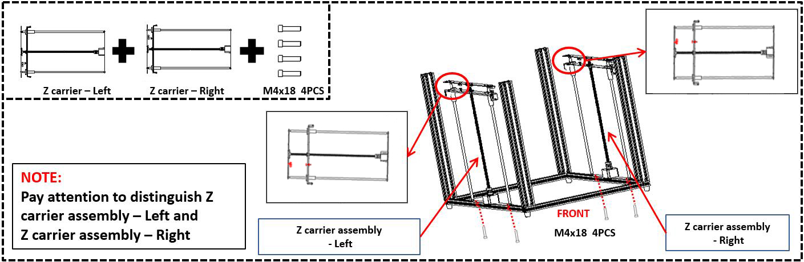       
### :warning: Pay attention to distinguish Left Z carrier assembly and Right Z carrier assembly.
### 3. Install top assembly
#### Place the top assembly (the side with motors on the back) on the Z-axis profiles, note that the screw cap of the Z carriers should be placed in the groove of the profile of top assembly. Two sides are fixed to the sheet metal of the Z carriers by using M4x36 long screws, use 4 PCS M5x22 screw to fix the top assembly and the Z-axis profiles, and use other 4 PCS M5x22 screws to fix the side of the Z profiles and the Y-axis profiles.
### :warning: Don't tighten these screws in this step.    
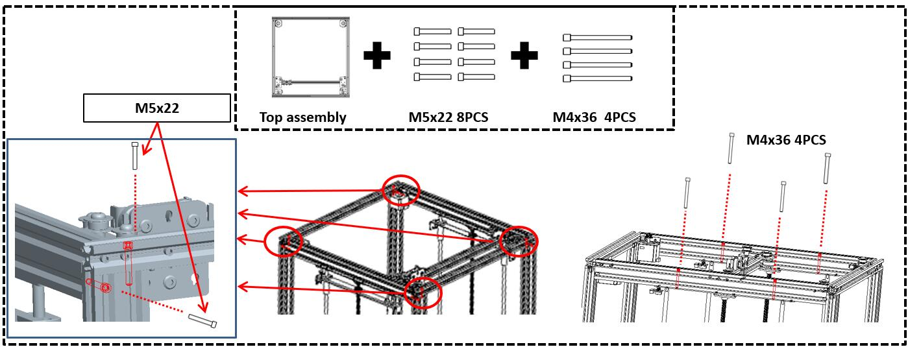       
### 4. Install controller assembly
#### 4.1 Put the control box assembly between the top assembly and the top assembly of the back of the machine, use 4 PCS M5x22 screws to fix it on the profiles.
#### 4.2 Tighten all those screws installed on step 3.  
#### 4.3 Install the bellows holder to the center of top-back profile.     
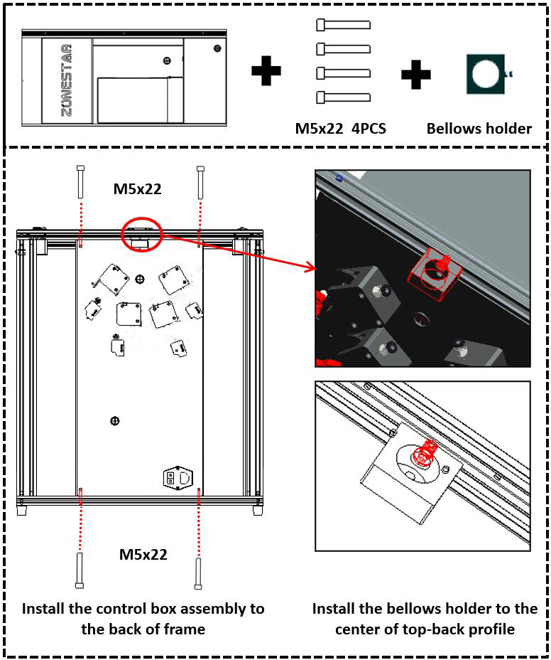   
### 5. Adjust the eccentric columns
#### 5.1 Adjust the eccentric columns (2 PCS on the left and 2 PCS on the right) under the Y carrier, and move the Y profile from front and back, ensure it can move smoothly and doesn’t shake.    
#### 5.2 Adjust the eccentric column under the X carriers, and move the X carriers from left and right, ensure it can move smoothly and doesn’t shake.    
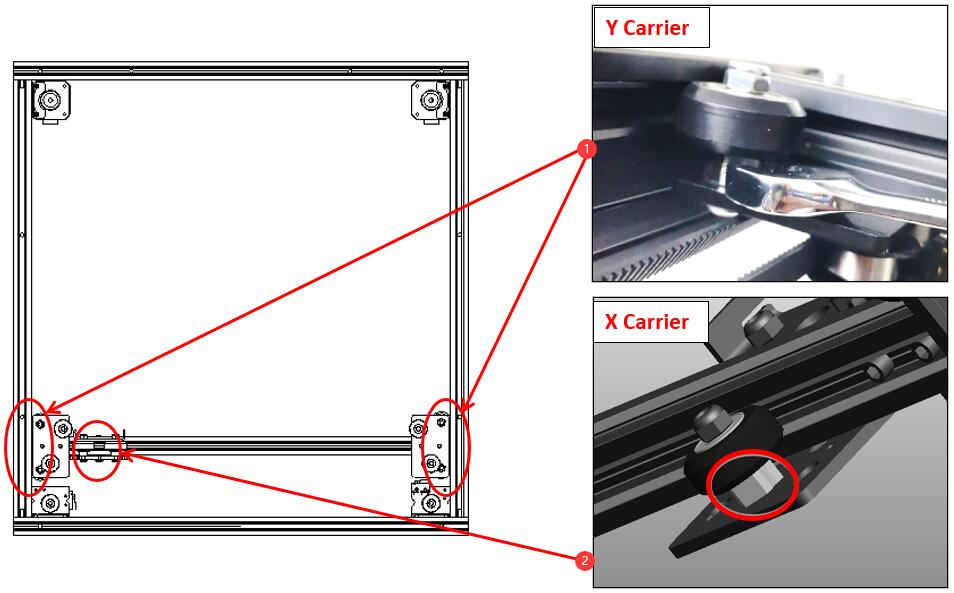   
### 6. Install hot bed parts
#### 6.1 Take down these M4 screws first on Z carriers metal pieces and then use these M4 screws to mount hot bed brackets on the Z carriers, 
#### 6.2 Install aluminum heat bed to the hot bed brackets, the springs should be placed between the heat bed and the bracket, install the hand nuts under the brackets.
### :warning: Note the the hotbed cable should be place to the right-back corner of the machine.  
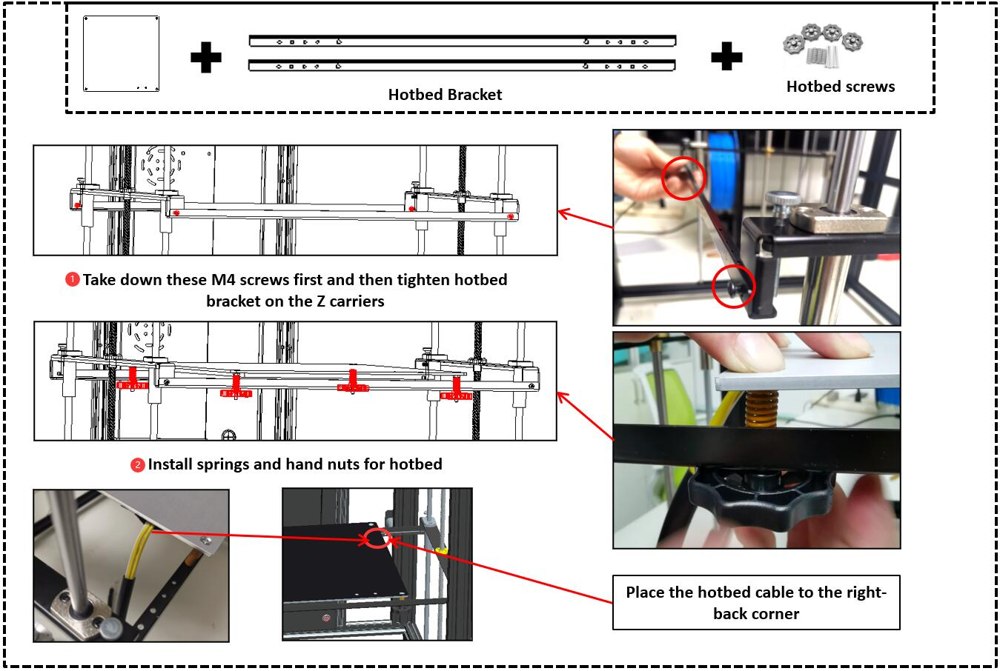  
### 7. Install control panel
#### Install control panel to the center of bottom-front profile.
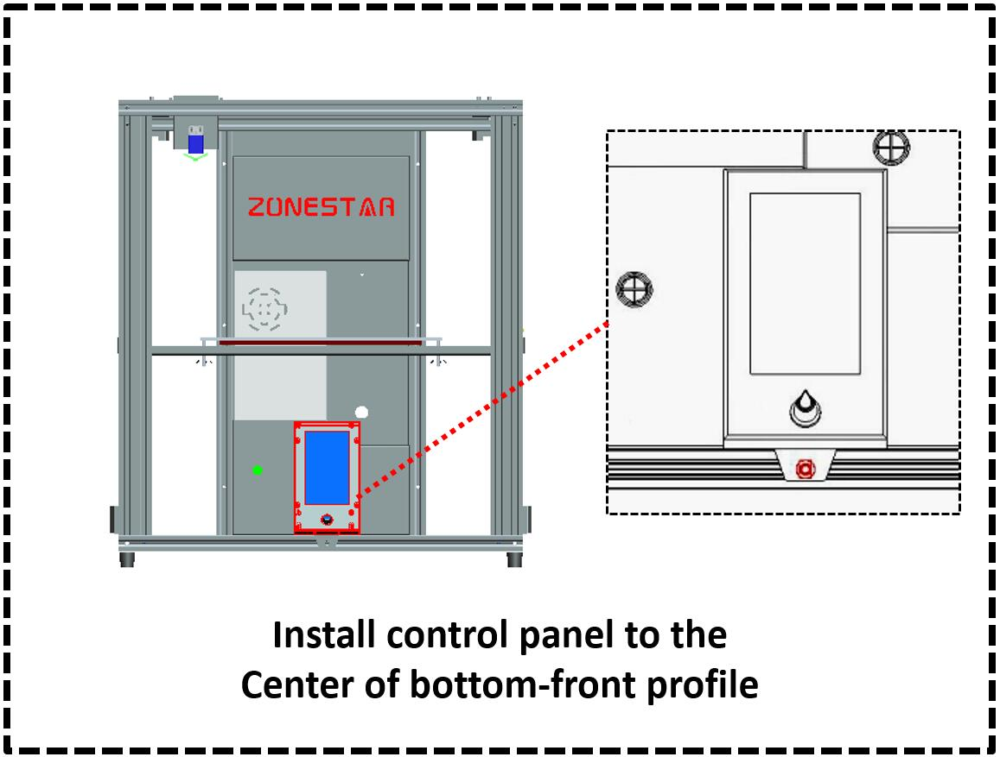  
### 8. Install filament holders
#### Install 4 sets of filament brackets to the back Z profiles.
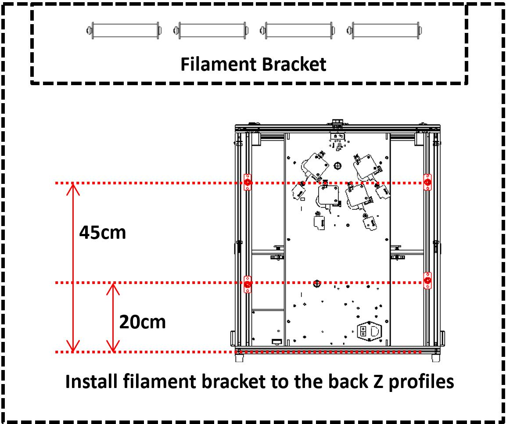  
### 9. Install hotend assembly
#### Loosen the 3 pcs of screws on the hot end assembly and then mount the hot end assembly to the X carrier.
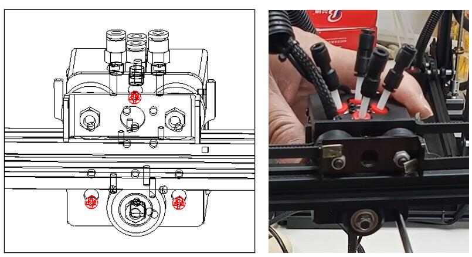  
### 10. Past the heat bed sticker
#### Place the "A side" of the magnetic hot bed sticker (that with PC film) on the hot bed (B side has already pasted on the heat bed).
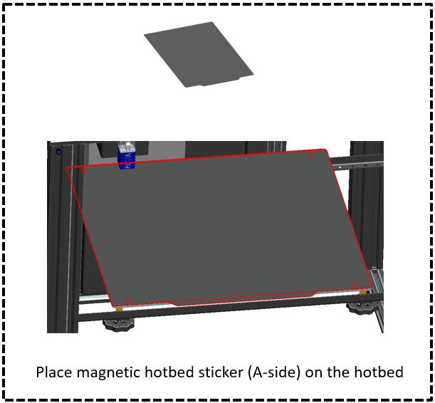  

-----
## :fireworks: Congratulate! 
Now the machine installation is announced to be completed, next you can arrange to wiring.      
- [**:book: Wiring Guide Online Document**](./Wiring.md).
- [**:blue_book: Wiring Guide pdf file**](./Wiring.pdf).

