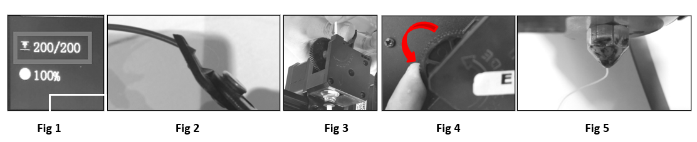

## <a id="choose-language">:globe_with_meridians: Choose language </a>

----
## 操作ガイド
印刷を開始する前に、ホットベッドを水平にし（ノズルと印刷プラットフォーム間の距離を微調整）、フィラメントを押出機とホットエンドにロードする必要があります。
## ホットベッドを水平にする
#### :warning: FDM 3D プリンタの場合、最初の層を印刷する際、ノズルとホット ベッドの間の距離が非常に重要です。 距離が近すぎると、フィラメントがノズルから流れ出すことができず、ノズルやホットベッドを損傷することもあります。 距離が遠すぎると、フィラメントをホットベッドに貼り付けることができず、次の層を正しく積み重ねることができず、印刷が失敗する可能性があります。
###### 
- **ステップ 1.** 3D プリンターの電源をオンにし、LCD メニューで ***Prepare>>Auto Home>>Home All*** を実行し、ホットエンドが HOME 位置に移動するまで待ちます。
- **ステップ 2.** ベッドの下のハンドナットを締めて、ベッドを最も低い位置まで下げます (Fig 1)。
- **ステップ 3.** コントロール パネルの ***Prepare>> Bed leveling>> Point 1*** を実行します (Fig 2)。ノズルがベッドの隅に移動し、ホットベッドの下のハンド ナットを緩めます。 (Fig 3)、ノズルがホットベッドにほぼ接触するようにします (Fig 4)。 4 つの角がすべて水平になるまで、***Point 2/3/4*** を続けます。
- **ステップ 4.** ステップ 3 を繰り返し、四隅がすべて同じ高さになるまで 2 ～ 3 周行います。

----
### フィラメントをロードする
###### 
このプリンタには、4 つの押出機と 1 つの 4-IN-1-OUT カラーミキシングホットエンドが装備されています。 押出機とホットエンドはフィラメントガイド（PTFEチューブ）で接続されています。 ***印刷する前に、4 本のフィラメントすべてを押出機にロードし、ホットエンドの底部にフィードする必要があります。***
- **ステップ 1.** コントロール パネルで ***Prepare>>Auto Home>>Home All*** を実行し、次に ***Prepare>>Temperature>>PLA Preheat*** を実行し、ノズル温度が到達するのを待ちます。 190℃まで（Fig1）。
- **ステップ 2.** 斜めペンチを使用してフィラメントの頭を切り落とし (Fig 2)、エクストルーダー #1 のハンドルを押してフィラメントを挿入し、PTFE の中にフィラメントが見えるまでフィラメントを押します。 ガイド (Fig 3)。 エクストルーダー #1 (Fig 4) のギアを回転させ、フィラメントがホットエンドの底に入るまで観察します。
- **ステップ 3.** ステップ 2 と同じ方法を使用して、フィラメントをエクストルーダー #2 ～エクストルーダー #4 にロードし、フィラメントがホットエンドの底部に入るまで観察します。
- **ステップ 4.** エクストルーダー #1 ～エクストルーダー #4 のギアを 1 つずつゆっくりと回転させ、ノズルからフィラメントが流れ出すのが確認できるまでノズルを観察します (Fig 5)。

----
### 「Hellow World」の作品を印刷します
#### 単一カラーのテスト ファイルを印刷する
###### 
- **ステップ 1.** SD カードをプリンターの SD カード ソケットに挿入します (Fig 1)。
- **ステップ 2.** コントロール パネルの ***Print*** アイコンをクリックし、***xyz_cube.gcode*** (Fig 2) を選択し、ノブをクリックして印刷を開始します。
- **ステップ 3.** ホットエンドとホットベッドが設定温度に達するまで待ちます (Fig 3)。ノズルは原点位置に戻り、印刷プラットフォームの上に移動してフィラメントを押し出します。ピンセットを使用します。 流出フィラメントを取り外します (Fig 4)。
- **ステップ 4.** ノズルがホット ベッドに移動して印刷が開始されたら、ノブをダブルクリックして **Babystep Z** メニュー (Fig 5) を開き、ノブをゆっくり回して印刷の高さを微調整します。 ノズルからベッドまでの距離が適切になるまで、プラットフォームに注意してください (Fig 6)。
- **ステップ 5.** 印刷が完了するのを待ち (Fig 7)、ホットベッドが冷えるのを待ち (Fig 8)、印刷されたオブジェクトをホットベッドから取り外します (Fig 9)。

#### マルチカラー テスト ファイルを印刷する
###### 
多色印刷と単色印刷の手順は基本的に同じですが、印刷を開始する前に、すべての押出機からフィラメントをいくつか押し出し、ホットエンドが正常に動作することを確認してください。
- **ステップ 1.** SD カードをプリンターの SD カード ソケットに挿入します。
- **ステップ 2.** ノズルを加熱し、フィラメンを押し出します。 ***Prepare>>Filament: *Preheat Nozzle: 200* -> *Extruder: All* -> *Load Slowly***。
- **ステップ 3.** コントロール パネルの「印刷」アイコンをクリックし、***M4_4CTest.gcode*** を選択し、ノブをクリックして印刷を開始します。
- **ステップ 4.** ノズルからベッドまでの距離を微調整します。
- **ステップ 5.** 印刷が完了するまで待ちます。

-----
### :fireworks: おめでとうございます!
最初の作品を印刷すると、3D プリンターがどのように機能するかについての基本的な理解が得られます。 次に、他のテスト ファイルを印刷するか、独自の 3D モデルをスライスしてマシンを使用して印刷できます。
スライス ソフトウェアをダウンロードしてインストールし、その使用方法を知るためにスライス ソフトウェアのユーザー ガイドを読むことをお勧めします。詳細については、[:book: **スライス ガイド**](https://github.com/ZONESTAR3D/Z9/tree/main/Z9V5/Z9V5-MK6/4.Slicing)。

