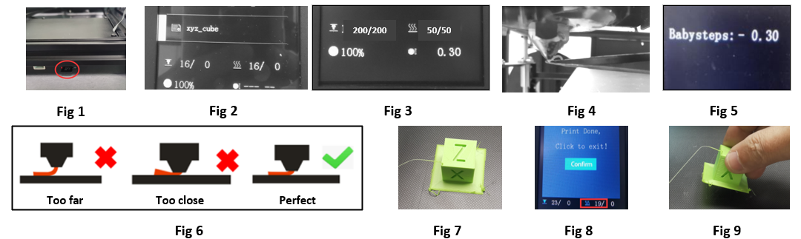

## <a id="choose-language">:globe_with_meridians: Choose language </a>

----
## Руководство по эксплуатации
Перед началом печати необходимо выровнять горячую станину (точно отрегулировать расстояние между соплом и печатной платформой) и загрузить нити в экструдеры и хотэнд.
## Выравнивание горячей грядки
#### :warning: Для 3D-принтеров FDM расстояние между соплом и горячим слоем очень важно при печати первого слоя. Если расстояние слишком маленькое, нити не смогут вытечь из сопла и даже повредить сопло и горячий слой. Если расстояние слишком большое, нити не могут быть наклеены на горячий слой, следующие слои не могут быть правильно уложены, что приведет к сбою печати.
###### 
- **Шаг 1.** Включите 3D-принтер, а затем выполните ***Подготовка>>Автоматический возврат>>Домашний все*** в ЖК-МЕНЮ, подождите, пока хотэнд перейдет в исходное положение.
- **Шаг 2.** Затяните гайки под кроватью, чтобы опустить кровать в самое нижнее положение (Fig 1).
- **Шаг 3.** Выполните ***Подготовка>> Выравнивание грядки>> Точка 1*** на панели управления (Fig 2), сопло дойдет до углов грядки, ослабьте ручные гайки под парником. (Fig 3) и дайте соплу почти коснуться парника (Fig 4). Продолжайте выполнять ***точки 2/3/4***, пока все 4 угла не будут выровнены.
- **Шаг 4.** Повторите шаг 3 и сделайте 2–3 круга, пока все четыре угла не окажутся на одной высоте.

----
### Загрузка нитей
###### 
Этот принтер оснащен четырьмя экструдерами и одним горячим концом для смешивания цветов 4-В-1-ВЫХ. Экструдеры и горячий конец соединены направляющей нити (трубка из ПТФЭ). ***Перед печатью необходимо загрузить в экструдеры все 4 нити и подать их в нижнюю часть хотэнда.***
- **Шаг 1.** Выполните ***Подготовка>>Автоматический режим >>Домой Все*** на панели управления, а затем выполните ***Подготовка>>Температура>> Предварительный нагрев PLA***, ожидайте достижения температуры сопла. до 190 ℃ (Fig 1).
- **Шаг 2.** С помощью диагональных плоскогубцев отрежьте головку нити (Fig 2), а затем нажмите на ручку экструдера №1 и вставьте нить, нажимайте на нить, пока не увидите нить в ПТФЭ. направляющая (Fig 3). Вращайте шестерню экструдера №1 (Fig 4), наблюдая за нитью, пока она не войдет в нижнюю часть горячего конца.
- **Шаг 3.** Используя тот же метод, что и на шаге 2, для загрузки нитей в экструдеры №2 ~ экструдеры №4, наблюдайте за нитями, пока они не войдут в нижнюю часть горячего конца.
- **Шаг 4.** Медленно вращайте шестерню экструдера №1 ~ экструдера №4 один за другим и наблюдайте за соплом, пока не увидите, что нить вытекает из сопла (Fig 5).

----
### Распечатайте свои работы "Hello World"
#### Распечатайте тестовый файл одного цвета
###### 
- **Шаг 1.** Вставьте SD-карту в гнездо для SD-карты на принтере (Fig 1).
- **Шаг 2.** Нажмите значок ***Печать*** на панели управления и выберите ***xyz_cube.gcode*** (Fig2 ), нажмите ручку, чтобы начать печать.
- **Шаг 3.** Подождите, пока нагреватель и нагреватель не достигнут заданной температуры (Fig 3), сопло вернется в исходное положение, а затем переместится вверх над печатной платформой и выдавит нить, используя пинцет. удалить выходную нить (Fig 4).
- **Шаг 4.** Когда сопло переместится в зону нагрева и начнет печатать, дважды щелкните ручку, чтобы открыть меню **Babystep Z** (Fig 5), медленно поверните ручку, чтобы точно настроить высоту печати. платформе, следите за расстоянием от сопла до станины, пока расстояние не станет хорошим (Fig 6).
- **Шаг 5.** Подождите, пока печать закончится (Fig 7), подождите, пока горячий столик остынет (Fig 8), а затем удалите напечатанный объект из горячего стола (Fig 9).

#### Распечатайте многоцветный тестовый файл
###### 
Шаги для многоцветной и одноцветной печати в основном одинаковы, но перед началом печати вытяните несколько нитей из всех экструдеров, чтобы убедиться, что горячий конец работает нормально.
- **Шаг 1.** Вставьте SD-карту в гнездо для SD-карты на принтере.
- **Шаг 2.** Нагрейте сопло и выдавите немного нити. **Подготовка>>Нить: *Предварительный нагрев сопла: 200* -> *Экструдер: Все* -> *Загрузка медленно***.
- **Шаг 3.** Нажмите ЗНАЧОК «Печать» на панели управления и выберите ***M4_4CTest.gcode***, нажмите ручку, чтобы начать печать.
- **Шаг 4.** Точно отрегулируйте расстояние от сопла до станины.
- **Шаг 5.** Дождитесь завершения печати.

----
### :fireworks: Поздравляю!
Распечатав первые работы, вы имеете базовое представление о том, как работает 3D-принтер. Затем вы можете распечатать другие тестовые файлы или разрезать свою собственную 3D-модель и распечатать ее на принтере.
Рекомендуется загрузить и установить программное обеспечение для нарезки, а также прочитать руководство пользователя программного обеспечения для нарезки, чтобы узнать, как его использовать. Подробную информацию можно найти в [:book: **Руководство по нарезке**](https://github.com/ZONESTAR3D/Z9/tree/main/Z9V5/Z9V5-MK6/4.Slicing).
