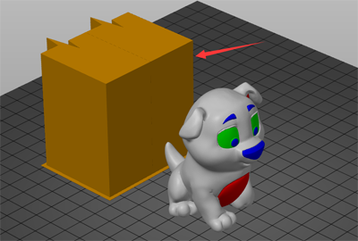

# PrusaSlicer slicing guide for ZONESTAR 3D Printer 

-----
## 1. Download PrusaSlicer
- **For windows system (win 7/8/10/11)**
  - :clapper: [**Download and install slicing software**](https://youtu.be/SgyXD-kQIeo)
  - :arrow_down: [**Download PrusaSlicer 2.4.2 with ZONESTAR 3D Printer Profiles**](https://github.com/ZONESTAR3D/Slicing-Guide/releases)     
  Download it and unzip it to your PC or laptop, and then find and run the "PrusaSlicer.exe".  
- **For Macos or linux**
  - [**Download PrusaSlicer software**](https://github.com/prusa3d/PrusaSlicer/releases)
  - [**Download profiles**](https://downgit.github.io/#/home?url=https:%2F%2Fgithub.com%2FZONESTAR3D%2FSlicing-Guide%2Ftree%2Fmaster%2FPrusaSlicer%2FProfiles)
  - Copy Profiles to "resource/profiles" directory of the installation directory of the PrusaSlicer software.

## 2. Run PrusaSlicer and choose the printer 
### 2.1 Find the PrsuaSlicer.exe and click it to run.

### 2.2 Choose your printer, "Other Vendors>>Zonestar FFF>>your printer model>>finish"

## 3. Slicing one color 3d model
#### :clapper: [**Slicing guide - for one color printing**](https://youtu.be/g-YSgV44Rik) 
### 3.1 choose printer presets "Z9 + One Color"

### 3.2 load 3d model file (stl/obj/AMF file etc.)

### 3.3 Choose print filament type

### 3.4 If need, you can resize, cut, rotate the 3d model 
  
### 3.5 Set the print settings: layer height, print speed, support, infill, etc.
  
You may need to set these parameters according to the shape of the model and your requirements for print quality. For some models, the object even cannot be printed successfully if the settings is incorrect. For details please refer to the [**PrusaSlicer introduction**](https://www.prusa3d.com/page/prusaslicer_424/).
### 3.6 Slice
  
### 3.7 Preview the sliced result (gcode file) and then save to gcode file to your PC and then copy to SD card
  

## 4. Slicing muti color 3d model
#### :clapper: [**Slicing guide - for multi colors printing**](https://youtu.be/2IHiP2r7KNk)  
### 4.1 choose printer presets "Z9 + M4 hotend"

### 4.2 load 3d model files (stl/obj/AMF file etc.)
 
#### :memo: Usually, "split model" is inneed to print multi-color, that is, a 3d model has been split into multiple STL files according to colors, and these files use the same origin coordinate position so that they can be merged correctly.
#### :star2: PrusaSlicer has a very powerful new feature. It can painting any 3d model into multi colors. For details, please refer to
:clapper: [**Slicing guide - Convert one color 3d file to multi colors**](https://youtu.be/Yx4fKDRGEJ4) 
### 4.3 Choose print filament type - PLA and set filament color

### 4.4 Assign extruders to different parts

### 4.5 If need, you can resize, cut, rotate the 3d model 
  
### 4.6 Set the print settings: layer height, print speed, support, infill, etc.
  
You need to set these parameters according to the shape of the model and your requirements for print quality. Even for some models, printing cannot be completed normally without support. For details please refer to:
- [**PrusaSlicer introduction**](https://www.prusa3d.com/page/prusaslicer_424/)
- [**Slic3r User Manuual**](https://manual.slic3r.org/)
### 4.7 Set parameters for "wipe tower"
#### You may notice that a square square will appear in the sliced figure, which is called "Wipe tower" in PrusaSlicer. Because for the multi-color printer, while switching extruders, there are still the previous color filaments inside the hotend, it need to be clean before printing another color.   
    
In order to obtain better cleaning effect and minimize to waste filament, we can set the amount of purge volume according to different colors. Please pay attention to the following table, the columns shows the filament color of the last extruder printed, and the rows shows the filament color of the next extruder to be printed. When we change from the extruder with lighter color filament to the extruder with darker color filament, we can set a smaller purge volume. On the contrary, when we change from the darker color filament to the  lighter color filament, we need to set a bigger purge volume.   
  
### 4.8 Slice
  
### 4.9 Preview the sliced result (gcode file) and then save the gcode file to your PC and then copy it to SD card.
   

