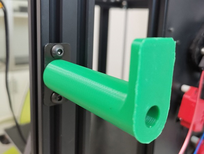
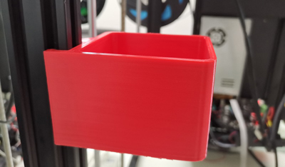
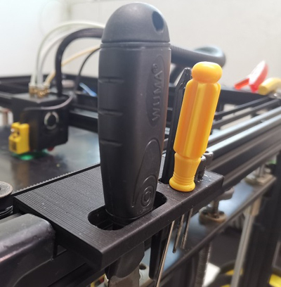
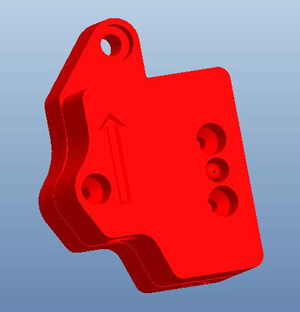

## Parts_Stl
- [:arrow_down:**Filament holder**](https://github.com/ZONESTAR3D/Z9/tree/main/Z9V5/Parts_Stl/FilamentSpoolBracket.zip). The filament holder of Z9V5Pro can support the vast majority of filament spool in the market, but there are also some filament spools that may be longer. You can download stl files and print them to replace the original ones.    
      
- [:arrow_down:**Power supply fan cover**](https://github.com/ZONESTAR3D/Z9/tree/main/Z9V5/Parts_Stl/PSUfancover.zip). The fan of the power supply may have some dust after long-term use. You can print a cover and install it on the power fan, which can be easier to clean. And this cover can also reduce the noise of the fan.   
      
- [:arrow_down:**Hotend fan duct**](https://github.com/ZONESTAR3D/Z9/tree/main/Z9V5/Parts_Stl/fanduct_m4v6.zip). The dock of the extruder fan is may be damaged after using a while, you can download and print one to replace it.     
      
- [:arrow_down:**Filament recycling box**](https://github.com/ZONESTAR3D/Z9/tree/main/Z9V5/Parts_Stl/Recyclebin.zip). When printing, there are always some fine threads that need to be removed. It is a good idea to print a small garbage box and install it on the Z-axis profile of the machine to collect this garbage.     
      
- [:arrow_down:**Tool station**](https://github.com/ZONESTAR3D/Z9/tree/main/Z9V5/Parts_Stl/Z9_tool_supports.zip). Diagonal pliers, tweezers, shovels, and small screwdrivers are commonly used tools with 3D printers. You can print a collection station for tools to place them.     
      
- [:arrow_down:**Filament run out detector case**](https://github.com/ZONESTAR3D/Z9/tree/main/Z9V5/Parts_Stl/FRODV6.zip). The case of the Filament run our sensor equipped with the machine is a print part. If it is damaged, you can print one by yourself.     
      
### :arrow_right:More print stl files, please refer to https://github.com/ZONESTAR3D/Z9/tree/main/Z9V5/Parts_Stl.

