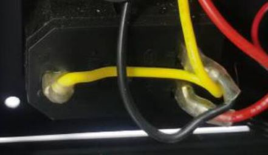

## The printer shut down when printing from SD card
### 1. Print another gcode file and try again.
### 2. Format the SD card and copy only that gcode file which need to be printed to SD card and try to print again.
:warning: Sometimes the automatic shutdown is due to the quality of the SD card, not the gcode file itself. This causes a card reading error and shutdown.
### 3. [:link: Open the control box](../How_to_open_the_control_box.jpg) and check the wires which connected the AC connector to the power supply. Please check the yellow and black wires carefully, Check whether the connector is damaged or not tightly connected with the AC socket.
## :loudspeaker: :warning: Disconnect AC Power Before Checking.:warning:     

### 4. If you have enabled the "gradient color mixing" or "random color mixing" feature, please turn it off first and check if the problem can be fixed. If it can be fixed, please upload the newest firmware ([Download the newsst firmware](https://github.com/ZONESTAR3D/Firmware/tree/master/Z9/Z9V5/bin)) to the control board and check again.

--------
## :email: If you can't find a solution to solve your problem after readed the FAQ , please contact our technical support team : support@zonestar3d.com .