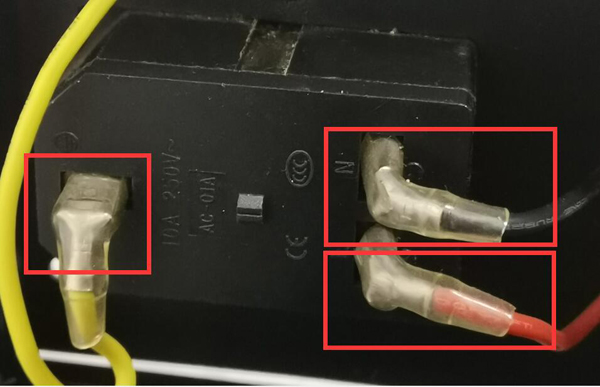

## The printer shut down by itself when printing from SD card
1. Upload the newest firmware to the control board and try again. [:arrow_down: Download firmware][Z9V5_FIRMWARE] 
2. Format the SD card and copy only one gcode file to SD card and print it again.     
3. Print another gcode file and try again.
4. Replace a new SD card (Maximum 32G, FAT or FAT32 format) and try again.    
:warning: Sometimes the automatic shutdown is due to the quality of the SD card, not the gcode file itself. This causes a card reading error and shutdown.   
5. Turn off the **PowerLoss Recovery** feature and try again (***Control>>Configre>>PowerLoss Recovery***).    

      -----
      **:loudspeaker: :warning: Disconnect AC power before doing the below steps.:warning:**

      -----     

6. [:link: Open the control box](../How_to_open_the_control_box.jpg) and check the wires of DC power supply are connected well.   

7. Check if the wiring terminals of the AC wires are tightly connected to the AC socket.     

8. Check if the AC wire is connected well with the power supply.     

-----
### If you have tried all above steps and the question can't be fixed, please contact our technical support team : support@zonestar3d.com.

[Z9V5_FIRMWARE]: https://github.com/ZONESTAR3D/Firmware/tree/master/Z9/Z9V5/bin