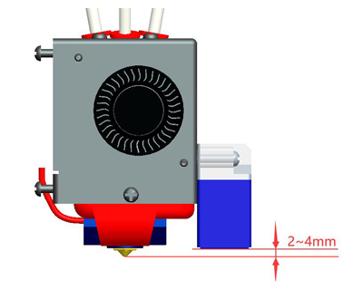
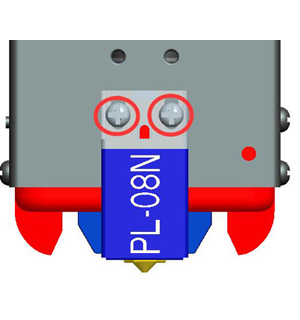
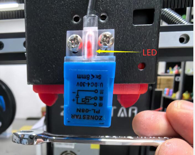
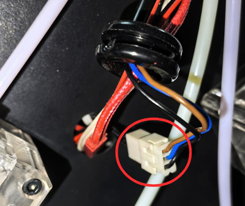
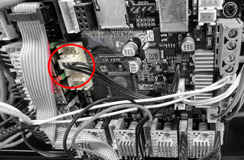
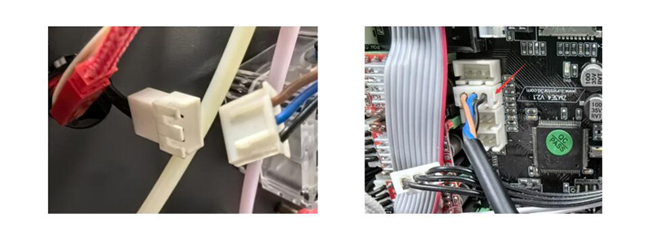
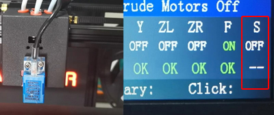
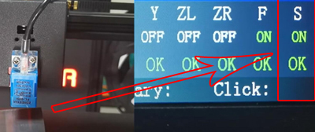

## Troubleshooting for Bed auto leveling Issue 
###  :one: Check the installation of the PL-08N.
- Check the installation height of the sensor as figure below.    
:pushpin:Loosen the screws which fixed the sensor and move up / down the sensor to adjust installation height if need.    
      
- Power on the printer and use a metal plate to approach the bottom of the sensor and check if the LED would light up.
  - :black_circle: No. Refer to [step 2](#step2).   
  - :red_circle: Yes. Refer to [step 5](#step5).     
  - :rotating_light: **The light will not go out! Refer to [here](#keepon).**         
   

###  :two: Check the connection between sensor and extend wire.      
:bulb: In order to make it easier to replace different types of hot end assembly (print head), Z9V5 uses an extend wire between the hot end assembly and the control board. To find the terminals of the extend wire, you need to remove the rubber protective sleeve on the metal backplane first.      
   
Reconnect the extend wire and the sensor terminals, then repeat the step 2 to check if the sensor will light up.
  - :black_circle: No. Refer to [step 3](#step3).   
  - :red_circle: Yes. Refer to [step 5](#step5).     

###  :three: Check the connection on the control board side. 
1. Refer to [:link: this guide][OPEN_CONTROL_BOX] to open the control board and check if the wire is connected well to the Z+ connector on the control board.       
     
2. Reconnect the extend wire to the control board and then repeat the step 2 to check if the sensor will light up.
  - :black_circle: No. Refer to [step 4](#step4).   
  - :red_circle: Yes. Refer to [step 5](#step5).     

###  :four: By pass the extend wire and connect the sensor to the control board directly. 
1. Refer to [:link: this guide][OPEN_CONTROL_BOX] to open the control box.  
2. Disconnect the sensor from the extend wire and connect the sensor to the Z+ connector on the control board directly.     
     
3. Repeat the step 2 to check if the sensor will light up.    
  - :black_circle: No. **PL-08N sensor is broken and needs to be replaced.** [:gift:Sell link][PL08N_SALELINK]
  - :red_circle: Yes. **Extended wire is damaged and need to be replaced.** [:gift:Sell link][3PINEXTEND_SALELINK]

###  :five: Check if the PL-08N can be triggered normally.
Start an ["electronic parts automatic testing process" video tutorial][AUTO_TESTING] and test if the sensor work properly.    
    
  - Always OFF or ON, **Control board is damaged, please contact us to get a solution** :email: support@zonestar3d.com.
  - Working normally, congratulations on fixing the problem!
 
###  :rotating_light: The light of the sensor remains constantly on and will not go out.
1. If your control board is the ZM3E4 V1.0, please check if used a sensor with a rated voltage of 3V (Yellow color).   
2. If your control board is ZM3E4 V2.0 or later, please check the V_END jumper on the control board has been set to the **5V** position.
3. Go to [step 2](#step2) and check if the terminals of the sensor and extend wire are properly connected.     
4. Go to [step 4](#step4) and check the extend wire.    
     

[OPEN_CONTROL_BOX]: https://github.com/ZONESTAR3D/Z9/tree/main/Z9V5/Z9V5_FAQ#how-to-open-the-control-box
[AUTO_TESTING]: https://github.com/ZONESTAR3D/Z9/tree/main/Z9V5/Z9V5_FAQ#electronics-parts-auto-testing
[PL08N_SALELINK]: https://www.aliexpress.com/item/2255800409994958.html
[3PINEXTEND_SALELINK]: https://www.aliexpress.com/item/3256803720013266.html