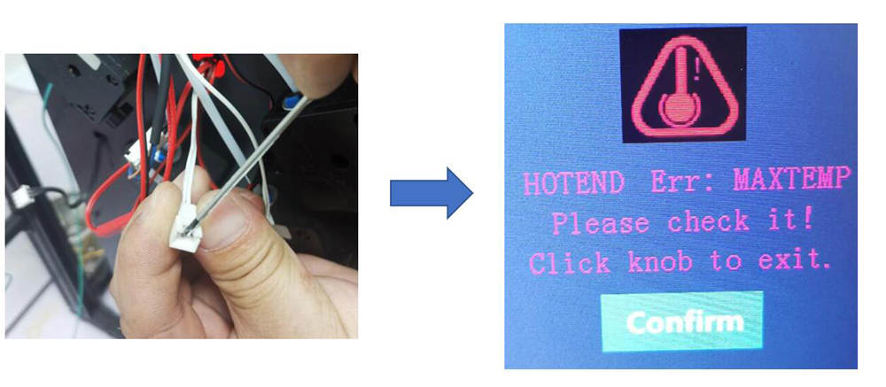
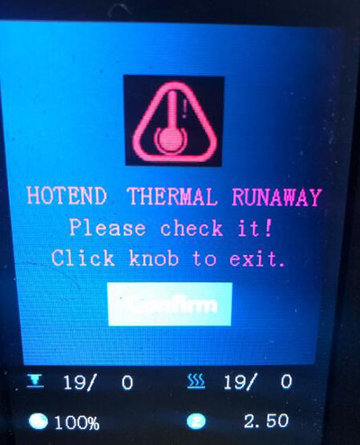
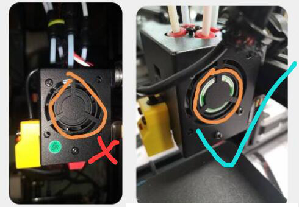

# Heating Issues
## Hot bed and hot end wiring
    

-----
## 1. Check the temperature after the machine startup
First, turn on the power and watch the current temperature display on the LCD display. If the hot bed or hot end (nozzle) is still hot, wait for them to get cool.  
  
> 
    1: current hotend(nozzle) temperature       2: current hotbed temperature
Under normal conditions, the current temperature of hot end and hot bed should be approximately the same as the room temperature. 
### 1.1 Hot bed shows 0℃: 
If the current temperature of hot bed shows 0 degrees, it means that the temperature sensor of the hot bed is disconnected, please check following the below steps:
- Is the wiring is connected well? (Refer to the wiring picture above).
- Is the temperature sensor damaged. You can connect the hot bed temperature sensor to hot end connecor and then watch the current hotend temperaure on LCD screen, if the LCD screen can show correct temperature, it means the temperature sensor of hot bed is okay. 
- Open the control box and check if the hot bed temperature sensor wire is disconnected from the control board.
- Check if the hot bed extension cable is damaged.

### 1.2 Hot end shows 0℃
If the current temperature of the hot end shows 0 degrees, it means that the temperature sensor of the hot end is disconnected, please check:
- Is the wiring is connected well? (Refer to the wiring picture above).     
- Is the temperature sensor damaged. You can connect the hot end temperature sensor to hot bed connecor and then watch the current hotbed temperaure on LCD screen, if the LCD screen can show correct temperature, it means the temperature sensor of hot end is okay.     
- Open the control box and check if the hot end temperature sensor wire is disconnected from the control board.     
- Check if the hot end extension cable is damaged.       
:pushpin:A simple way to determine whether the problem is from the thermistor of the hot end (Temperature is damaged or its wire is broken) or the control board side (extension cable is broken or disconnected with the control board): Short the 2 pins of the temperature sensor connector of the extension cable and check if the LCD screen will prompt a "MAXTEMP error". If "MAXTEMP error" showed, the problem is from the thermistor, if the LCD screen still shows 0℃, the question comes from the control board side.          

### 1.3 Hot end shows round of 150℃
If the temperature of the hot end shows a high temperature (about 150℃) even if the nozzle is actually cool, then it is very likely that you have connected the temperature sensor of the hot end to the fan by mistake, please pay attention to check the wiring of the hot end.   

-----    
## 2. Hot end issue
### 2.1 When heating the hot end, the temperature does not rise.
- Check if the heater connector plug well.  
    
- Check if the pin of the heater connector is well.  

- Use a multi-meter to measure the resistance of the heater, the resistance should be about 10 Ohm. If not, heater is burn.

- [:link:Open the control box ](../How_to_open_the_control_box.jpg) and check if the heater wire is connected well to the control board.

- [:link:Open the control box](../How_to_open_the_control_box.jpg) and check if the LED4 will light when heating the hotend. 

### 2.2 The hot end cannot be heated to the set temperature for a while
If the hotend temperature is raise, but it can't be reached to the setting temperature. LCD will shows **hot end heating fail** after a period of time.  

- 2.2.1 **If hot end will not be heated to more than 150℃:** Check the temperature sensor on the side of hotend, it may be drop out from the heat block. ***In this case, the hot end will not be heated to more than 150℃ usually.*

- 2.2.2 **If hot end can be heating to 200℃, but it is unstable**, please refer to the [**section 2.3**](#23-the-temperature-of-the-hot-end-is-unstable-sometimes-show-a-run-away-issue). 

### 2.3 The temperature of the hot end is unstable, sometimes show a "run away" issue

  - **Step 1**: Check the cooling FAN installation, if it is blowed inside to the housing, please change to blowed outside.

  - **Step 2**: [Upload the newest firmware to the printer](https://github.com/ZONESTAR3D/Firmware/tree/master/Z9/Z9V5) and do once  ***Control>>Restore Defaults"***, and then heating again.

#### If you did the above two steps but the question can't be solved, do the below steps: ***Control>>Configre>>Hotend PID>>PID auto tune: 200 {200 for printing PLA or 240 for printing PETG/ABS}***, and wait until it done. [:movie_camera: **Video Tutorial**](./PID_Auto_Tune.gif). Here are some PID parameters we measured for your reference:   
  |  HOTEND TYPE  |  Temperature |      P       |     I     |     D     |
  |:-------------:|:------------:|:------------:|:---------:|:---------:|
  |   Common      |              |     22.2     |    1.08   |    114.0  |
  |    M4V4       |     200℃    |     17.4     |    0.51   |    148.6  |
  |    M4V4       |     240℃    |     21.9     |    0.67   |    178.2  |
  |    M4V6       |     200℃    |     14.5     |    0.71   |    75.5   |
  |    M4V6       |     240℃    |     15.7     |    0.77   |    80.4   |
  |     E4        |     200℃    |     12.8     |    0.61   |    70.2   |
  |     E4        |     240℃    |     10.1     |    0.45   |    56.0   |
  
#### If you did all the above steps but the question can't be solved, please [**contact with our support team**](#contact-with-our-support-team) or repleace a new cartridge heater and try again. 

-----
## 3. Hot bed issue
### 3.1 LCD shows hotbed max temperature after power on.
   
- 3.1.1 Disconnect the wire of the hotbed temperature sensor and try again. If it was fixed, replace a new temperature sensor.
- 3.1.2 [:link: Open the control box](../How_to_open_the_control_box.jpg) and discounect the temperature sensor wire from the control board. If it was fixed, replace a new temperature sensor wire. If it wasn't solved, replace a new control board.

### 3.2 When heating the hot bed, the temperature does not rise.
- 3.2.1 Check if [:point_up: the power wire of hot bed](#11-hot-bed-shows-0℃) is connected well.
- 3.2.2 [:link: Open the control box](../How_to_open_the_control_box.jpg) and check if the power wire of hot bed connect well with the control board.
- 3.2.2 [:link: Open the control box](../How_to_open_the_control_box.jpg) and check if the [:point_up: LED3](#21-when-heating-the-hot-end-the-temperature-does-not-rise) will light when heating the hot bed, if not, it means the MOSFET of the control boad is damaged and need to be replaced.

### 3.3 The hot bed cannot be heating to over 100℃.
- 3.3.1 Do not put the fan or air conditioner outlet toward the machine.
- 3.3.2 If the temperature of the room is low (<20 ℃), try to wrap around the machine.

-----
## Contact with our support team
:email: If you can't find a solution to solve your problem after readed the FAQ , please contact our technical support team : support@zonestar3d.com .
