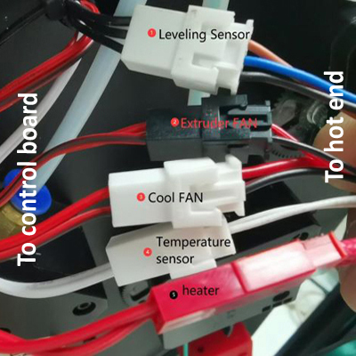
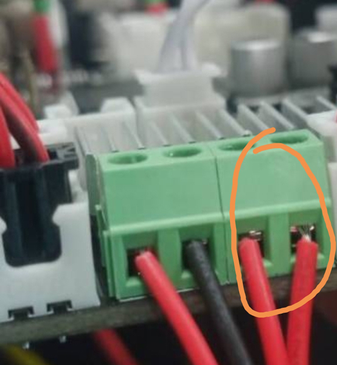

## Heating Issues
### 1. Check the startup temperature
First, turn on the power and observe the current temperature display on the LCD display. If the hotbed or hotend (nozzle) is still hot, wait for them to cool before turning it on.  
  
> 
    1: hot end(nozzle) temperature       2: hotbed temperature
Normally, the current temperature of the hot end and hot bed should be approximately the same as room temperature. 
#### 1.1 Hot bed shows 0℃: 
If the current temperature of hot bed shows 0 degrees, it means that the temperature sensor of the hot bed is disconnected, please check whether the wiring is well connected.   

#### 1.2 Hot end shows 0℃
If the current temperature of the hot end shows 0 degrees, it means that the temperature sensor of the hot end is disconnected, please check whether the wiring is well connected.   
#### 1.3 Hot end shows round of 100℃
If the temperature of the hot end shows a high temperature (about 100℃), but the nozzle is actually cool, then it is very likely that you have connected the temperature sensor of the hot end to the fan by mistake, please pay attention to check the wiring of the hot end.   
     
        
 
### 2. Hot end issue
#### 2.1 When heating the hot end, the temperature does not rise.
- Check if the heater connector plug well.  
    
- Check if the pin of the heater connector is well.  

- Use a multi-meter to measure the resistance of the heater, the resistance should be about 10 Ohm. If not, heater is burn.

- [:link:Open the control box ](../How_to_open_the_control_box.jpg) and check if the heater wire is connected well to the control board.

- [:link:Open the control box](../How_to_open_the_control_box.jpg) and check if the LED4 will light when heating the hotend. 

#### 2.2 The hot end cannot be heated to the set temperature for a while
If the hotend temperature is raise, but it can't be reached to the setting temperature. LCD will shows **hot end heating fail** after a period of time.  

- 2.2.1 **If hot end will not be heated to more than 150℃:** Check the temperature sensor on the side of hotend, it may be drop out from the heat block. ***In this case, the hot end will not be heated to more than 150℃ usually.*

- 2.2.2 **If hot end can be heating to 200℃, but it is unstable**, please refer to the [**section 2.3**].(#23-the-temperature-of-the-hot-end-is-unstable-jumping-up-and-down) 

#### 2.3 The temperature of the hot end is unstable, jumping up and down
  - Check the cooling FAN installation, if it is blowed inside to the housing, please change to blowed outside.

  - [Upload the newest firmware to the printer](https://github.com/ZONESTAR3D/Firmware/tree/master/Z9/Z9V5) and do once ***Control>>Configre>>Hotend PID>>PID auto tune: 200 {200 for printing PLA or 240 for printing PETG/ABS}***, and wait until it done. [:movie_camera: **Video Tutorial**](./PID_Auto_Tune.gif). Here are some PID parameters we measured for your reference:    

  |  HOTEND TYPE  |  Temperature |      P       |     I     |     D     |
  |:-------------:|:------------:|:------------:|:---------:|:---------:|
  |    M4V4       |     200℃    |     17.4     |    0.51   |    148.6  |
  |    M4V4       |     240℃    |     21.9     |    0.67   |    178.2  |
  |    M4V6       |     200℃    |     14.5     |    0.71   |    75.5   |
  |    M4V6       |     240℃    |     15.7     |    0.77   |    80.4   |
  |     E4        |     200℃    |     12.8     |    0.61   |    70.2   |
  |     E4        |     240℃    |              |           |           |
  - If you did the above two steps but the question can't be solved, please [**contact with our support team**](#contact-with-our-support-team) or repleace a new cartridge heater and try again. 

### 3. Hot bed issue
#### 3.1 LCD shows hotbed max temperature after power on.
   
- 3.1.1 Disconnect the wire of the hotbed temperature sensor and try again. If it was fixed, replace a new temperature sensor.
- 3.1.2 [:link: Open the control box](../How_to_open_the_control_box.jpg) and discounect the temperature sensor wire from the control board. If it was fixed, replace a new temperature sensor wire. If it wasn't solved, replace a new control board.

#### 3.2 When heating the hot bed, the temperature does not rise.
- 3.2.1 Check if [:point_up: the power wire of hot bed](#11-hot-bed-shows-0℃) is connected well.
- 3.2.2 [:link: Open the control box](../How_to_open_the_control_box.jpg) and check if the power wire of hot bed connect well with the control board.
- 3.2.2 [:link: Open the control box](../How_to_open_the_control_box.jpg) and check if the [:point_up: LED3](#21-when-heating-the-hot-end-the-temperature-does-not-rise) will light when heating the hot bed, if not, it means the MOSFET of the control boad is damaged and need to be replaced.

#### 3.3 The hot bed can be heating to over 100℃.
- 3.3.1 Do not put the fan or air conditioner outlet toward the machine.
- 3.3.2 If the temperature of the room is low (<20 ℃), try to wrap around the machine.

--------
## Contact with our support team
:email: If you can't find a solution to solve your problem after readed the FAQ , please contact our technical support team : support@zonestar3d.com .

