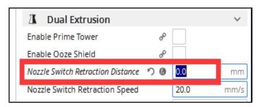
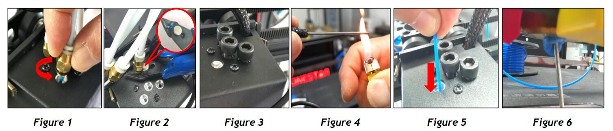

## How to fix the clogged issue for mixing color hotend
### :warning: ATTENTION :warning:
For the 4-IN-1-OUT color mixing hot end of the 3th version (M4V3) and the 4th version  (M4V4) 4-IN-1-OUT hotend, please note the following points:   
#### :warning: Use the "hotend-clean-tool" to close the unused channels of hotend before printing. [:point_down: See Figure 3](#step-7-install-the-nozzle-back)
#### :warning: Don't heating the hot end to over 240℃ if your hotend is the 3th version 4-IN-1-OUT hotend.
#### :warning: Adjust the pressure of the extruder according to the type of filament, especially for the Z9V5Pro. [See picture](./adjust_pressure.jpg)
#### :warning: The PTFE tube connecting the extruder and the hot end shall not be too soft, or it will increase the resistance of filament movement.
#### :warning: When printing multi colors, it is recommended that the printing speed isn't greater than 40mm/s, hot end flow rate isn't greater than 5mm3/s, and the recommended nozzle temperature should be 205℃ (PLA) and 215℃ (PLA+).
>
    NOTE: Default Z9V5-MK1/MK2 equiped with M4V3 hotend, Z9V5-MK3 and Z8P-M4 equiped with M4V4 hotend. 
------
### Please pay attention to the following points. If these operations are incorrect, the hot end of the heat conduction may be easily blocked
There are many reasons that may cause the hoend to be blocked, please check the list one by one to ensure that you have noticed these matters when using or slicing.
#### The nozzle are too close to the print platform when printing the first layer.
If the nozzle is too close to the hot bed when printing the first layer, the filament may not be ejected. If this is maintained for a long time, it may cause the filament in the hot end to be over-compressed and cause blockage (often blocked at the entrance of hotend). When printing the first layer, pay attention to the distance between the nozzle and the hot bed. If necessary, open the "BabyStep" menu to adjust the nozzle height.
#### Slicing settings
For 4-IN-1-OUT mix color hotend, the "Extruder switching retraction length" MUST be set to 0. For example, set “Nozzle Switch Retraction Distance” to 0 when you use Cura Slicer.  

#### Filaments loading
:pushpin: When loading the filament to the hotend, please ensure that the filaments enter the bottom of the hot end.
:pushpin: If you used less than 4 colors filament, to use the “hotend-clean-tool” to close the unused channels or load filaments to all 4 channels.
#### Defective nozzle  
The nozzle may also be partially clogged. If you find the filament flowed out from the nozzle is thinner than normal, the nozzle may be partially clogged, please replace a new nozzle directly.  

------
### How to clean the clogged mix color hotend
#### Step 1: Heat the hot end (nozzle) to 200℃ and wait for the temperature to be reached
#### Step 2: Remove the fitting and pull out the filament ([Figure 1](#step-7-install-the-nozzle-back))
:pushpin: If it is difficult to pull out the filaments, you can use the cutting pliers to clamp the filaments and pull out ([Figure 2](#step-7-install-the-nozzle-back)).   
:pushpin: If the filaments cannot be pulled out at all, you can use cutting pliers to cut the filaments.    
#### Step 3: Remove the nozzle from the hot end.
:exclamation:HOT:exclamation: It is recommended to wear heat-resistant gloves for operation.
#### Step 4: Install the hotend-clean-tool on the hot-end ([Figure 3](#step-7-install-the-nozzle-back)) to close the channels that are not clogged.
:pushpin: If the hot end is blocked by filaments and cannot be inserted into the hotend-clean-tool, you can use a lighter to heat the thin rod of the hotend-clean-tool, and then insert it to the hotend ([Figure 4](#step-7-install-the-nozzle-back)).
#### Step 5: Manually feed in at least 50cm filaments slowly from the hotend ([Figure 5](#step-7-install-the-nozzle-back)).
#### Step 6: Clean the filaments in front of the hotend ([Figure 6](#step-7-install-the-nozzle-back)). 
:pushpin: If necessary (there are other channels are blocked), you can close the cleaned channel with a “hotend-clean-tool” before cleaning the next channel.
#### Step 7: Install the nozzle back.

## Upgrade to the newest M4V6 hotend
We launched the 6th version of 4-IN-1-OUT mix color hot end, which greatly reduced the channel resistance, and the working temperature of the hot end was increased to 260℃. The probability of hot end blockage is greatly reduced, and it can well support the printing of ABS and other materials. For details, refer to [:book: here](https://github.com/ZONESTAR3D/Upgrade-kit-guide/tree/main/HOTEND/M4%20%204-IN-1-OUT%20Mixing%20Color%20Hotend).  
[:gift: Sell link](https://bit.ly/3QhWJtf).  
[:gift: Sell link](https://www.aliexpress.com/item/1005004547646195.html).  

## More 
- [:book: More Informware of 4-IN-1-OUT Mix Color Hotend](https://github.com/ZONESTAR3D/Upgrade-kit-guide/tree/main/HOTEND/M4%20%204-IN-1-OUT%20Mixing%20Color%20Hotend)
- [:book: FAQ of M4V3 & M4V4](https://github.com/ZONESTAR3D/Upgrade-kit-guide/blob/main/HOTEND/M4%20%204-IN-1-OUT%20Mixing%20Color%20Hotend/M4_V3_V4/FAQ.md)

