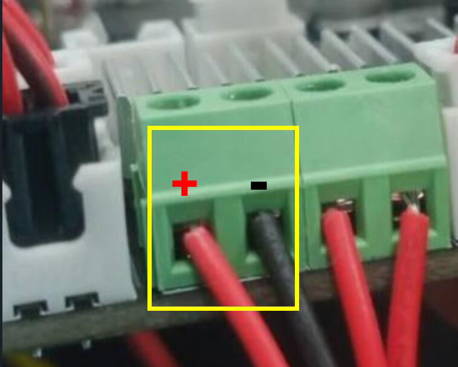
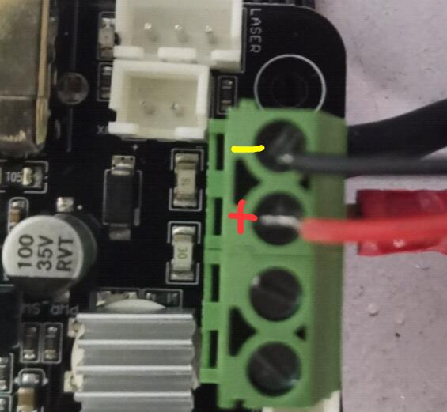

## The Logo Backlight doesn't light up.
#### 1. Check the brightness of backlight on LCD screen, if the brightness is 0, it will turn off.

#### 2. [:link:Open the control box ](../How_to_open_the_control_box.jpg) and check if the backlight wire connected well with the control board.

#### 3. Try to connect the backlight wire to the power supply directly and check if the back light will light up. If not, the backlight is damaged and need to be replaced.

#### 4. Check if the LED5 light will light up, if not, it means the MOSFET of the control board is damaged and need to be replaced.

--------
## :email: If you can't find a solution to solve your problem after readed the FAQ , please contact our technical support team : support@zonestar3d.com .