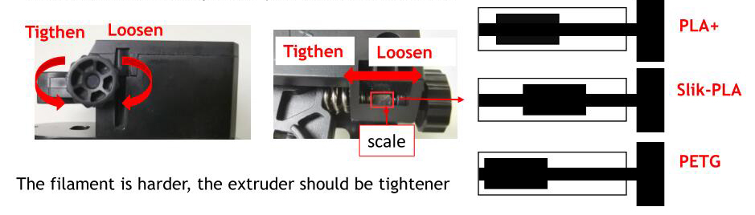
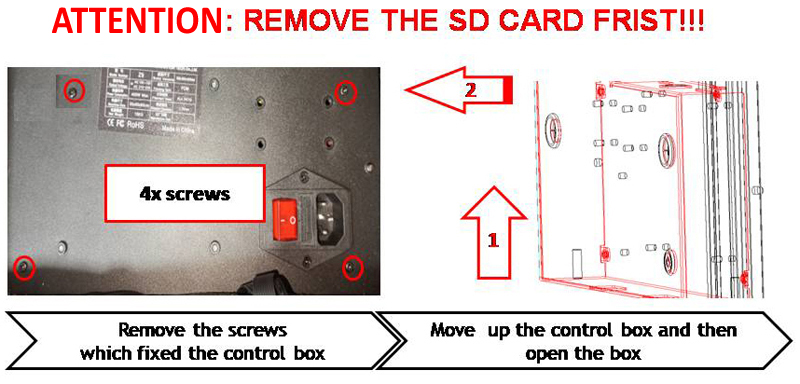

## Extruder insufficient discharge or slightly blocked.
### Reason:
This is because the resistance of the extruder is too large (when pushing the filament ). The solution is to reduce the resistance or increase the pushing force.
### Solution:
#### 1. Reduce the resistance
- **Reduce the printing speed.**  You can try to adjust the printing speed to 50% (***MENU>> Tune>>Speed***). You can also set to lower printing speed when slicing, especially the printing speed of the first layer (suggest set to 15mm/s).
- **Increase the nozzle temperature.**  e.g. set to 215 degreeC for PLA.
- **Bypass the Filament run out sensor.** Do not pass the filament through the "Filament run out sensor" if you can confirm that the filament is enough and it doesn't run out, because the filament passing through the "Filament run out sensor" will slightly increase the resistance.
- **Replace the filament guide tube.** The "filament guide tube" is made of PTFE. The PTFE has self-lubricating characteristics, so usually the filament can pass it smoothly. However, if the tube is deformed or the size inside is uneven, the resistance may great increase, so the filaments may not pass smoothly. :warning:Some machines used a transparent filament guide tube on extruder #1, its resistance is greater than the others channel, please check it carefully and replace it if possible.
#### 2. Increase the pushing force.
- **Adjust the pressure of the extruder.** Refer to the following picture to adjust the pressure of the extruder.:warning: When adjusting the pressure, it is also necessary to consider the hardness of the filament. If the pressure is too high, the filament may be scraped.   
   
:movie_camera: [**How to adjust the pressure of extruder**](https://youtu.be/UYairVqN7H0)
- **Increase torque of extrusion motor.** You can open the control box and then adjust the driving current of the extruder motor drivers. Adjust the potentiometer clockwise to reduce the driving current and counterclockwise to increase and adjust the driving current.    
:warning: ***1. Power off before adjustment. 2. The maximum adjustment angle shall not exceed 30 degrees.***
   
