# Homing Issues

-----
## The normal moving process of the machine after doing "Home All":
1. Move the heating bed down 10mm.
2. The print head moves forward until Y ENDSTOP is triggered and stops.
3. The print head moves to the left until the print head triggers X ENDSTOP and stops.
4. The heating bed moves upward until both Z-end stops are triggered and then stops.
The components that may cause Home abnormalities include:
X/Y/ZL/ZR motor and limit switch wires/cables, stepper motors, limit switches, drive modules on the control board, the control board, and the coupling which connecting Z-axis motors and lead screws.     
#### :warning: NOTE:warning: 
- **Since the Z9V5 uses a CoreXY structure, when moving the X or Y axis, the XY motors must work at the same time.**
- **Z9V5 must first Homing Y before Homing X due to the special.**

-----
## The most common problems
### The hot end (print head) don't stop movement when homing X?
If the issue is because the hot end (print head) don't stop movement when homing X or homing all, the reason may be because the print head (the hot end metal case) can't touch the X ENDSTOP while homing X, refer to the picture below to slightly correct the tongue of the X limit switch and try again. If this is not the issue, or the problem has not been solved, please [:point_right: go to Other issues](#other-issues)    
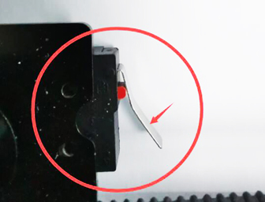

### X and Y move in the opposite direction when homing?
1. If the wires of the X and Y motors and the limit switches are exchanged, the XY axis may move in opposite directions when returning.    
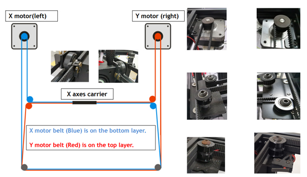    
2. Because there are several versions of Z9V5Pro, some versions use different motor drive modules. If you upgrade the wrong firmware version, this problem may also occur. Regarding the version differences of Z9V5Pro, please refer to [:point_right:**here**](https://github.com/ZONESTAR3D/Z9/tree/main/Z9V5#how-to-distinguish-z9v5-mk1mk2mk3mk4mk5mk6).

### The print head can only move in the 45 degree direction?
- If the print head only move from left-front to right-rear (**as indicated by the red arrow**), then it reveals that the X motor doesn't work. 
- If the print head only move from right-front to left-rear (**as indicated by the blue arrow**), then it reveals that the Y motor doesn't work.   
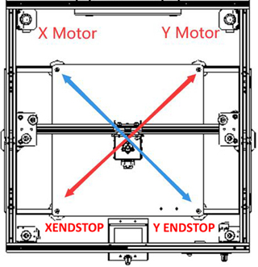   

-----
## Other issues
If your problem is not as the most common problems, please follow the [:movie_camera:**electronics parts auto testing video tutorial**](https://youtu.be/Mf92BlmKA0A) to check the ENDSTOPs and motors, if you find a problem during testing, click the link of the problem source listed below to get the solution.  
- :point_right:[**X ENDSTOP or motor don't work**](#x-endstop-or-motor-dont-work).
- :point_right:[**Y ENDSTOP or motor don't work**](#y-endstop-or-motor-dont-work).
- :point_right:[**Z ENDSTOPs or motors don't work**](#z-endstops-or-motors-dont-work).  
:warning: Because Z9V5 uses the "CoreXY structure", when testing the XY motors, the print head will only move left and right but not move front and back. If the print head only move at 45 degree, it means X or Y motor don't work well.

### X ENDSTOP don't work?
1. Check X ENDSTOP wiring. 
2. Check X wiring on the control boad.   
3. Check that the X limit switch is well soldered to the wire and that the wire is connected to the NO and COM pins of the limit switch.   
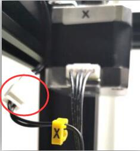 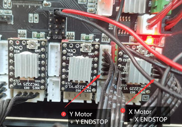 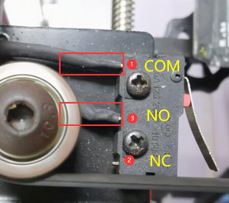

### Y ENDSTOP don't work?
1. Check Y ENDSTOP wiring.    
2. Check Y wiring on the control boad.   
3. Check that the Y limit switch is well soldered to the wire and that the wire is connected to the NO and COM pins of the limit switch.
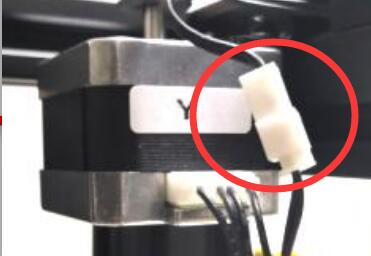   

### X or Y motor don't work?
1. Check X & Y motor wiring.    
2. Check X & Y wiring on the control boad.   
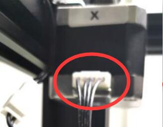 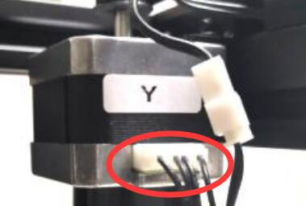 

### Z ENDSTOPs or motors don't work?
:loudspeaker:Because the Z axis has 2 sets of drive system (the left and the right), so if you find a problem with the Z, you can swap the wiring on the left and right to confirm whether the problem is from the control board side or the motor/ENDSTOP side.   
:warning: For Z axis, the two sets (left and right) of ENDSTOPS + Motor must be matched. If you exchange one of them (for example, the left and right ENDSTOP wiring is exchanged but the motor wiring is not ), it will also cause the Z axis to fail to home.  
- **ZL/ZR ENDSTOPs don't work?**  
1. Check Z ENDSTOPs wiring (Both the left and right).    
2. Check the Z ENDSTOPs PCBA  (Both the left and right).    
:warning: Please pay attention to check the Z limit switch circuit board for damage or accidental poor soldering.   
 
- **ZL/ZR Motor don't work?**  
1. **Check ZL/ZR motor wiring. **  
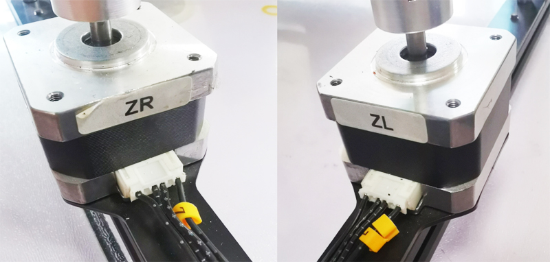  
2. **Check ZL/ZR Motor wiring on the control boad.**   
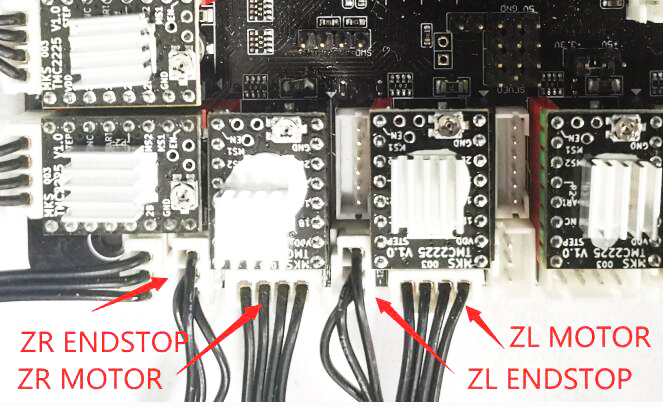
3. **Check the screws on the coupling which to fix the motor shaft and lead screws.**
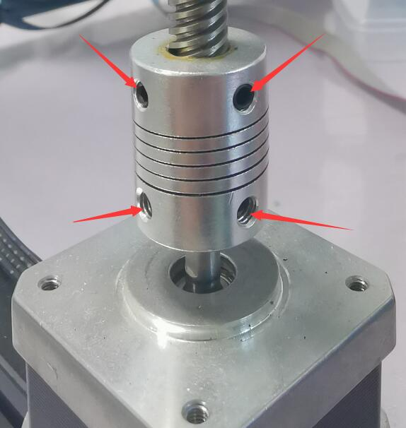

-----
### :email: If you can't find a solution to solve your problem after readed this document, please contact our technical support team : support@zonestar3d.com .