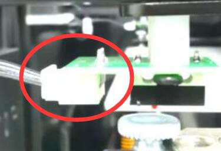

## Homing Issues
### Step 1
If the issue is because the hot end (print head) don't stop movement when homing X or homing all, the reason may be because the print head (the hot end metal case) can't touch the X ENDSTOP while homing X, refer to the picture below to slightly correct the tongue of the X limit switch and try again. If this is not the issue, or the problem has not been solved, please [:point_right: go to step 2](#step-2)    

### Step 2
Follow the [:movie_camera:**electronics parts auto testing video tutorial**](https://youtu.be/Mf92BlmKA0A) to check the ENDSTOPs and motors, if you find a problem during testing, click the link of the problem source listed below to get the solution.  
- :point_right:[**X ENDSTOP or motor don't work**](#x-endstop-or-motor-dont-work).
- :point_right:[**Y ENDSTOP or motor don't work**](#y-endstop-or-motor-dont-work).
- :point_right:[**Z ENDSTOPs or motors don't work**](#z-endstops-or-motors-dont-work).  
:warning: Because Z9V5 uses the "CoreXY structure", when testing the XY motors, the print head will only move left and right but not move front and back. If the print head only move at 45 degree, it means X or Y motor don't work well.

-----

### X ENDSTOP don't work?
1. Check X ENDSTOP wiring. 
2. Check X wiring on the control boad.   
3. Check that the X limit switch is well soldered to the wire and that the wire is connected to the NO and COM pins of the limit switch.   
  

### Y ENDSTOP don't work?
1. Check Y ENDSTOP wiring.    
2. Check Y wiring on the control boad.   
3. Check that the Y limit switch is well soldered to the wire and that the wire is connected to the NO and COM pins of the limit switch.
   

### X or Y motor don't work?
1. Check X & Y motor wiring.    
2. Check X & Y wiring on the control boad.   
  

### Z ENDSTOPs or motors don't work?
:loudspeaker:Because the Z axis has 2 sets of drive system (the left and the right), so if you find a problem with the Z, you can swap the wiring on the left and right to confirm whether the problem is from the control board side or the motor/ENDSTOP side.   
:warning: For Z axis, the two sets (left and right) of ENDSTOPS + Motor must be matched. If you exchange one of them (for example, the left and right ENDSTOP wiring is exchanged but the motor wiring is not ), it will also cause the Z axis to fail to home.  
- **ZL/ZR ENDSTOPs don't work?**  
1. Check Z ENDSTOPs wiring (Both the left and right).    
2. Check the Z ENDSTOPs PCBA  (Both the left and right). :warning: Please pay attention to check the Z limit switch circuit board for damage or accidental poor soldering.   
 
- **ZL/ZR Motor don't work?**  
1. Check Z(L/R) motor wiring.    
2. Check Z(L/R) Motor wiring on the control boad.   
 

