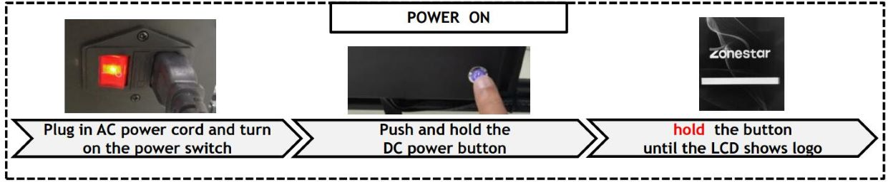
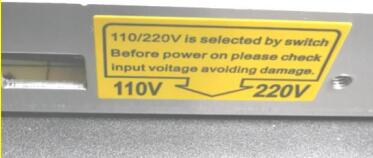
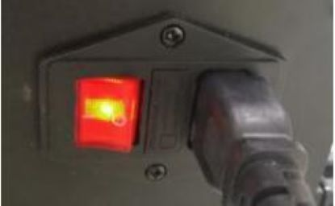
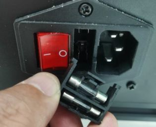
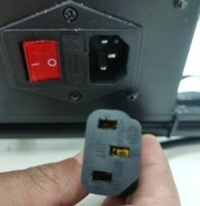
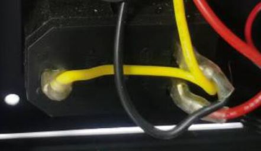
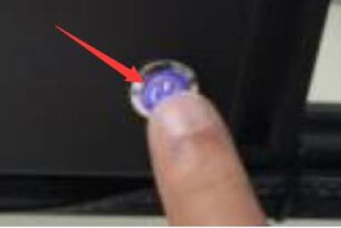
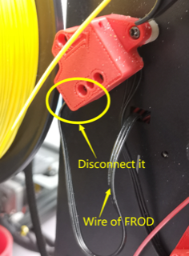
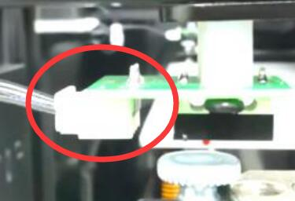

## The printer can't start up
:loudspeaker: First of all , We hope you know that the startup mode of this machine may be different from that of your previous machines. Esspecially please pay attention to that you need to ***press and hold the DC button for about 5 seconds*** until you see the ZONESTAR logo on the LCD screen. :movie_camera: [**Turn On / Turn Off the printer**](https://youtu.be/xTlMHtxkGoY)

----
### To choose the solution according to the status of your printer.
##### :one: The LCD Screen don't show anything, and the ZONESTAR LOGO light don't light up. [:point_right:Get solution](#1-does-the-ac-power-select-switch-set-to-the-correct-position)
##### :two: The LCD screen shows menu and the printer reset itself after several seconds later. [:point_right:Get solution](#5-upload-the-firmware-and-try-again)
##### :three: The LCD screen can shows menu, but the printer reset itself after shows "heating fail" menu. [:point_right:Get solution](../Issue_heating/readme.md)
##### :four: The LCD screen only show a ZONESTAR logo and don't shows menu, and the printer auto turn off after released the DC button. [:point_right:Get solution](#5-upload-the-firmware-and-try-again)
##### :five: My situation does not correspond to any of the above status. [:point_right:Get solution](#contact-our-support-team)
----
### Checking steps
#### 1. Does the AC power select switch set to the correct position?
   

#### 2. Does the AC power switch light up? 
   
:white_check_mark:**Yes, go to the next step**[:point_right:](#3-does-the-led-of-the-power-supply-light-up) :x:**Not, check following the below steps:**
- **Check if the fuse is burn out? If yes, replace a new one (220V/5A).**    

- **Check if AC power cord is connected well with the AC connector, or replace a new AC power cable and try again.**     

#### 3. Does the FAN of the power supply work?
:white_check_mark: **Yes, go to the next step**[:point_right:](#4-does-the-light-of-dc-button-will-light-up-when-press-it)  :x: **Not, open the control box and check the AC power wire.**   
:pushpin: [**How to Open the control box**](../How_to_open_the_control_box.jpg)    

#### 4. Does the light of DC button will light up when press it?
    
:white_check_mark: **Yes, go to the next step**[:point_right:](#5-upload-and-try-again) :x: **Not, check following the below steps:**
- **Disconnect the wire of filament run out sensor and check again.**       
   
:warning:Please that the filament run out sensors (the red part in the figure below) has two connector, the one is INPUT and another is OUTPUT, it cannot be inserted reversely, otherwise it will lead to the failure of starting up.   

- **Disconnect the Z ENDSTOPs (both left and right) wires and try again.**    
     
- **Remove SD card and try again.**     
- **Disconnect the LCD cable and try again.**     

#### 5. Upload the firmware and try again.
Please try to download the firmware and upload it to your printer again. [:arrow_down:](https://github.com/ZONESTAR3D/Firmware/tree/master/Z9/Z9V5/bin/Z9V5Pro-MK3)

----

### Contact our support team.
If you still haven't fixed the question after did above 5 steps, contact our tech-support team [:email: support@zonestar3d.com](support@zonestar3d.com).

--------
## :email: If you can't find a solution to solve your problem after readed the FAQ , please contact our technical support team : support@zonestar3d.com .