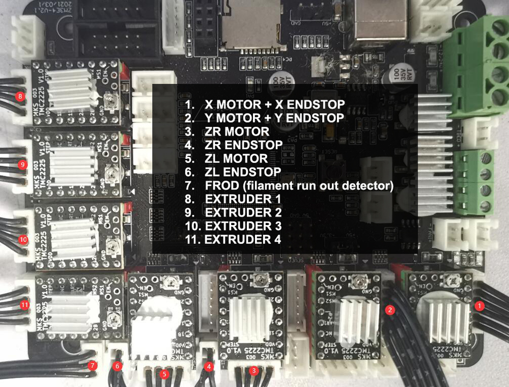
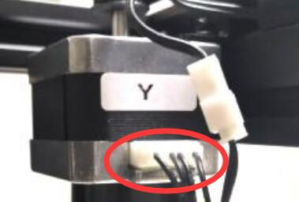

## Stepping motor don't work
:warning: Power off the printer first before connecting or disconnecting the motor cables.

### Wiring of the motors and ENDSTOPs on the control board side

### X&Y motors 
- Check the motor wire on motor side.  
    
- Check the motor wire on control board side.  Please refer to the picture of [:point_up: Wiring on control board side](#wiring-of-the-motors-and-endstops-on-the-control-board-side)
- Check the motor wires.   
:star2: Tips: First loosen the belt on the top, then try to exchange the wiring of X and Y motors, and then move X on the LCD menu to check whether the problem is from the motor side or the control board side.   
:warning: Please note that because the Z9 is a Corexy structure, the X and Y motors will rotate at the same time when the print head moves along the X axis or Y axis.

### ZL or ZR motors
- Check the motor wiring well on motor side.
      
- Check the motor wiring well on control board side. Please refer to the picture of [:point_up: Wiring on control board side](#wiring-of-the-motors-and-endstops-on-the-control-board-side)
- Check the motor wires.   
:star2: Tips: Try to exchange the wiring of Z-L and Z-R motors, and then move Z on the LCD menu to check whether the problem is from the motor side or the control board side.

### Extruder motors
- Check the motor wires connection on control board side. Please refer to the picture of [:point_up: Wiring on control board side](#wiring-of-the-motors-and-endstops-on-the-control-board-side)
- Open the upper control box [:point_right:How to open the upper control box](../Upper_box_mounted_screws.jpg) and check the motor wires connection on the motors side.
     

--------
## :email: If you can't find a solution to solve your problem after readed the FAQ , please contact our technical support team : support@zonestar3d.com .