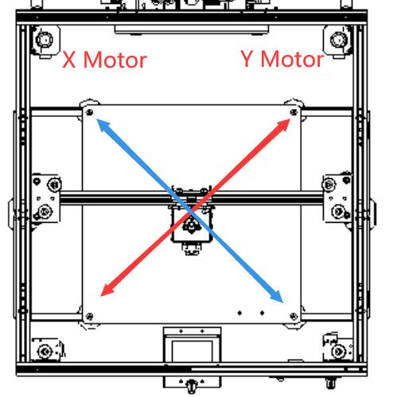
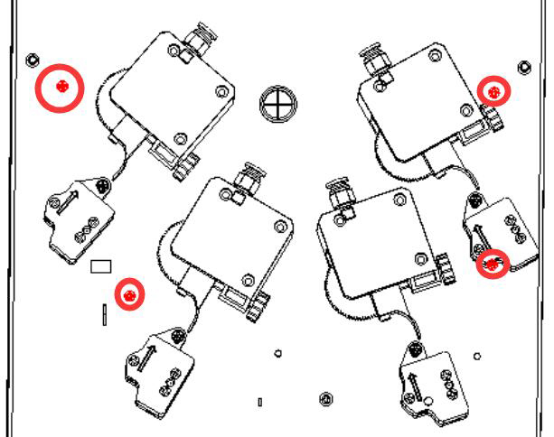
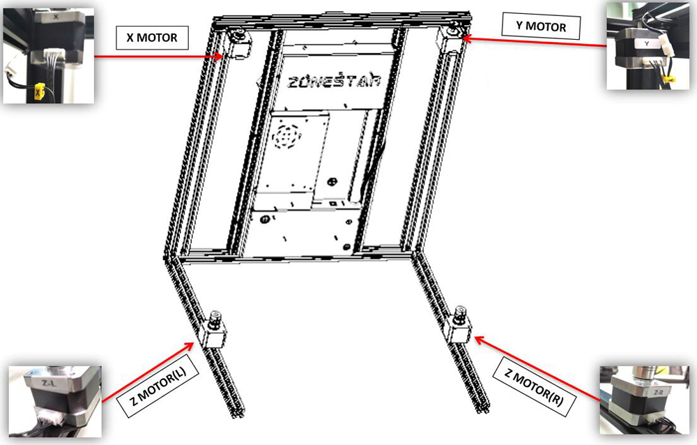
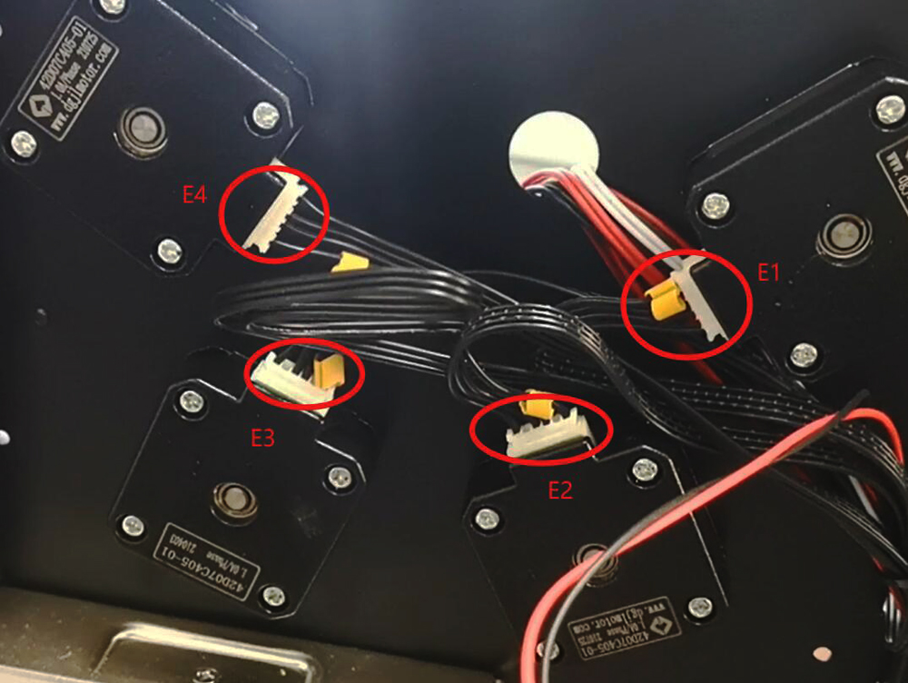

## Stepping motors don't work
#### :warning: Power off the printer first before connecting or disconnecting the motor cables and open the control box.

-----
### X & Y axis motors don't work
- **[:art: Check if the motor wires are connected well on motor side](XYZMotors_wiring.jpg).**
- **[:art: Open the bottom control box](../How_to_open_the_control_box.jpg) and [:art: check if the motor wires are connected well on control board side](MotorENDSTOP_wiring.jpg).**
- **Replace the motor wire and check again.**   
:warning: Please note that because the Z9 is a Corexy structure, if one of the XY motors does not work, the print head can only move in the 45 degree direction. As shown in the following figure:
- If the print head only move from left-front to right-rear (**as indicated by the red arrow**) when moving the X/Y axis on the LCD menu (**"Prepare>>Move"**), then it reveals that the X motor doesn't work. 
- f the print head only move from right-front to left-rear (**as indicated by the blue arrow**) when moving the X/Y axis on the LCD menu (**"Prepare>>Move"**), then it reveals that the Y motor doesn't work.   

 
### Z axis motors don't work
- **[:art: Check if the motor wiring are connected well on motor side](XYZMotors_wiring.jpg).**
- **[:art: Open the bottom control box](../How_to_open_the_control_box.jpg) and [:art: check if the motor wiring are connected well on control board side](MotorENDSTOP_wiring.jpg).**
- **Replace the motor wire and check again.**   
:star2: Tips: Try to exchange the wiring of Z-L and Z-R motors, and then move Z axis on the LCD menu (**"Prepare>>Move"**) to check the problem is from the motor side or the control board side.

### Extruder motors don't work
- **[:art: Open the bottom control box](../How_to_open_the_control_box.jpg) and [:art: check if the motor wires are connected well on control board side](MotorENDSTOP_wiring.jpg).**
- **[:art: Open the upper control box](../Upper_box_mounted_screws.jpg) and [:art: check the motor wires are connected well on the motors side](ExtruderMotors_wiring.jpg).**
- **Replace the motor wire and check again.**   

-----
## :email: If you can't find a solution to solve your problem after readed the FAQ , please contact our technical support team : support@zonestar3d.com.

-----
### Pictures

