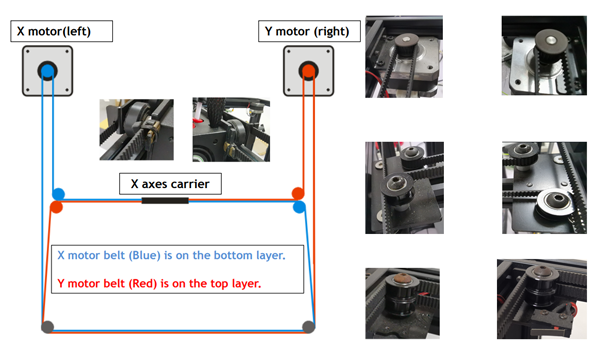

## Stepping motors don't work
#### :warning: Power off the printer first before connecting or disconnecting the motor cables and open the control box.

-----
### X & Y axis motors don't work
- **[:art: Check if the motor wires are connected well on motor side](XYZMotors_wiring.jpg).**
- **[:art: Open the bottom control box](../How_to_open_the_control_box.jpg) and [:art: check if the motor wires are connected well on control board side](MotorENDSTOP_wiring.jpg).**
- **Replace the motor wire and check again.**   
:warning: Please note that because the Z9 is a **Corexy structure** (about more Corexy structure, please refer to [**here**](http://corexy.com/)), if one of the X and Y motors does not work, the print head can only move in the 45 degree direction. As shown in the following figure:
- If the print head only move from left-front to right-rear (**as indicated by the red arrow**) when moving the X/Y axis on the LCD menu (**"Prepare>>Move X (Move Y)"**), then it reveals that the X motor doesn't work. 
- If the print head only move from right-front to left-rear (**as indicated by the blue arrow**) when moving the X/Y axis on the LCD menu (**"Prepare>>Move X  (Move Y)"**), then it reveals that the Y motor doesn't work.   

|   Layout of X/Y drive belts | Movement when X or Y Motor has issue  |
|:---------------------------:|:-------------------------------------:|
|              |               |

 
### Z axis motors don't work
- **[:art: Check whether the screws fixing the coupling to the motor shaft are tight](couplingscrews.png).**
- **[:art: Check whether the motor wire and motor are well connected](XYZMotors_wiring.jpg).**
- **[:art: Open the bottom control box](../How_to_open_the_control_box.jpg) and [:art: Check whether the motor wire and the control board are well connected](MotorENDSTOP_wiring.jpg).**
- **Replace the motor wire and check again.**   
:star2: Tips: Try to exchange the wiring of Z-L and Z-R motors, and then move Z axis on the LCD menu (**"Prepare>>Move Z"**) to check the problem is coming from the motor or the control board.

### Extruder motors don't work
- **[:art: Open the bottom control box](../How_to_open_the_control_box.jpg) and [:art: check if the motor wires are connected well on control board side](MotorENDSTOP_wiring.jpg).**
- **[:art: Open the upper control box](../Upper_box_mounted_screws.jpg) and [:art: check the motor wires are connected well on the motors side](ExtruderMotors_wiring.jpg).**
- **Replace the motor wire and check again.**   

-----
## :email: If you can't find a solution to solve your problem after readed the FAQ , please contact our technical support team : support@zonestar3d.com.

-----
### Pictures
#### How to open the upper box

#### How to open the control(bottom) box 

#### Wiring description of Motors and ENDSTOPs on the control board side

#### X/Y/Z Motors and ENDSTOPs wiring description

#### Extruder Motors wiring description
