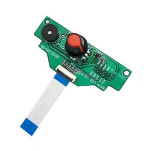

# Z9V5 Troubleshooting

-----
## Reference
In order to find and solve the problem of the product, you may need to use the automatic test function, open the control box to check the wiring or tune the mortor drive current, use a "swap test" to check an electronic component, etc.. Here we list these guides, pictures and video tutorial for you reference.
### How to open the control box
There are two control boxes on the control backplane of the Z9V5 machine.    
The upper box has the extruder motors and the LED backlight of LOGO inside, and the wires of the shortage detector and the hot end also passes through this box.    
The lower box has control board and AC power socket, and the connectors of X/Y/Z motors, ENDSTOPs and LCD screen is also inside the box.  
- **How to open the upper box** [:art: Picture](./Upper_box_mounted_screws.jpg)  [:clapper: Video](https://github.com/ZONESTAR3D/Z9/assets/29502731/f32b4a1c-f125-46b9-b6c7-f7fa09b943cc) 
- **How to open the control box** [:art: Picture](./How_to_open_the_control_box.jpg) [:clapper: Video](https://github.com/ZONESTAR3D/Z9/assets/29502731/b1a81306-d17e-41e0-80e3-508cc2afe01d) 

### Electronics parts auto testing
##### [:clapper:**Video Tutorial**](https://youtu.be/Mf92BlmKA0A).
The Z9V5Pro machine has builted-in an automatic testing program. You can use this program to determine where the problem comes from when any electronic component encounters a problem.    
To start this program, you need to open the "**Info**" menu and rotate the knob to point to the "**Date: xx-xx-xx**" item, and then press the knob five times. 

### About "swap test"
When we find that there is a functional problem in the machine, and the cause of the problem has multiple possibilities (multiple parts may cause to the same problem), we have the opportunity to use the so-called "**swap test**" to locate the cause of the problem as soon as possible.    
For example, if the left Z-axis motor does not work, the problem may come from the wiring, stepper motor, motor cable, the motor drive module on the control board or the control board. Because there are two sets of Z-axis drive systems in the machine - left Z drive systems nd right Z drive system - which are identical, we can exchange the same parts/components/wire on the left and right sides one by one to confirm where the  problem comes from.    
The parts in the machine that can carry out the exchange test include:
- X/Y motor and limit switch.
- ZL/ZR motor and limit switch
- 4 sets of extruder motors
- Heating tube and temperature sensor of hot bed and hot end.

-----
## Contents
- [**The machine can't start up**](./Issue_of_startup/readme.md)
- [**Homing issue**](./Issue_of_Homing/readme.md)
- [**Stepping motor(s) does not work properly**](./Issue_of_stepping_motor/readme.md)
- [**Heating issue**](./Issue_heating/readme.md)
- [**Not read SD card issue**](./Issue_not_read_sdcard/readme.md)
- [**Bed auto leveling issue**](./Issue_bed_auto_leveling/readme.md)
- [**Auto shut down when printing from SD card**](./Issue_auto_shut_down/readme.md)
- [**Auto pause when printing from SD card**](./Issue_auto_pause/readme.md)
- [**Mixing Color hotend is clogged**](./Issue_mix_color_hotend_clogged/readme.md)
- [**LCD screen knob issue**](#lcd-screen-knob-issue)
- [**Crash when connecting USB in Cura**](./issue_of_connect_USB_in_Cura/readme.md)
<!-- - [**Logo Backlight issue**](./Issue_of_Backlight/readme.md) -->
<!-- - [**Not extruding at the start of the print**](./Issue_not_extrusion_at_start/readme.md) -->
<!-- - [**Prints not sticking to bed**](./Issue_not_sticking_to_bed/readme.md) -->
<!-- - [**Filament run out sensor issue**](./Issue_FROD/readme.md) -->
<!-- - [**Filament clogged issue**](./Issue_M4hotend_clogged/readme.md) -->
<!-- - [**Shifted layers when printing from SD card**]() -->
<!-- - [**Pillowing, e.g. incomplete top layer fills, top layer holes/gaps**]() -->
<!-- - [**Warping or coner lifting**]() -->
<!-- - [**Layer separation or warping within the part**]() -->
<!-- - [**Blobs and/or pimples on exterior surface**]() -->
<!-- - [**How to fix Extruder insufficient discharge issue**](./Issue_of_Extruder_insufficient_discharge/readme.md) -->
<!-- - [**How to improve strings/drawing/oozing issue of the mixing color hotend**](./Issue_of_strings_drawing_m4/How_to_improve_Strings_or_Oozing_issue_of_mixing_color_hotend.pdf) -->
<!-- - [**Scars on top surface**]() -->
<!-- - [**Infill showing on exterior of print**]() -->
<!-- - [**Weak infill**]() -->

-----
## Other references
- **[44 Common 3D Print Problems](https://github.com/ZONESTAR3D/Document-and-User-Guide/tree/master/FAQ)**
- **[All Problems & Solutions (@All3DP.com)](https://all3dp.com/1/common-3d-printing-problems-troubleshooting-3d-printer-issues/)**

-----
## LCD screen knob issue
If you find that the knob of the LCD screen is stuck, you can click on [:gift: this link](https://www.aliexpress.com/item/3256805596235491.html) to purchase a replacement keypad. If your product is within the warranty period (within 12 months from the date of receiving the package), please contact us after placing the order, and we will provide you with after-sales service.     
How to replace the keypad of the LCD screen, please watch the video tutorial:
- For the welding version (older), please refer to [:clapper: this video](https://youtu.be/Xwfczp3nLOY).   
- For the FPC version (newer), please refer to [:clapper: this video](https://youtu.be/z9E6glRZRIQ).  

-----
## If you can't find a solution to solve your problem after readed the FAQ , please contact our technical support team by email. :email: support@zonestar3d.com .

