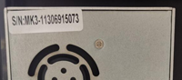

### Choose Language (Translated by google)

-----
### Documents link for ZONESTAR Z9V5 3D Printer
#### [:file_folder: Z9V5Pro-MK4](https://github.com/ZONESTAR3D/Z9/tree/main/Z9V5/Z9V5-MK4)
#### [:file_folder: Z9V5Pro-MK3](https://github.com/ZONESTAR3D/Z9/tree/main/Z9V5/Z9V5-MK3)
#### [:file_folder: Z9V5Pro-MK2](https://github.com/ZONESTAR3D/Z9/tree/main/Z9V5/Z9V5-MK2)
#### [:file_folder: Z9V5Pro-MK1](https://github.com/ZONESTAR3D/Z9/tree/main/Z9V5/Z9V5-MK1)
#### [:file_folder: Z9V5](https://github.com/ZONESTAR3D/Z9/tree/main/Z9V5/Z9V5-MK1)

-----
### How to distinguish Z9V5-MK1/MK2/MK3/MK4
You can distinguish MK1/MK2/MK3/MK4 by product serial number. There is a white sticker on the power supply, which indicates the product serial number.  

- **Z9V5-MK1:** Serial Number is **xxxxxxxxxx**   
- **Z9V5-MK2:** Serial Number is **V1-xxxxxxxxxx** and **V2-xxxxxxxxxx**    
- **Z9V5-MK3:** Serial Number is **MK3-xxxxxxxxxx**  
- **Z9V5-MK4:** Serial Number is **MK4-xxxxxxxxxx**  

### What's different on Z9V5-MK1/MK2/MK3/MK4
- **Z9V5-MK4 mainly improves than Z9V5-MK3**:  
1. Use E4 (4-IN-1-OUT non mix color) hotend as default hotend to replace of the M4 hotend.
2. Use magnetic hot bed sticker to replace hot bed glass.
3. Bed leveling sensor used PL-08N.
4. Optimized structure on top assembly, filament run out sensor case, etc..    
    - :green_book: [**View Documents link**](https://github.com/ZONESTAR3D/Z9/tree/main/Z9V5/Z9V5-MK4)    
    - :arrow_down:[**Download all Z9V5-MK4 files**](https://downgit.github.io/#/home?url=https:%2F%2Fgithub.com%2FZONESTAR3D%2FZ9%2Ftree%2Fmain%2FZ9V5%2FZ9V5-MK4)  

-  **Z9V5-MK3 mainly improves than Z9V5-MK2**:  
1. Upgraded bed leveling sensor to [**ZLSensor**](https://aliexpress.com/item/1005002865311470.html) from [**PL-08N**](https://www.aliexpress.com/item/2255800409994958.html) bed leveling sensor. ZLSensor can probing the glass directly.  
2. Upgraded the extruder motor drivers to [**TMC2225**](https://aliexpress.com/item/1005003270721219.html) from [**A4988**](https://www.aliexpress.com/item/2255800771058461.html).
    - :green_book: [**View Documents link**](https://github.com/ZONESTAR3D/Z9/tree/main/Z9V5/Z9V5-MK3)
    - :arrow_down:[**Download all Z9V5-MK3 files**](https://downgit.github.io/#/home?url=https:%2F%2Fgithub.com%2FZONESTAR3D%2FZ9%2Ftree%2Fmain%2FZ9V5%2FZ9V5-MK3)   

- **Z9V5-MK2 mainly improves than Z9V5-MK1**:  
1. **Hot end interface** When shipping, the print head (hotend assembly) is separated from the backplane. There are 5 connectors behind the backplane, which can connect the wiring of the hot end without opening the control box. It will help switch between [**different types of hotends**](https://github.com/ZONESTAR3D/Upgrade-kit-guide/tree/main/HOTEND) quickly.    
2. Improved the M4 hotend from the 2nd version (***M4-V2***) to the 3rd version(***M4-V3***). More details of the M4 hotend, please refer to [Here](https://github.com/ZONESTAR3D/Upgrade-kit-guide/tree/main/HOTEND/M4%20%204-IN-1-OUT%20Mixing%20Color%20Hotend).  
3. Improved the backlight of ZONESTAR LOGO.  
4. Improved the cover case of control box to make it easier to open.  
5. improved the belt transmission device to prevent the belt from scratching the idler pulley.  
6. improved the filament run out installation to make it solve the problem that may lead to the winding of filament.    
:warning: **NOTE** :warning:   
Due to the shortage of chips, a small numbers of **Z9V5-MK2** used **ZM3E4V1** control board. Please check the product serial number (a white lable pasted on the power supply). If the product with serial number **V1xxxxxxxx** , it means your machine used a **ZM3E4V1** control board. Basically ZM3E4V1 has the same features with ZM3E4V2.        
    - :green_book: [**View Documents link**](https://github.com/ZONESTAR3D/Z9/tree/main/Z9V5/Z9V5-MK2)  
    - :arrow_down: [**Download all Z9V5-MK2 files**](https://downgit.github.io/#/home?url=https:%2F%2Fgithub.com%2FZONESTAR3D%2FZ9%2Ftree%2Fmain%2FZ9V5%2FZ9V5-MK2) 

**Z9V5-MK1 is the first version Z9V5**
- :green_book: [**View Documents link**](https://github.com/ZONESTAR3D/Z9/tree/main/Z9V5/Z9V5-MK1) 
- :arrow_down: [**Download all Z9V5-MK1 files**](https://downgit.github.io/#/home?url=https:%2F%2Fgithub.com%2FZONESTAR3D%2FZ9%2Ftree%2Fmain%2FZ9V5%2FZ9V5-MK1) 

----------
### How to downlod file from Github page
#### Step 1: Click this link [**https://downgit.github.io/**](https://downgit.github.io/) 
#### Step 2: Copy the Github file or direcotry link which you want to download.
#### Step 3: Click download button to download. 
    
