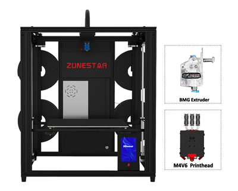
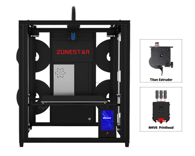
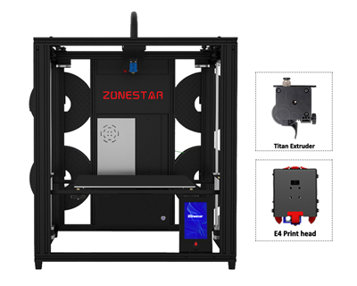
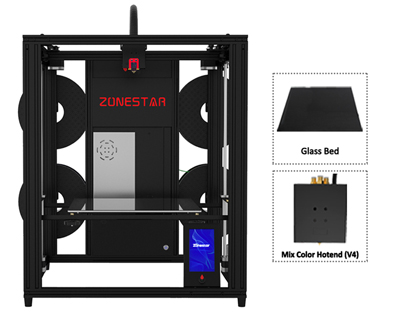
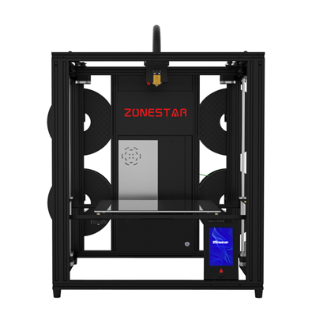

# User Guide for ZONESTAR Z9V5 3D Printer 

-----
## Contents
- **[Translate this page](#translate-this-page)**
- **[User Guide links](#link-to-user-guide-for-z9v5pro-3d-printers)**
- **[What's different on Z9V5-MK1/MK2/MK3/MK4/MK5/MK6](#whats-different-on-z9v5-mk1mk2mk3mk4mk5mk6)**
- **[How to distinguish Z9V5-MK1/MK2/MK3/MK4/MK5/MK6](#how-to-distinguish-z9v5-mk1mk2mk3mk4mk5mk6)**
- **[Troubleshooting](#troubleshooting)**

-----
### :globe_with_meridians: Translate this page
We provide online documentation because it is easily translated into a language you are familiar with. Here are some common browser translation plug-ins for your reference.
- [**Windows Edge Translate Add-on**](https://microsoftedge.microsoft.com/addons/detail/edge-translate/bfdogplmndidlpjfhoijckpakkdjkkil?hl=en-US)    
- [**Firefox Translations Add-on**](https://support.mozilla.org/en-US/kb/firefox-translations-add-on?redirectslug=firefox-translations&redirectlocale=en-US)
- [**Google Translate Chrome Extension**](https://chrome.google.com/webstore/detail/google-translate/aapbdbdomjkkjkaonfhkkikfgjllcleb)

-----
### Link to user guide for Z9V5Pro 3D Printers 
- :file_folder: **Z9V5Pro-MK6: https://github.com/ZONESTAR3D/Z9/tree/main/Z9V5/Z9V5-MK6**    
- :file_folder: **Z9V5Pro-MK5: https://github.com/ZONESTAR3D/Z9/tree/main/Z9V5/Z9V5-MK5**    
- :file_folder: **Z9V5Pro-MK4: https://github.com/ZONESTAR3D/Z9/tree/main/Z9V5/Z9V5-MK4**    
- :file_folder: **Z9V5Pro-MK3: https://github.com/ZONESTAR3D/Z9/tree/main/Z9V5/Z9V5-MK3**    
- :file_folder: **Z9V5Pro-MK2: https://github.com/ZONESTAR3D/Z9/tree/main/Z9V5/Z9V5-MK2**    
- :file_folder: **Z9V5Pro-MK1: https://github.com/ZONESTAR3D/Z9/tree/main/Z9V5/Z9V5-MK1**    

-----
### What's different on Z9V5-MK1/MK2/MK3/MK4/MK5/MK6
#### :black_circle: Z9V5-MK6 mainly improves than Z9V5-MK5:       
1. Upgraded to Dual Gear Extruders.
2. Upgraded control board to ZM3E4 V3.     
3. Changed motor drivers: TMC2208 used on driving XYZ motors and A4988 used on driving extrurder motors.     

#### :black_circle: Z9V5-MK5 mainly improves than Z9V5-MK4:     
Used M4V6 (the 6th version 4-IN-1-OUT mix color) hotend as default hotend.   
**[What's different between M4V6 hotend and E4 hotend][FAQ_M4E4].**     

#### :black_circle: Z9V5-MK4 mainly improves than Z9V5-MK3:  
1. Use E4 (4-IN-1-OUT non mix color) hotend as default hotend.
2. Use flexibel magnetic hot bed sticker to replace hot bed glass.
3. Bed leveling sensor used PL-08N.
4. Optimized structure on top assembly, filament run out sensor case, etc..    

#### :black_circle: Z9V5-MK3 mainly improves than Z9V5-MK2:
1. Upgraded bed leveling sensor to [**ZLSensor**](https://aliexpress.com/item/1005002865311470.html) from [**PL-08N**](https://www.aliexpress.com/item/2255800409994958.html), ZL-Sensor can probing the glass directly.  
2. Changed motor drivers: TMC2225 used on driving XYZ motors and extrurder motors..     
3. Upgraded the M4 hotend from the 3nd version (***M4V3***) to the 4th version(***M4V4***).

#### :black_circle: Z9V5-MK2 mainly improves than Z9V5-MK1:    
1. Added air connectors for hot end wiring, making it easier to switch between different types of hot ends.
2. Upgraded the M4 hotend from the 2nd version (***M4V2***) to the 3rd version(***M4V3***). .  
3. Improved the backlight of ZONESTAR LOGO.  
4. Improved the cover case of control box to make it easier to open.  
5. improved the belt transmission device to prevent the belt from scratching the idler pulley.  
6. improved the filament run out installation.    
:warning: **NOTE** :warning:   
Due to the shortage of chips, a small numbers of **Z9V5-MK2** used **ZM3E4V1** control board. Please check the product serial number (a white lable pasted on the power supply). If the product with serial number **V1xxxxxxxx** , it means your machine used a **ZM3E4V1** control board. Basically ZM3E4V1 has the same features with ZM3E4V2.        

#### :black_circle: Z9V5-MK1 is the first version Z9V5    

-----
### How to distinguish Z9V5-MK1/MK2/MK3/MK4/MK5/MK6
You can distinguish MK1/MK2/MK3/MK4 by product serial number. There is a white sticker on the power supply, which indicates the product serial number.  

- **Z9V5-MK1:** Serial Number is **xxxxxxxxxx**   
- **Z9V5-MK2:** Serial Number is **V1-xxxxxxxxxx** and **V2-xxxxxxxxxx**    
- **Z9V5-MK3:** Serial Number is **MK3-xxxxxxxxxx**  
- **Z9V5-MK4:** Serial Number is **MK4-xxxxxxxxxx**  
- **Z9V5-MK5:** Serial Number is **MK5-xxxxxxxxxx**  
- **Z9V5-MK6:** Serial Number is **MK6-xxxxxxxxxx**  

-----
### Troubleshooting
If you have any problem when installing and using Z9V5, please read the [**:book: Z9V5Pro Troubleshooting**][Troubleshooting] to find a solution a solution first.

[FAQ_M4E4]: https://github.com/ZONESTAR3D/Upgrade-kit-guide/blob/main/HOTEND/FAQ_M4E4.md#whats-different-between-e4-and-m4-hotend
[Troubleshooting]: https://github.com/ZONESTAR3D/Z9/tree/main/Z9V5/Z9V5_FAQ
