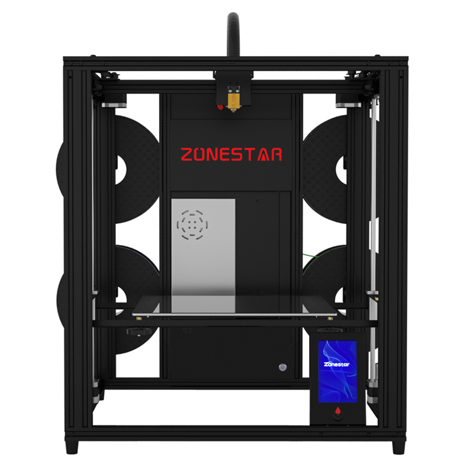
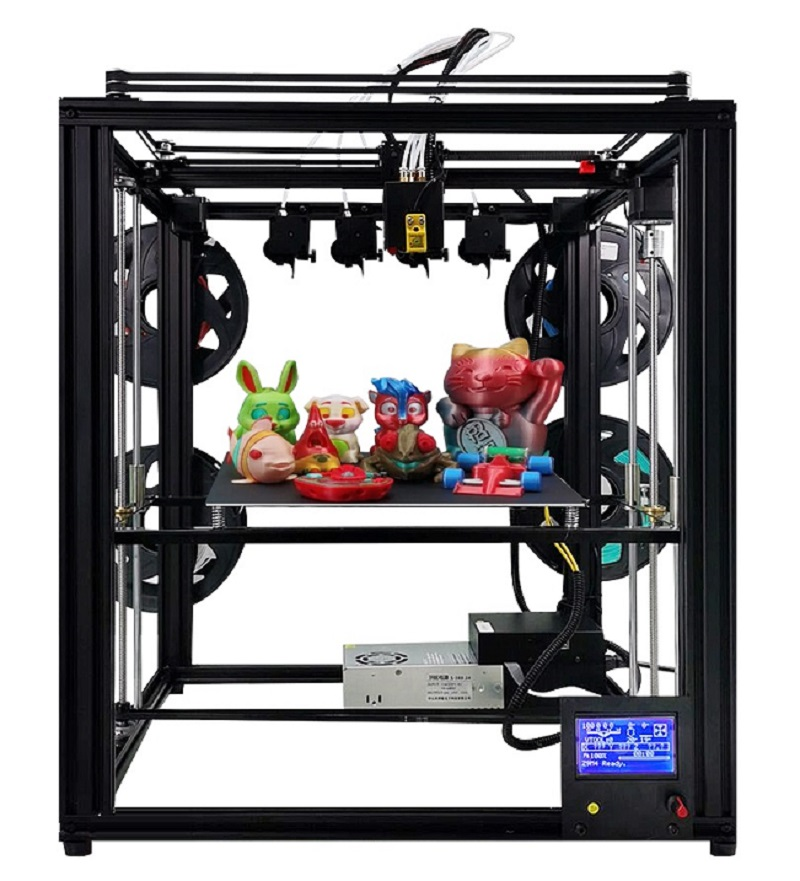
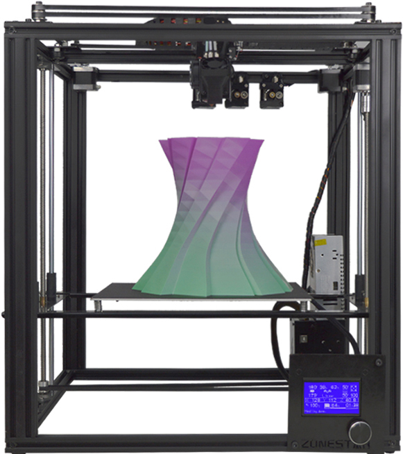

### :globe_with_meridians: Choose Language (Translated by google)

----
### About ZONESTAR Z9 series 3d printer
The main features of Z9 include:  
1. Used **Aluminum profile frame** structure makes the machine  stronger and more stable. The profiles screw is directly fixed, which is more accurate than using profile connectors.  
2. Used **Core-XY** drive structure effectively reduces the weight of the motion system.
3. Used **Open builds pulley + V-profile track**. It has the comprehensive characteristics of high precision, high speed, low resistance and low cost.  
4. **Dule drive z-axis** design is adopted to simplify leveling and improve the stability of the printing platform.  
5. **Elastic replaceable hotend** design is adopted. Fast heat exchange end (extruder) can be selected according to different printing material requirements.   More details, please refer to [**here**](https://github.com/ZONESTAR3D/Upgrade-kit-guide/tree/main/HOTEND)

----
## :file_folder:[Z9V5](https://github.com/ZONESTAR3D/Z9/tree/main/Z9V5)
**Z9V5** is the latest version of Z9 series. Compared with **Z9M4**, the main upgrades include:  
1. Higher pre assembly ratio and faster installation.  
2. The appearance is more beautiful.  
3. Using TMC silent motor drive module, the operation noise is lower (less than 55db @ 1 meter distance).  
4. Upgrade to dual Z driver.  

#### What's different between Z9V5 with Z9V5Pro    
1. **Z9V5** used 128x64 dots LCD screen (LCD12864) and a PC hotbed film.  
2. **Z9V5Pro** used used a 4.3" TFT-LCD screen (LCD-DWIN) and glass print platform.
  
### [Z9V5-MK1](https://github.com/ZONESTAR3D/Z9/tree/main/Z9V5/Z9V5-MK1) 
**The first version Z9V5**.   
### [Z9V5-MK2](https://github.com/ZONESTAR3D/Z9/tree/main/Z9V5/Z9V5-MK2)
**The 2nd version Z9V5**.   
##### Z9V5-MK2 upgrade than Z9V5-MK1:  
1. **Hot end interface** When shipping, the print head (hotend assembly) is separated from the backplane. There are 5 connectors behind the backplane, which can connect the wiring of the hot end without opening the control box. It will help switch between [**different types of hotends**](https://github.com/ZONESTAR3D/Upgrade-kit-guide/tree/main/HOTEND) quickly.  
2. Improved the M4 hotend from the 2nd version (HM4-V2) to the 3rd version(HM4-V3). More details of the M4 hotend, please refer to [Here](https://github.com/ZONESTAR3D/Upgrade-kit-guide/tree/main/HOTEND/M4%20%204-IN-1-OUT%20Mixing%20Color%20Hotend).  
3. Improved the backlight of ZONESTAR LOGO.  
4. Improved the cover case of control box to make it easier to open.  
5. improved the belt transmission device to prevent the belt from scratching the idler pulley.  
6. improved the filament run out installation to make it solve the problem that may lead to the winding of filament.    
    
### [Z9V5-MK3](https://github.com/ZONESTAR3D/Z9/tree/main/Z9V5/Z9V5-MK3)
**The 3rd version Z9V5**.    
##### **Z9V5-MK3 mainly improves than Z9V5-MK2**:  
1. Upgraded bed leveling sensor to [**ZLSensor**](https://aliexpress.com/item/1005002865311470.html), to replace the PL-08N bed leveling sensor. ZLSensor can probing the glass directly.  
2. Upgraded the extruder motor drivers to [**TMC2225**](https://aliexpress.com/item/1005003270721219.html)(from A4988). So **Z9V5-MK3**'s firmware is different with **Z9V5-MK1** and **Z9V5-MK2**.  

### [Z9V5-MK4](https://github.com/ZONESTAR3D/Z9/tree/main/Z9V5/Z9V5-MK4)
**The 4th version Z9V5**.    
##### **Z9V5-MK4 mainly improves than Z9V5-MK3**:  
1. Use 4-IN-1-OUT non color mixing hotend as default hotend.
2. Use magnetic hot bed sticker to replace hot bed glass.
3. Bed leveling sensor used PL-08N.
4. Optimized structure on top assembly, filament run out sensor case.

----
## :file_folder:[Z9M4](./Z9M4/) 
#### [:book:Documents](./Z9M4/readme.md)    
**Z9M4** is a version of Z9 series launched in 2020. Compared with Z9FM3, the main upgrades include:  
1. Upgrade to 4 extruders  
2. Upgrade to 4-IN-1-OUT hotend  
3. Upgrade to 32 bits control board  
**NOTE: Z9M4 is stopped produce since April 2021**  

----
## :file_folder:[Z9M3](./Z9M4/)  
**Z9M3** is a version of Z9 series launched in 2019.  it has produced two versions, Z9T/Z9F. Compared with Z9M2, the main upgrades include:  
1. Upgrade to 3 extruders  
2. Upgrade to 3-IN-1-OUT hotend  
3. From Z9F, it upgrade the extduer to a Titan extruders.  
**NOTE: Z9M3 is stopped produce since April 2020**  
  

----
## Z9M2 
**Z9M2** launched in 2018, it is the first verison of Z9 series. it has produced two versions, Z9 and Z9S. Z9 use a H-BOT structure and Z9S used a Core-XY structure, and after Z9S, all of the Z9 series are used Core-XY structure.

------
## How to downlod files from Github page
#### Step 1: Click this link [**https://downgit.github.io/**](https://downgit.github.io/) 
#### Step 2: Copy the Github file or direcotry link which you want to download.
#### Step 3: Click download button and wait a few seconds, it will start to download automatically. 
   

 

