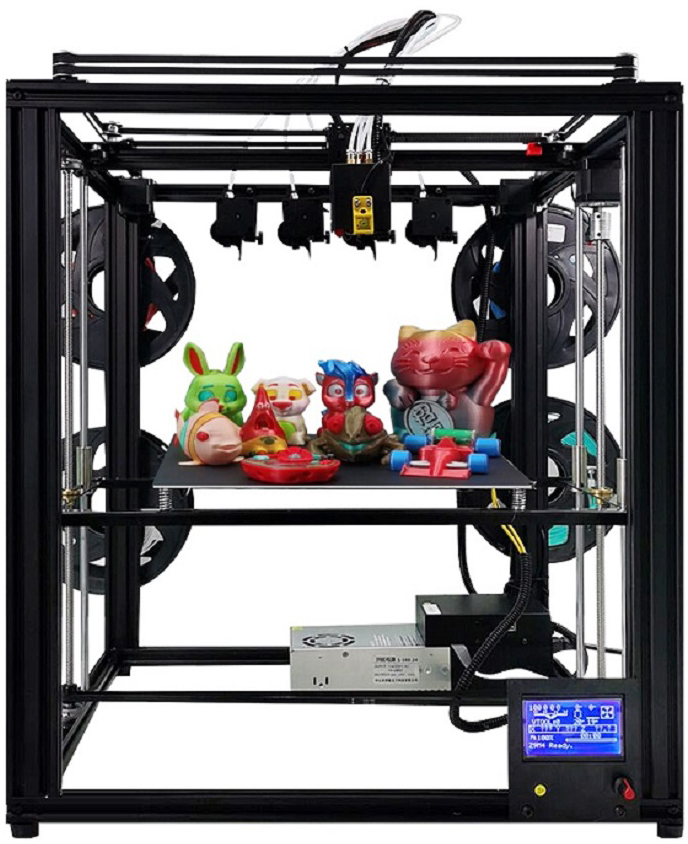
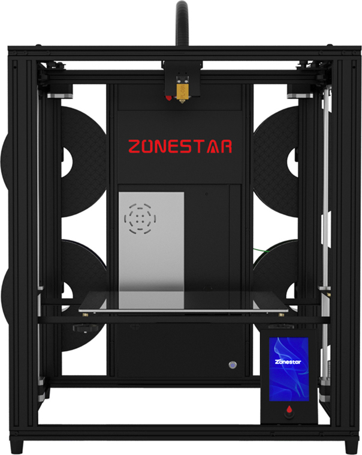

# About Z9 series 3d printer
**Z9M2** launched in 2018, it is the first verison of Z9 series. it has produced two versions, Z9 and Z9S. Z9 use a H-BOT structure and Z9S used a Core-XY structure, and after Z9S, all of the Z9 series are used Core-XY structure, the main features of Z9 include:  
1. Used **Aluminum profile frame** structure makes the machine  stronger and more stable. The profiles screw is directly fixed, which is more accurate than using profile connectors.  
2. Used **core-XY** drive structure effectively reduces the weight of the motion system.
3. Used **open builds pulley + V-profile track**. It has the comprehensive characteristics of high precision, high speed, low resistance and low cost.  
4. **Dule drive z-axis** design is adopted to simplify leveling and improve the stability of the printing platform.  
5. **Elastic replaceable hotend** design is adopted. Fast heat exchange end (extruder) can be selected according to different printing material requirements. The optional hot end includes:  
- **2-IN-1-OUT** mixing color hotend    
- **2-IN-2-OUT** hotend   
- **3-IN-1-OUT** mixing color hotend  
- **3-IN-2-OUT** hotend  
- **3-IN-3-OUT** hotend  
- **4-IN-1-OUT** mixing color hotend  
- **4-IN-1-OUT** non-mixing color hotend    
- **Direct drive extruder**  
- **High speed and large flow hotend**  

# Z9M3 
**Z9M3** is a version of Z9 series launched in 2019.  it has produced two versions, Z9T/Z9F. Compared with Z9M2, the main upgrades include:  
1. Upgrade to 3 extruders  
2. Upgrade to 3-IN-1-OUT hotend  
3. From Z9F, it upgrade the extduer to a Titan extruders.  
**NOTE: Z9M3 is stopped produce since April 2020**  
  

# Z9M4 
**Z9M4** is a version of Z9 series launched in 2020. Compared with Z9FM3, the main upgrades include:  
1. Upgrade to 4 extruders  
2. Upgrade to 4-IN-1-OUT hotend  
3. Upgrade to 32 bits control board  
**NOTE: Z9M4 is stopped produce since April 2021**  

# Z9V5
**Z9V5** is the latest version of Z9 series. Compared with **Z9M4**, the main upgrades include:
1. Higher pre assembly ratio and faster installation.
2. The appearance is more beautiful.
3. Using TMC silent motor drive module, the operation noise is lower (less than 55db @ 1 meter distance).
4. Upgrade to dual Z driver.

## What's different between Z9V5 with Z9V5Pro    
1. **Z9V5** used 128x64 dots LCD screen (LCD12864) and a PC hotbed film.  
2. **Z9V5Pro** used used a 4.3" TFT-LCD screen (LCD-DWIN) and glass print platform.
  
## [Z9V5-MK1](https://github.com/ZONESTAR3D/Z9/tree/main/Z9V5-MK1) 
**The first version Z9V5**

## [Z9V5-MK2](https://github.com/ZONESTAR3D/Z9/tree/main/Z9V5-MK2)
**The 2nd version Z9V5**    

## [Z9V5-MK3](https://github.com/ZONESTAR3D/Z9/tree/main/Z9V5-MK3)  
**The 3rd version Z9V5**  

